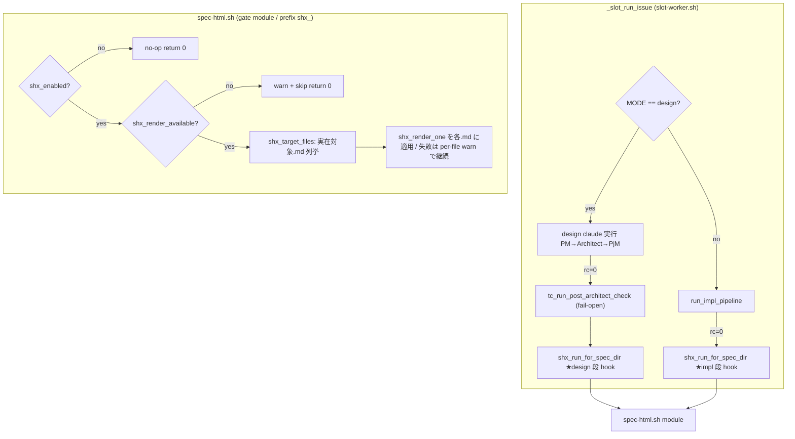

# Design Document

## Overview

**Purpose**: 本機能は「人間レビュー用 markdown 成果物（`docs/specs/<番号>-<slug>/` 配下の
requirements.md / design.md / tasks.md 等）を、生タグではなくレンダリング済み HTML でも確認できる」
可読性向上を、idd-claude を運用するオペレータ / レビュワーへ提供する。markdown を正準（source of
truth）に据えたまま、opt-in 有効化時のみ **並行して .html を派生生成**する。

**Users**: idd-claude オペレータ / 人間レビュワーが、設計 PR / 実装 PR のレビュー時に、ローカル
checkout した worktree 上の `design.html` 等を開いてレビューする workflow で利用する。機械ゲート
（watcher / 各エージェント）は従来どおり .md のみを契約入力とし、.html に一切依存しない。

**Impact**: 現在の watcher は spec 配下 .md を PM/Architect（design 段）・Developer/Reviewer（impl 段）が
生成する。本機能は **専用 module（`spec-html.sh`）** を追加し、Slot Runner（`slot-worker.sh`）の
design 分岐 rc=0 直後と impl 分岐 rc=0 直後の 2 箇所に fail-open hook を挿す。既定（opt-in gate OFF）
では 1 行も挙動を変えない。

複雑度は「標準（新規 module 1 + call site 2 + config + docs 同期）」。分量は design-principles.md の
標準バジェット（≤300 行）内に収める。

### Goals
- opt-in gate（既定 OFF）有効時のみ、対象 .md に対応する .html を並行生成する
- .md を正準として維持し、機械ゲート / エージェント連携が .html に依存しない状態を保つ
- 生成失敗を本流から分離し、silent fail を作らず、watcher exit code の意味を変えない
- 新規ランタイム非依存を貫き、依存 CLI 採用時も未インストールで本流を止めない
- 成功基準: gate OFF で観測可能挙動が導入前と完全一致し、gate ON で 5 対象 .md の .html が worktree に生成される

### Non-Goals
- .md の .html 置換（Introduction / Out of Scope に従い扱わない）
- 機械ゲート入力 .md の内容 / 形式の変更（checkbox / センチネル / `RESULT:` 行 / DSL）
- PR 本文の HTML 化 / spec 外 markdown の HTML 化 / CSS テーマ作り込み
- .md ↔ .html 乖離の自動検出・整合強制（本 spec は best-effort 追随のみ）
- 外部静的ホスティング / GitHub Pages への自動アップロード実装（別 opt-in gate 前提・本 spec 対象外）

## Architecture

### Existing Architecture Analysis
- **パイプライン構造**: `slot-worker.sh` の `_slot_run_issue` が 1 Issue を design / impl / impl-resume の
  モード別にディスパッチする。design 分岐は PM→Architect→PjM を 1 claude セッションで走らせ、rc=0 直後に
  既に **post-architect hook** `tc_run_post_architect_check || true`（Tasks Count Gate / #147）が挿さっている。
  impl 分岐は `run_impl_pipeline`（`impl-pipeline.sh`）を呼び、rc=0 で完了する。
- **尊重すべき境界**: module は「関数定義のみ・トップレベル副作用なし」。config（env var 定義・正規化）は
  `watcher-config.sh`。call site（実行順序）は slot-worker / 本体側に残す。ロガーは module 同居可（`tc_log` 前例）。
- **維持すべき統合点**: 機械ゲート（tasks.md checkbox / Tasks Count Gate / stage-a-verify センチネル /
  Reviewer `RESULT:` 行 / per-task checkbox）はすべて .md 限定。本機能はこの契約に一切干渉しない。
- **技術的負債の回避**: 既存の opt-in gate 慣習（`*_ENABLED=true` 厳密一致 / 不正値は安全側正規化 /
  fail-open hook `|| true`）を踏襲し、新パターンを持ち込まない。

### Architecture Pattern & Boundary Map

採用パターン: 既存 **post-stage fail-open hook + 専用 gate module**（`tasks-count-gate.sh` と同型）。
`tc_run_post_architect_check` が design rc=0 直後で tasks.md を再評価するのと同じ配置思想で、
`shx_run_for_spec_dir` を design / impl の rc=0 直後に挿す。



**Architecture Integration**:
- 採用パターン: post-stage fail-open hook + gate module（既存 Tasks Count Gate の再利用形。学習コスト最小）
- ドメイン境界: 生成ロジックは `spec-html.sh` に閉じる。call site は slot-worker.sh に 2 行追加のみ
- 既存パターンの維持: `*_ENABLED` 厳密一致正規化 / fail-open `|| true` / module 同居ロガー / 遅延束縛 global 参照
- 新規コンポーネントの根拠: 生成は独立責務であり本体 inline を避け module 化（CLAUDE.md §1）。新 prefix `shx_` を割当

### Technology Stack

| Layer | Choice / Version | Role in Feature | Notes |
|-------|------------------|-----------------|-------|
| Frontend / CLI | 生成物 .html（静的ファイル） | 人間レビュワーが local checkout で開く | GitHub は任意 .html を描画しない前提 |
| Backend / Services | bash 4+ module `spec-html.sh` | gate 判定 / 対象列挙 / 生成 orchestrate | 既存 module 群と同基盤 |
| Data / Storage | worktree 上の `.html` ファイル | 派生物（gitignore で版管理除外・既定案） | 正準は .md |
| Messaging / Events | なし | — | 新イベントなし |
| Infrastructure / Runtime | 外部 md→html CLI（既定 `pandoc`、env で差替可） | .md→.html 変換 | 未インストール時は skip+log（Req 5） |

## File Structure Plan

### 新規 / 変更ファイル

```
local-watcher/bin/
├── modules/
│   └── spec-html.sh            # 新規: 本機能 module（prefix shx_）。gate/列挙/生成/ロガー
├── watcher-config.sh           # 変更: SPEC_HTML_* env var 定義・正規化ブロック追加
└── issue-watcher.sh            # 変更: REQUIRED_MODULES に "spec-html.sh" を 1 要素追加

local-watcher/bin/modules/
└── slot-worker.sh              # 変更: design 分岐 rc=0 直後 / impl 分岐 rc=0 直後に
                                #        `shx_run_for_spec_dir || true` を各 1 行挿入（call site）

local-watcher/test/
└── spec-html_test.sh           # 新規: extract_function 隔離抽出でユニット検証

.gitignore                      # 変更: `docs/specs/**/*.html` を追加（版管理除外・既定案 / Req 7.2）

README.md                       # 変更: 「オプション機能一覧」に SPEC_HTML_* / 閲覧経路 / setup を追記
CLAUDE.md                       # 変更: 機能追加ガイドライン §2 prefix 表に `shx_` 行を追加
```

- `install.sh` / `install-lib.sh` は **変更不要**: `local-watcher/bin/modules/*.sh` を glob 配布するため
  新 module は自動配布される（`install-lib.sh:1315-1317` の `copy_glob_to_homebin ... "*.sh"`）。
- `repo-template/` 同期: 本機能は `.claude/agents` / `.claude/rules` を変更しないため byte 一致同期対象外
  （NFR 4.1/4.2 は vacuously 満たす）。consumer 側 `.gitignore` は install 管理外のため README で opt-in
  setup として案内する（NFR 4.3）。

## Requirements Traceability

| Requirement | Summary | Component / 配置 |
|-------------|---------|------------------|
| 1.1 | gate 非 true は .html 非生成・導入前等価経路 | `shx_enabled` / call site 内部 no-op |
| 1.2 | gate true で並行生成実行 | `shx_run_for_spec_dir` |
| 1.3 | 不正値を安全側正規化 + 1 行 log | watcher-config `SPEC_HTML_ENABLED` case 正規化 |
| 1.4 | 既定で処理順序 / 成果物 / ログ先に副作用なし | call site の `|| true` + gate 早期 return |
| 2.1 | .md 新規生成時に対応 .html 生成 | design/impl hook → `shx_render_one` |
| 2.2 | 必須対象 = requirements/design/tasks.md | `SPEC_HTML_TARGETS` 既定値 |
| 2.3 | 追加対象 = impl-notes/review-notes.md（含める確定） | `SPEC_HTML_TARGETS` 既定値 |
| 2.4 | .md と同一 dir に識別可能命名で配置 | `shx_html_path`（`<name>.html`） |
| 2.5 | .md 内容を反映した可読 HTML | `SPEC_HTML_RENDER_CMD`（既定 pandoc gfm） |
| 3.1 | .md を正準維持・置換しない | module は .html のみ Write（.md 不変） |
| 3.2 | 機械ゲートは .html 非依存 | 本機能は既存ゲートに 1 行も触れない（設計不変） |
| 3.3 | エージェント連携は .md 正準入力 | 本機能は agents/rules を変更しない |
| 3.4 | .html 欠落/破損でも既存パイプライン同一判定 | .html を読む経路が存在しない（設計不変） |
| 4.1 | .md 更新時に .html 追随再生成 | design/impl 両 hook が毎回上書き再生成 |
| 4.2 | .html を派生物扱い・手編集を維持しない | `shx_render_one` は無条件上書き |
| 5.1 | 生成失敗でも .md 完了・本流継続 | `shx_run_for_spec_dir` 常に return 0 + `|| true` |
| 5.2 | 生成失敗を 1 行以上 log | `shx_warn`（対象ファイル付き） |
| 5.3 | .html 成否を exit code に反映しない | hook は `|| true`、module は return 0 固定 |
| 6.1 | 外部送信せずローカル生成 | worktree 内 Write のみ（gh/network 呼ばない） |
| 6.2 | 外部アップロードは別 opt-in gate | 本 spec 未実装・予約名を README 記載 |
| 6.3 | 閲覧手段を案内 | README 閲覧経路節 |
| 7.1 | commit する場合 generated 扱い | 代替案（`.gitattributes linguist-generated`）を確認事項に記載 |
| 7.2 | commit しない場合 版管理除外 | `.gitignore` `docs/specs/**/*.html`（既定案） |

**NFR Traceability**（NFR は numeric collision 回避のため明示ラベル併記）:

| NFR | Summary | 対応 |
|-----|---------|------|
| NFR 1.1/1.2/1.3 | 後方互換（挙動 / env / cron / label 不変） | gate 既定 OFF・既存 env 名不変・新 label/cron なし |
| NFR 2.1/2.2 | ランタイム非追加 / 依存 CLI は design 判断 + README 明記 | 新規 runtime なし・CLI は opt-in 配下 skip-if-missing |
| NFR 3.1 | 分岐点をログ判定可能 | `shx_log/warn`（skip理由/対象/成功/失敗） |
| NFR 4.1/4.2/4.3 | 二重管理整合 | agents/rules 非変更・consumer setup を README 同期 |
| NFR 5.1 | 未信頼入力の path 検証 | 対象 basename allowlist + NUMBER `^[0-9]+$` 既検証 + quote |
| NFR 6.1 | 静的解析警告ゼロ | `shellcheck` / `bash -n` 検証タスク |
| NFR 7.1/7.2 | ドキュメント整合 | 同一 PR で README / CLAUDE.md 更新 |

## Components and Interfaces

### spec-html.sh（gate module / prefix `shx_`）

#### spec-html module

| Field | Detail |
|-------|--------|
| Intent | opt-in 有効時に spec 配下対象 .md の .html を並行生成する fail-open orchestrator |
| Requirements | 1.1-1.4, 2.1-2.5, 4.1-4.2, 5.1-5.3, 6.1, NFR 3.1, NFR 5.1 |

**Responsibilities & Constraints**
- 主責務: gate 判定 → CLI 可用性判定 → 対象 .md 列挙 → 各 .md を .html へ変換
- 境界: 生成ロジックのみを所有。call site の実行順序は所有しない。.md は一切書き換えない（read-only 入力）
- invariants: `shx_run_for_spec_dir` は **常に return 0**（本流の exit code に影響しない / Req 5.3）。
  gate OFF / CLI 不在 / 生成失敗のいずれでも本流を止めない
- データ所有権: 生成する `.html` は派生物。手編集は保護せず毎回上書き（Req 4.2）

**Dependencies**
- Inbound: `slot-worker.sh` `_slot_run_issue`（design/impl rc=0 hook）— 生成トリガ（Criticality: 低 / fail-open）
- Outbound: なし（他 module を呼ばない）
- External: `pandoc` 等 md→html CLI（`SPEC_HTML_RENDER_BIN`）— 変換（Criticality: 低 / 不在時 skip）
- 実行時 global 参照（遅延束縛）: `REPO_DIR` / `SPEC_DIR_REL` / `NUMBER` / `REPO` / `LOG` / `SPEC_HTML_*`

**Contracts**: Service [x] / API [ ] / Event [ ] / Batch [ ] / State [ ]

##### Service Interface

```bash
# ロガー（module 同居 / prefix "spec-html:" / grep 可能な 3 段 prefix）
shx_log()  { : ; }   # stdout
shx_warn() { : ; }   # stderr
shx_error(){ : ; }   # stderr

# gate 判定: SPEC_HTML_ENABLED == "true" 厳密一致で 0、それ以外 1（副作用なし）
shx_enabled() -> rc 0|1

# CLI 可用性: command -v "$SPEC_HTML_RENDER_BIN" が真で 0。偽なら shx_warn + 1（Req 5 skip）
shx_render_available() -> rc 0|1

# 対象 .md 列挙: $SPEC_HTML_TARGETS の basename allowlist のうち spec dir に実在する
#   regular file のみを 1 行 1 パス（絶対パス）で stdout。存在しないものは黙って除外
shx_target_files() -> stdout: <abs md path>\n...

# .html パス導出（純粋）: <name>.md -> <name>.html（同一 dir）
shx_html_path(md_path) -> stdout: <abs html path>

# 1 ファイル変換: SPEC_HTML_RENDER_CMD の {IN}/{OUT} を置換し timeout 付きで実行。
#   成功 0 / 失敗は shx_warn（対象ファイル名付き）+ 非 0。呼び出し側が吸収する
shx_render_one(md_path) -> rc 0|non-0

# orchestrator（唯一のエントリ）: gate→available→列挙→各変換。件数を summary log。常に return 0
shx_run_for_spec_dir() -> rc 0 (always)
```
- Preconditions: `REPO_DIR` / `SPEC_DIR_REL` が解決済み（Slot Runner が設定済み）
- Postconditions: gate ON かつ CLI 可用時、実在対象 .md ごとに .html を生成 or per-file warn を記録
- Invariants: .md を変更しない / 外部ネットワークを呼ばない（Req 3.1, 6.1）/ return 0 固定

### call site（slot-worker.sh `_slot_run_issue`）

| Field | Detail |
|-------|--------|
| Intent | design/impl 完了直後の生成トリガ配線（実行順序の所有） |
| Requirements | 1.4, 2.1, 4.1, 5.1, 5.3 |

- design 分岐 rc=0 case: `tc_run_post_architect_check || true` の直後に `shx_run_for_spec_dir || true`
- impl 分岐 `_impl_rc` case 0（`✅ 完了`）: `shx_run_for_spec_dir || true` を 1 行追加
- 双方 `|| true` で、module が return 0 固定なのと二重に本流非干渉を保証（Req 5.3 / NFR 1.1）

## Data Models

### 命名 / 対象モデル
- **.html 命名規約**（Req 2.4）: `<basename>.md` → `<basename>.html`（同一 dir）。例: `design.md`→`design.html`。
  spec dir は既知ファイルのみのため衝突しない。人間が「design の HTML」と即識別できる
- **対象集合**（Req 2.2, 2.3 / Open Question 確定）: `SPEC_HTML_TARGETS` 既定 =
  `requirements.md design.md tasks.md impl-notes.md review-notes.md`。必須 3 + 追加 2（含める確定）。
  各 hook は **実在するもののみ**生成（design 段では impl-notes/review-notes 不在 → 除外・エラーにしない）
- **生成失敗時の扱い**（Req 5.1, 5.2）: per-file 失敗は当該 .html を生成せず warn を残し次の対象へ継続。
  orchestrator は成功/失敗件数を summary log（NFR 3.1）。.md 生成物・本流は不変

### env var（watcher-config.sh 追加）

| env var | 既定 | 正規化 | 役割 |
|---------|------|--------|------|
| `SPEC_HTML_ENABLED` | `false` | `true` 厳密一致のみ ON / 他は `false`（case） | opt-in gate（Req 1.1, 1.3） |
| `SPEC_HTML_RENDER_BIN` | `pandoc` | そのまま | 可用性 `command -v` 対象 |
| `SPEC_HTML_RENDER_CMD` | `pandoc -f gfm -t html5 -s -o {OUT} {IN}` | そのまま | 変換テンプレ（`{IN}`/`{OUT}` 置換） |
| `SPEC_HTML_TIMEOUT` | `60` | 非整数 / ≤0 は `60` | 1 ファイル変換の timeout 秒 |
| `SPEC_HTML_TARGETS` | 上記 5 basename | そのまま（space 区切り） | 対象 allowlist |

> `SPEC_HTML_UPLOAD_ENABLED` は **将来の外部アップロード用予約名**（Req 6.2）。本 spec では定義・実装しない
> （未使用 env を作らない）。採用時は本機能とは独立した別 opt-in gate として追加する旨を README に記載。

## Error Handling

### Error Strategy
すべて **fail-open**。生成系の失敗は本流（.md 生成 / ラベル遷移 / PR 作成 / ゲート判定）へ伝播させない。

### Error Categories and Responses
- **CLI 不在（環境エラー）**: `shx_render_available` が false → `shx_warn` 1 行 + orchestrator は return 0。
  gate ON でも本流を止めない（Req 5 の核心）
- **1 ファイル変換失敗（System 5xx 相当）**: `shx_render_one` 非 0 → per-file `shx_warn`（対象ファイル名付き / Req 5.2）。
  他対象は継続。orchestrator は return 0（Req 5.1, 5.3）
- **未信頼入力（Security / NFR 5.1）**: spec dir path は `NUMBER`（`^[0-9]+$` 既検証）+ 固定 basename allowlist
  から構成。変数は全 quote。`{IN}`/`{OUT}` 置換値は allowlist 由来の実在 path のみ。任意入力を CLI へ渡さない
- **gate 不正値（User 設定ミス）**: `SPEC_HTML_ENABLED` の typo 等は case 正規化で `false` に倒し 1 行 log（Req 1.3）

## Testing Strategy

- **Unit Tests**（`spec-html_test.sh` / extract_function 隔離抽出 + `test/lib/test-helpers.sh`）:
  1. `shx_enabled` — `true` のみ ON / 未設定・空・`True`・`1`・typo は OFF（Req 1.1, 1.3）
  2. `shx_html_path` — `design.md`→`design.html` 導出（Req 2.4）
  3. `shx_target_files` — 実在対象のみ列挙 / allowlist 外・不在は除外（Req 2.2, 2.3）
  4. `shx_render_available` — `SPEC_HTML_RENDER_BIN` を stub コマンドで存在/不在双方（Req 5）
  5. `shx_run_for_spec_dir` — gate OFF で no-op return 0 / CLI 不在で skip return 0（Req 1.4, 5.1, 5.3）
- **Integration Tests**（`render` CLI を stub 化した shell-level）:
  1. gate ON + stub CLI 可用 → 実在対象数だけ `.html` が生成される（Req 2.1, 4.1）
  2. 1 対象で stub を失敗させても他対象は生成され orchestrator return 0（Req 5.1, 5.2）
  3. gate OFF で `.html` が 1 つも生成されず .md も不変（Req 1.4, 3.1）
- **E2E / Smoke**:
  1. `SPEC_HTML_ENABLED` 未設定の dry-run（対象なし）で `処理対象の Issue なし` 正常終了（NFR 1.1）
  2. `shellcheck local-watcher/bin/modules/spec-html.sh ...` 新規警告ゼロ・`bash -n` OK（NFR 6.1）
  3. 本 self-hosting repo で本 spec dir に対し gate ON + pandoc で `.html` が生成され .md 変更なしを確認

## Risks & Mitigations

- **後方互換**: gate 既定 OFF・call site `|| true`・module return 0 固定・新 label/cron/exit code なし →
  未設定環境は導入前と byte 等価（NFR 1.1-1.3）
- **依存欠落**: 既定 CLI `pandoc` 未インストールでも gate ON 時 skip+log で本流継続（Req 5 / NFR 2）
- **未信頼入力**: 固定 basename allowlist + NUMBER 既検証 + 全 quote で path 横断 / 引数注入を予防（NFR 5.1）
- **二重管理ドリフト**: agents/rules 非変更（`diff -r` は空維持）。README / CLAUDE.md prefix 表を同一 PR 更新（NFR 4, 7）
- **PR への .html 混入**: HTML 生成は claude セッションの commit / PR 作成 **後**に走り `git add` しないため
  当該 PR に混入しない。加えて `.gitignore` で後続 `git add -A` の巻き込みも防ぐ（Req 7.2）
- **worktree 揮発性**: 生成 .html は worktree ローカル。閲覧はローカル checkout 前提（Req 6.1, 6.3）。
  リモートレビュワーの HTML 閲覧要求がある場合は commit 版管理（確認事項）へ切替

## 確認事項（人間レビュー向け）

以下は Architect が確定案を置いたが、方針として人間承認を要する論点。PjM が PR 本文に転記する。

1. **生成手段（確定案: 外部 CLI `pandoc` 既定 + env 差替可 + skip-if-missing）**: NFR 2.1 は「新規 runtime
   非追加」を *should* とし、本機能は opt-in 既定 OFF のため未有効化環境に依存を課さない。ゆえに高品質な
   md→html（見出し/リスト/コード/テーブル反映 / Req 2.5）を得られる pandoc を既定に採用し、`SPEC_HTML_RENDER_CMD`
   で任意 CLI へ差替可能とした。代替案: (a) bash 完結の自前変換（テーブル/ネスト対応が高コストで乖離温床・不採用）
   (b) エージェント自身生成（LLM トークン消費・非決定的・commit 混入リスク・不採用）。**依存 CLI 導入の是非**に人間承認を要する
2. **版管理方針（確定案: `.gitignore` 除外 = Req 7.2）**: 生成を commit/PR 作成後・`git add` なしで走らせ、
   `.gitignore` で `docs/specs/**/*.html` を除外する。理由: 本流の git 状態に一切触れず非干渉が最強（絶対制約に
   最適合）・実装最小・self-hosting repo に生成 HTML を溜めない・Req 6.1/7.2 直結。**代替案（commit + Req 7.1）**:
   `.gitattributes` に `docs/specs/**/*.html linguist-generated=true` を置き diff 折り畳み。利点は「checkout →
   ファイルを開く」でリモート/ローカル双方が閲覧容易。欠点は生成後に追加 commit+push が必要で本流 git 状態に触れる。
   **リモートレビュワーの HTML 閲覧要求の有無**で最終選択が変わるため人間判断を要する
3. **対象成果物集合（確定案: 5 ファイル）**: requirements/design/tasks（必須 Req 2.2）+ impl-notes/review-notes
   （Req 2.3 の should を「含める」で確定 / PM 推奨）。impl-notes/review-notes は impl 段 hook で生成する
4. **閲覧経路（確定案: ローカル checkout での worktree 参照）**: README にオペレータ向けの開き方を記載する。
   PR 本文への「開き方案内」追記の要否は運用判断
5. **consumer `.gitignore` 反映**: consumer の `.gitignore` は install 管理外のため、opt-in setup として README で
   1 行追加を案内する（install.sh による自動追記はしない）。install 自動追記が望ましいかは確認事項

## Supporting References
- pandoc md→html 変換の標準呼び出し（`pandoc -f gfm -t html5 -s -o out.html in.md`）は安定仕様のため
  Web 検索は行わず既知仕様を採用。exact flag は `SPEC_HTML_RENDER_CMD` で差替可能にし load-bearing にしない
- 既存 gate module 前例: `local-watcher/bin/modules/tasks-count-gate.sh`（post-architect hook / fail-open / opt-out）
