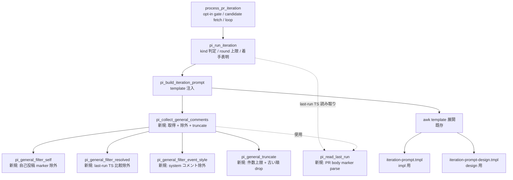

# Design Document

## Overview

**Purpose**: PR Iteration Processor (#26 / #35) が PR Conversation タブの一般コメントを
集める際に **`@claude` mention 必須**という暗黙のフィルタを撤廃し、人間レビュワーが mention
なしで残した指摘も Claude へ確実に届くようにする。これにより PR #53 で発生した「mention
無し general コメント 2 件が prompt から落ち、Claude が `ready-for-review` へ無対応のまま
昇格した」事故を再発させない。

**Users**: idd-claude を運用する maintainer（cron / launchd で `PR_ITERATION_ENABLED=true` を
有効化済み）と、その対象 repo に PR レビューを書く collaborator。レビュワーは
mention 抜きでも自然な日本語で指摘を残せばよくなる。運用者は除外件数・除外理由カテゴリを
watcher ログで観測できる。

**Impact**: `pi_build_iteration_prompt` 内部の jq 式（`select(... test("@claude") ...)`）を
**自己投稿除外 + 過去 round 対応済み除外 + システムコメント除外**の 3 種フィルタへ差し替える。
prompt template（impl 用 / design 用）の見出し・説明文から「`@claude` mention 付き」文言を
排除する。`PR_ITERATION_ENABLED` opt-in 構造、ラベル遷移契約、hidden round marker、
`PR_ITERATION_HEAD_PATTERN` 等の env var、cron 登録文字列、exit code 規約は **一切変更しない**。
README / `repo-template/.claude/agents/project-manager.md` を本変更と同一 PR で更新し、
template との二重管理を避ける。

### Goals

- 一般コメントの取得方針を「`@claude` mention 必須」から「**原則すべて、ただし自己投稿・
  過去 round 対応済み・システムコメントは除外**」に切り替える（Req 1.1〜1.6）
- 自己投稿除外を **marker ベース**（cron 環境の GitHub user 同一性に依存しない方式）で実装する（Req 2.1）
- 過去 round 対応済み判定を **PR body の `last-run=ISO8601` を基準**に行い、初回 round（marker 不在）
  では除外を一切行わない（Req 2.2 / 2.3 / 2.4）
- 大量コメント時のコンテキスト圧迫を**件数上限 + 古い順 truncate** で防ぎ、削減事実を WARN ログと
  prompt 内表記で観測可能にする（Req 3.1〜3.4 / NFR 2.1 / NFR 2.2）
- impl PR / design PR の両 template と同一 builder で取り扱いを共通化する（Req 6.1〜6.4）
- README / PjM agent doc / repo-template を同一 PR 内で揃え、二重管理を排除する（Req 5.1〜5.5）

### Non-Goals

- line comment（`{{LINE_COMMENTS_JSON}}`）の収集ロジック変更（Out of Scope）
- review submission の summary text 取り込み（Out of Scope）
- 「`@claude` mention 必須」を opt-out で復活させる新規 env var の導入（Req 4.4 で明示禁止）
- GitHub Actions 版 workflow（`.github/workflows/issue-to-pr.yml`）への波及（local watcher 経路に閉じる）
- 設計 PR への Reviewer エージェント連携（impl 系限定の現状仕様を踏襲）
- 削減アルゴリズムを高度化する（reaction-base / reply-tree-base 等の判定は将来課題）

## Architecture

### Existing Architecture Analysis

PR Iteration Processor は `local-watcher/bin/issue-watcher.sh` 内の `pi_*` 関数群と、
`local-watcher/bin/iteration-prompt.tmpl` / `iteration-prompt-design.tmpl` の 2 種類の prompt
template から構成される単一 bash スクリプトのサブシステム。flock 境界内で Issue 処理ループと
直列実行される。

尊重すべき制約:

- **既存 env var / ラベル / cron 登録文字列の不変性**（CLAUDE.md「禁止事項」）
- **awk による template 展開**（`{{KEY}}` 行単独置換）の互換性
  - `{{GENERAL_COMMENTS_JSON}}` は「行全体が placeholder のみ」のテンプレ行を ENVIRON 経由で
    多行値に置換する設計。本変更後も同じ展開機構を流用する
- **PR body hidden marker `<!-- idd-claude:pr-iteration round=N last-run=ISO8601 -->`** の形式・
  更新タイミング・キー名（Req 4.1）。本変更で **読み取り**を増やすが、書き込み側は
  `pi_post_processing_marker` の現行実装をそのまま流用する
- **着手表明コメント marker `<!-- idd-claude:pr-iteration-processing round=N -->`**（Req 4.5）

解消する technical debt:

- jq 式 `select((.body // "") | test("@claude"; "i"))` が一般コメント取得時に **silent fail**
  しているケース（PR #53）の根本原因を取り除く
- prompt template と watcher 側の文言が「mention 必須」前提でドキュメントに残存している不整合
  （README / PjM agent doc / repo-template）を一掃

### Architecture Pattern & Boundary Map

採用パターン: **既存 `pi_build_iteration_prompt` の内部関数分割**（Extract Function refactor）。
新たな env var / 配置先ファイル追加は行わず、`pi_build_iteration_prompt` の jq パイプラインを
purpose 単位の **shell 関数 3 つ**に分解する。これにより自己投稿除外 / 過去 round 除外 /
truncate を独立にユニット境界で扱える。



**Architecture Integration**:

- 採用パターン: **bash 関数の単一責務分割**。新規 env var / 新規 process / 新規依存
  CLI は導入しない（NFR 1.1 / NFR 3.1）
- ドメイン／機能境界:
  - **Collector**（取得）: GitHub API から raw 一般コメント JSON を取る（既存ロジック流用）
  - **Filters**（除外）: 自己投稿 / 過去 round / event-style の 3 段。**順序固定で OR ではなく AND
    でないコメントのみ残す**（後述）
  - **Reducer**（削減）: 上限超過時のみ件数 truncate。通常時は no-op（Req 3.4）
  - **Reporter**（観測）: 各段の除外件数を変数に蓄積し、サマリ 1 行を WARN/INFO ログへ吐く
- 既存パターンの維持: opt-in gate / dirty working tree 検知 / flock 境界 / kind 判定 /
  round 上限判定 / template path 切替 / awk による placeholder 注入は **すべて従来どおり**
- 新規コンポーネントの根拠: フィルタ判定が 3 種に増えたため、`pi_build_iteration_prompt` 内に
  すべてインライン化すると関数が 80 行を超え保守しづらい。purpose 単位で抽出し、shellcheck
  のスコープ汚染も避ける

### Technology Stack

| Layer | Choice / Version | Role in Feature | Notes |
|-------|------------------|-----------------|-------|
| Frontend / CLI | （該当なし） | — | 本機能は watcher 内部処理のみ |
| Backend / Services | bash 4+ + `gh` + `jq` | watcher 関数群の実装 | 新規依存なし。`date` で TS 比較 |
| Data / Storage | PR body hidden marker（既存） | round / last-run 永続化 | 既存形式不変（Req 4.1） |
| Messaging / Events | GitHub API `/repos/.../issues/<n>/comments` | 一般コメント取得 | 既存呼び出し点をそのまま流用 |
| Infrastructure / Runtime | cron / launchd（既存） | watcher 起動 | 登録文字列不変（Req 4.6 / NFR 1.3） |

## File Structure Plan

本機能は単一 bash スクリプト + 2 template + ドキュメント数本の改修であり、新規ファイル追加は
行わない。

```
local-watcher/
└── bin/
    ├── issue-watcher.sh                 # pi_build_iteration_prompt 改修 + 新規 pi_collect_* 関数群
    ├── iteration-prompt.tmpl            # 一般コメント節の見出し・説明文 改稿（impl 用）
    └── iteration-prompt-design.tmpl     # 一般コメント節の見出し・説明文 改稿（design 用）

repo-template/
├── CLAUDE.md                            # 「PR Iteration の責務境界」節の文言（必要なら）整合更新
└── .claude/
    └── agents/
        └── project-manager.md           # 設計 PR ガイダンス内の「@claude mention 付き」文言更新

README.md                                # 「PR Iteration Processor (#26)」節の対象コメント記述を改稿
                                         #   + 「対象コメント」サブ節を新設（自己除外 / 過去 round 除外）
                                         #   + Migration Note に本変更の後方互換性を追記

docs/specs/55-feat-watcher-pr-iteration-general-commen/
├── requirements.md                      # 既存（PM 確定済み）
├── design.md                            # 本ファイル
└── tasks.md                             # 同 PR で確定
```

### Modified Files

- `local-watcher/bin/issue-watcher.sh` —
  - `pi_build_iteration_prompt`: 一般コメント取得部の jq `test("@claude")` を撤去し、新規ヘルパ
    `pi_collect_general_comments` を呼ぶ形に置換
  - 新規関数を追加（順序: 既存 `pi_build_iteration_prompt` の直前か直後）:
    - `pi_read_last_run`（PR body から `last-run=ISO8601` を抽出、無ければ空）
    - `pi_collect_general_comments`（取得 + 除外 + truncate のオーケストレーション）
    - `pi_general_filter_self`（marker ベース自己投稿除外、jq）
    - `pi_general_filter_resolved`（`created_at < last_run` 除外、jq）
    - `pi_general_filter_event_style`（GitHub system コメント除外、jq）
    - `pi_general_truncate`（件数上限と古い順 drop、jq + 注釈付加）
  - 観測性: `pi_log` / `pi_warn` で「取得 N 件 → 自己除外 a / 過去 round 除外 b / system 除外 c
    → truncate d → 最終 e 件」を 1 行サマリで出す（NFR 2.2）
- `local-watcher/bin/iteration-prompt.tmpl` —
  - 「## @claude mention 付き general コメント」見出しを「## PR の一般コメント (Conversation タブ)」へ変更
  - 説明文から「`@claude` mention 付き」文言を削除し、「watcher が自己投稿と過去 round で対応済みの
    コメントを事前除外している」「精読し、対応すべきと判断したものに修正 commit または返信を行う」
    旨を Claude の責務として明記（Req 1.6）
  - 「## あなたの責務」5 番目の `@claude mention 付き general コメントへの返信は ...` も
    「general コメントへの返信は ...」に改稿（Req 1.2）
  - 後段に「**注**: コメント数が `PI_GENERAL_MAX_COMMENTS`（既定 50）を超えると古いものから
    自動 truncate される。truncate 発動時は本節の冒頭に `[truncated: 採用 N / 元 M 件]` 注釈が
    入っている」旨を追記（Req 3.3）
- `local-watcher/bin/iteration-prompt-design.tmpl` —
  - impl 版と同じ書き換えを行う（Req 6.1）。Architect 責務節の表記揃えのみ調整
- `README.md` —
  - 「PR Iteration Processor (#26)」節の (1) (4) の記述から「`@claude` mention 付き」を削除
  - 「対象 PR の判定」直前に「**対象コメント**」サブ節を新設し、(a) 行コメント = 既存どおり、
    (b) 一般コメント = mention 不要・自己投稿除外・過去 round 除外・大量時 truncate を整理（Req 5.1 / 5.2）
  - `needs-iteration` ラベル節の「付与契機」行から `@claude` mention 表記を削除（Req 5.1）
  - Migration Note に「本変更で env var / ラベル / cron 文字列を壊さない」旨を 1 項目追加（Req 5.4）
- `repo-template/.claude/agents/project-manager.md` —
  - 第 36 行の「`@claude` mention general コメントを残してから ...」を「PR の一般コメント
    （mention 不要）を残してから ...」に書き換え（Req 5.3）
- `repo-template/CLAUDE.md` —
  - 132〜136 行の「PR Iteration の責務境界」節は文言上 `@claude` 表記が含まれていない。
    本変更では原則変更不要。ただし「対象コメント」表現を README に揃える必要が生じれば
    1〜2 行の追記を行う（最小修正）。実装時に diff を取り、必要なければ no-op で良い

## Requirements Traceability

| Req ID | Summary | Components | Interfaces | Flows |
|--------|---------|------------|------------|-------|
| 1.1 | mention 篩い分けを行わず原則すべて積む | `pi_collect_general_comments` | jq pipeline からの `test("@claude")` 撤去 | Collector → Filters（mention 判定なし） |
| 1.2 | mention 有無による特別扱いを一切しない | `pi_collect_general_comments` / 両 template | 関数本体・template 本文 | — |
| 1.3 | impl 用 template から「`@claude` mention 付き」文言排除 | `iteration-prompt.tmpl` | template 本文 | — |
| 1.4 | design 用 template から「`@claude` mention 付き」文言排除 | `iteration-prompt-design.tmpl` | template 本文 | — |
| 1.5 | コメント 0 件時に空配列 `[]` を渡す | `pi_collect_general_comments` | jq fallback `// []` | Collector 失敗時も `[]` |
| 1.6 | template が「精読し対応 or 返信」を Claude へ責務として明示 | 両 template | template 本文 | — |
| 2.1 | 自己投稿除外（着手表明 / エスカレ等） | `pi_general_filter_self` | jq `select(.body \| contains("idd-claude:"))` 否定 | Filters 第 1 段 |
| 2.2 | 2 回目以降の round で過去 round 対応済みを除外 | `pi_general_filter_resolved` | jq `select(.created_at < $last_run)` 否定 | Filters 第 2 段 |
| 2.3 | 「対応済み」境界 = `last-run` TS より前に作成されたコメント | `pi_read_last_run` / `pi_general_filter_resolved` | shell + jq | last-run 抽出 → TS 比較 |
| 2.4 | 初回 round（marker なし）は除外を一切行わない | `pi_general_filter_resolved` | last_run="" の場合 no-op | Filters 第 2 段 short-circuit |
| 2.5 | 同一 round 内で 1 度だけ prompt に渡す | `pi_run_iteration`（既存） | round の 1 iteration 構造を維持 | 設計変更なし |
| 2.6 | system 由来の event-style コメントを除外 | `pi_general_filter_event_style` | jq `select(.user.type != "Bot" or ...)` | Filters 第 3 段 |
| 2.7 | 除外判定は body 中の `@claude` 文字列に依存しない | 全フィルタ | jq から `test("@claude")` 完全撤去 | — |
| 3.1 | 大量コメントで圧迫しない削減手段 | `pi_general_truncate` | 件数上限 + 古い順 drop | Reducer 段 |
| 3.2 | 削減発動時に WARN ログ 1 行 | `pi_collect_general_comments` | `pi_warn` 呼び出し | Reporter |
| 3.3 | prompt に「一部のみ提示」「未提示は次 round / 人間」旨を含める | `pi_general_truncate` + 両 template | JSON 配列冒頭の `_meta` 注釈 + template 補足 | Reducer 段 + template |
| 3.4 | 通常ケースは欠落・truncate なし | `pi_general_truncate` | 上限以下なら no-op | Reducer 段 |
| 4.1 | hidden round marker 形式・キー名・更新タイミング不変 | `pi_post_processing_marker`（既存） | 変更なし | — |
| 4.2 | ラベル遷移契約（needs-iteration → ready/awaiting-design/claude-failed）不変 | `pi_finalize_labels*` / `pi_escalate_to_failed`（既存） | 変更なし | — |
| 4.3 | `PR_ITERATION_ENABLED=false` で完全 skip | `process_pr_iteration`（既存） | opt-in gate | — |
| 4.4 | `@claude` mention 必須を opt-out で復活させる新規 env var を追加しない | （該当なし） | env var 一覧不変 | — |
| 4.5 | 着手表明 marker 文字列形式不変 | `pi_post_processing_marker`（既存） | 変更なし | — |
| 4.6 | 既存 env var 名・既定値・意味不変 | bash 冒頭 config block（既存） | 変更なし | — |
| 5.1 | README から `@claude` 文言削除 + 対象コメント書き換え | `README.md` | 文書 | — |
| 5.2 | README に自己除外 / 過去 round 除外を明記する「対象コメント」節 | `README.md` | 文書 | — |
| 5.3 | `repo-template/.claude/agents/project-manager.md` の文言更新 | `project-manager.md` | 文書 | — |
| 5.4 | README に後方互換性破壊なしの記述追加 | `README.md` Migration Note | 文書 | — |
| 5.5 | ドキュメント更新と実装が同一 PR | （PjM 領分） | PR 構成 | — |
| 6.1 | impl / design 両 template が同一規約で書かれる | 両 template | 文言揃え | — |
| 6.2 | impl PR / design PR で `{{GENERAL_COMMENTS_JSON}}` 生成ロジック共通化 | `pi_collect_general_comments` | kind 引数なしで共通呼び出し | — |
| 6.3 | design 用 template の編集スコープ規約・返信先規約は引き続き保持 | `iteration-prompt-design.tmpl` | template 本文（既存節を温存） | — |
| 6.4 | impl 用 template の commit / push / 返信規約は引き続き保持 | `iteration-prompt.tmpl` | template 本文（既存節を温存） | — |
| NFR 1.1 | 既存 env var / ラベル名・既定値・意味不変 | （全関数） | — | — |
| NFR 1.2 | exit code / サマリ 1 行形式不変 | `process_pr_iteration`（既存） | サマリ format 不変 | — |
| NFR 1.3 | cron / launchd 登録文字列不変 | （該当なし） | — | — |
| NFR 1.4 | repo-template ラベルセット名・色・意味不変 | `idd-claude-labels.sh`（既存） | 変更なし | — |
| NFR 2.1 | 除外件数・カテゴリが追跡可能なログ出力 | `pi_collect_general_comments` | `pi_log` / `pi_warn` | Reporter |
| NFR 2.2 | 1 round の対象 / 除外 / 最終件数を後追い把握できる粒度 | `pi_collect_general_comments` | 1 行ログ | Reporter |
| NFR 3.1 | shellcheck 警告ゼロ | bash 全体 | static check | — |
| NFR 3.2 | dry run（処理対象なし）が正常終了 | bash 全体 | smoke test | — |
| NFR 3.3 | PR #53 等価 fixture で当該コメントが Claude に届く | dogfood E2E | manual smoke | — |

## Components and Interfaces

### Iteration Prompt Builder（watcher 関数層）

#### `pi_collect_general_comments`（新規）

| Field | Detail |
|-------|--------|
| Intent | PR の一般コメントを取得し、3 段フィルタ + 削減を経て JSON 配列を返す |
| Requirements | 1.1, 1.2, 1.5, 1.6, 2.x, 3.x, 6.2, NFR 2.1, NFR 2.2 |

**Responsibilities & Constraints**

- 主責務: GitHub API `/repos/${REPO}/issues/${pr_number}/comments` を 1 回叩き、得られた配列に
  3 段フィルタ（自己 / 過去 round / system）を順次適用、最後に件数 truncate を適用
- ドメイン境界: **コメント取得 + 除外 + 削減のオーケストレーション** のみを担う。template
  注入は呼び出し元 `pi_build_iteration_prompt` に残す
- データ所有権・invariants:
  - 出力 JSON は常に有効な JSON 配列文字列（取得失敗時も `[]`）
  - kind（design/impl）に依存する分岐を持たない（Req 6.2）
  - **副作用は WARN/INFO ログのみ**。GitHub API への書き込みは行わない

**Dependencies**

- Inbound: `pi_build_iteration_prompt` — 一般コメント JSON を要求する（Critical）
- Outbound:
  - `pi_read_last_run` — last-run TS を取得（Critical / 失敗時は空文字列で初回 round 扱い）
  - `pi_general_filter_self` / `_resolved` / `_event_style` / `_truncate` — 各段のフィルタ（Critical）
  - `gh api` — GitHub REST API（Critical / 失敗時は空配列でフォールバック）
  - `jq` — JSON 加工（Critical）
- External: GitHub REST API（Critical / `PR_ITERATION_GIT_TIMEOUT` 秒で打ち切り、既存方針）

**Contracts**: Service [x] / API [ ] / Event [ ] / Batch [ ] / State [ ]

##### Service Interface（bash 関数）

```bash
# Inputs (positional):
#   $1: pr_number    (e.g. "53")
#   $2: pr_body      (gh pr view --json body --jq '.body // ""' で取得済みの文字列)
# Output (stdout): JSON array string of comments after filter + truncate.
#                  Schema per element: { id, user, body, url, created_at }
#                  Empty array "[]" when no comments or fetch failed.
# Exit code: 0 always (errors are degraded to "[]" + WARN log).
# Side effects:
#   - WARN/INFO log lines via pi_log / pi_warn (component: pr-iteration)
#   - Reads $REPO, $PR_ITERATION_GIT_TIMEOUT, $PI_GENERAL_MAX_COMMENTS
pi_collect_general_comments() { ... }
```

- Preconditions: `gh` 認証済み / `jq` 利用可能 / `$REPO` 設定済み
- Postconditions: 出力は JSON Array として `jq -e .` で valid と判定される
- Invariants: kind に依存しない / `@claude` 文字列を判定式に使わない / 失敗時も呼び出し元を
  止めない（degraded path）

##### ログ出力フォーマット（NFR 2.1 / 2.2）

```
[YYYY-MM-DD HH:MM:SS] pr-iteration: PR #N general comments: fetched=F, filtered_self=A, filtered_resolved=B, filtered_event=C, truncated=D, final=E
```

- truncate 発動時は末尾を `truncated=D (limit=L)` とし、**`pi_warn`** で出す
- truncate 非発動時は `pi_log`（INFO）で出す（NFR 2.2 を満たすため、通常時もサマリは残す）

#### `pi_read_last_run`（新規）

| Field | Detail |
|-------|--------|
| Intent | PR body から `last-run=ISO8601` を 1 つ抽出し stdout に出力（無ければ空） |
| Requirements | 2.3, 2.4 |

**Responsibilities & Constraints**

- 入力: `$1` = PR body 文字列
- 出力: ISO8601 文字列（例: `2026-04-25T12:34:56Z`）または空文字列
- 複数 marker が見つかった場合は **末尾（最新）の値**を採用（既存 `pi_read_round_counter` と
  整合 = `tail -1`）。これは `pi_post_processing_marker` が `sed -E s|...|...|g` で置換するため
  通常 1 つしか存在しないが、運用ミスでの fail-safe を踏襲
- regex: `idd-claude:pr-iteration round=[0-9]+ last-run=([^ >]+)`

**Dependencies**

- Inbound: `pi_collect_general_comments`
- Outbound: `grep` / `sed`（既存依存）

**Contracts**: Service [x]

```bash
# pi_read_last_run "$pr_body"   ->  stdout: "<ISO8601>" or ""
```

#### `pi_general_filter_self`（新規）

| Field | Detail |
|-------|--------|
| Intent | watcher 自身の自動投稿コメントを除外する（Req 2.1） |
| Requirements | 2.1, 2.7 |

**Responsibilities & Constraints**

- 判定基準: **コメント body 中に `idd-claude:` で始まる HTML hidden marker を含む**なら
  watcher 投稿として除外（marker ベース、Req 2.1）。GitHub user 同一性には依存しない
- 検出対象 marker（網羅）:
  - `idd-claude:pr-iteration-processing round=N`（着手表明）
  - `idd-claude:pr-iteration round=N last-run=...`（PR body 内 marker だが、PR body と一般
    コメントは別エンドポイントなので衝突しない。fail-safe で含める）
  - `idd-claude:pr-iteration` 系全般（将来の marker 拡張に対応するため、prefix `idd-claude:`
    を含む comment を除外する）
- jq 式: `select((.body // "") | contains("idd-claude:") | not)`
  - `contains` を使い、`@claude` 等の前方部分一致で誤除外しないよう **大文字小文字 sensitive**
- author ベース判定は **副次的に併用しない**（Req 2.7 / Issue 論点 2 の決定通り）

**Contracts**: Service [x]

```bash
# pi_general_filter_self <<< '<json-array>'   ->  stdout: '<filtered-json-array>'
# Implementation: pipe through `jq '[.[] | select(...)]'`
```

#### `pi_general_filter_resolved`（新規）

| Field | Detail |
|-------|--------|
| Intent | 過去 round の `last-run` TS より前に作成されたコメントを除外（Req 2.2 / 2.3） |
| Requirements | 2.2, 2.3, 2.4, 2.5, 2.7 |

**Responsibilities & Constraints**

- 入力: 一般コメント JSON 配列（stdin）+ `last_run` ISO8601 文字列（jq `--arg`）
- 判定: `last_run == "" || .created_at >= last_run` を満たすコメントのみ採用
  - **初回 round（marker なし）= `last_run` 空文字列 = 全件採用**（Req 2.4）
  - 比較は **ISO8601 lexicographic compare**（jq の文字列比較）。GitHub の `created_at` は
    すべて UTC `Z` 終端の ISO8601 で揃うため辞書順比較で正しい
  - **境界条件**: `created_at == last_run` のコメントは「`last-run` 時点で既に存在していた」可能性が
    高いため、**`>=` ではなく `>`** を採用する。同 round 内で次の watcher サイクルが回ったときの
    再取り込みを防ぐ（fail-safe を採用済み側に倒す）
- multi-day round 対応: round が複数日にまたがる（CI 待ち等）場合でも、`last-run` は **当該
  round の着手時刻**で更新済み（`pi_post_processing_marker`）。round 着手後・iteration 起動前
  までに付いたコメントは `created_at > last_run` で正しく拾える
- TS ずれ対応: GitHub 側 TS とローカル時計のズレは GitHub API が返す `created_at` を信頼源と
  し、`last-run` も watcher 自身が UTC で打刻している（`date -u '+%Y-%m-%dT%H:%M:%SZ'`）。
  両者が UTC ISO8601 同士の比較なら数秒のスキューしか生じず、誤除外境界は実害がない範囲

**Contracts**: Service [x]

```bash
# pi_general_filter_resolved "<last_run>" <<< '<json-array>'  ->  '<filtered-json-array>'
```

#### `pi_general_filter_event_style`（新規）

| Field | Detail |
|-------|--------|
| Intent | GitHub system が返す event-style コメントを除外（Req 2.6） |
| Requirements | 2.6, 2.7 |

**Responsibilities & Constraints**

- 対象 endpoint `/repos/.../issues/<n>/comments` は基本的にユーザーコメントしか返さないため、
  本フィルタは **保険的位置付け**（Req 2.6 を観測可能に保つため）
- jq 式: `select((.user.type // "") != "Bot" and (.body // "") != "")`
  - `body == ""` の event-style 通知（API がたまに返す noisy 行）を除外
  - **GitHub Actions / app bot は除外**したいが、`watcher 自身の投稿は marker で既に除外済み`
    のため、ここでは `Bot` 全般を除外しても二重除外にならず安全
  - 将来 trusted-bot allow-list を作る必要が出たら本関数を拡張する箇所として確保
- カテゴリ集計のため除外件数を呼び出し元で別変数として保持

**Contracts**: Service [x]

#### `pi_general_truncate`（新規）

| Field | Detail |
|-------|--------|
| Intent | 件数上限超過時に古い順に drop し、注釈付き JSON を返す（Req 3.x） |
| Requirements | 3.1, 3.2, 3.3, 3.4 |

**Responsibilities & Constraints**

- 上限値: `PI_GENERAL_MAX_COMMENTS`（**新規 shell 内定数、env override 可**、既定 `50`）
  - **新規 env var 追加に該当するか**: 該当しない。**最低限の運用ノブ** として shell 定数で
    宣言するが、README には記載しない（Req 4.4 が禁ずるのは「mention 必須を opt-out で復活
    させる env var」であり、本変数は別目的）。Migration Note にも書かない（運用上 default の
    50 で十分）
- アルゴリズム:
  1. 入力配列 length が `MAX` 以下 → no-op で素通り（Req 3.4）
  2. length > MAX → **`created_at` で昇順ソート → 末尾 MAX 件を採用**（= 古い順 drop）
     - 「新しいものが残る」運用ロジック。同一 round 内で「直前に追加された指摘 = レビュワーが
       期待する応答対象」を優先
- 注釈付加: 配列の **先頭に sentinel 要素**を 1 件挿入する形式は使わず、prompt template 側に
  「一般コメントの一部のみが提示されている可能性があります」旨の文言を**常に**含める（template
  改修側で対応、Req 3.3）。watcher は **truncate 発動時のみ WARN ログ 1 行**を出す（Req 3.2）
  - 設計判断: JSON に `_meta` を混ぜる案も検討したが、prompt の JSON スキーマ（`{id, user, body, url, created_at}`）を歪める。template 側の文言で十分（Claude は
    template 文字列を読めばよい）
  - watcher は ログ + WARN で観測可能
- 出力: 採用された JSON 配列（同一スキーマ）

**Contracts**: Service [x]

```bash
# pi_general_truncate "<limit>" <<< '<json-array>'   ->  '<json-array>'
# Side effect: stdout: comma-separated counts written to stderr only on truncate? — NO,
#              the caller logs the summary; this fn only returns the array.
# Exit code: 0
```

### Prompt Templates

#### `iteration-prompt.tmpl`（impl 用、改修）

| Field | Detail |
|-------|--------|
| Intent | impl PR の Developer 役割 prompt。一般コメント節の対象範囲記述を改稿 |
| Requirements | 1.3, 1.6, 3.3, 6.1, 6.4 |

**改稿セクション（要点）**:

- 見出し `## @claude mention 付き general コメント (JSON 配列)` →
  `## PR の一般コメント (Conversation タブ、JSON 配列)`
- 直前の説明: 「watcher が事前に **(a) 自分自身の自動投稿** と **(b) 過去 round で対応済みの
  もの**（PR body の `last-run` TS より前に作成されたコメント） を除外しています。さらに
  コメント件数が `PI_GENERAL_MAX_COMMENTS` を超える場合は古いものから自動 truncate されます。
  本節の JSON が空配列でない場合、各コメントを精読し、対応すべきと判断したものに対して
  修正 commit または返信を行ってください」
- 「責務」5 番目: `@claude mention 付き general コメントへの返信は同一 PR の一般コメントとして投稿`
  → `general コメントへの返信は同一 PR の一般コメントとして投稿`（mention 表記削除、Req 1.2）

**Dependencies**

- Inbound: `pi_build_iteration_prompt` の awk 展開
- Outbound: なし（テンプレ静的）

**Contracts**: Service [ ] / API [ ] / Event [ ] / Batch [ ] / State [ ]（template ファイル）

#### `iteration-prompt-design.tmpl`（design 用、改修）

| Field | Detail |
|-------|--------|
| Intent | design PR の Architect 役割 prompt。impl 版と同じ書き換えを適用 |
| Requirements | 1.4, 1.6, 3.3, 6.1, 6.3 |

**改稿セクション（要点）**:

- 見出し置換は impl 版と同一
- 「責務」6 番目（`@claude mention 付き general コメントへの返信は ...`）も同様に mention 表記削除
- design 用に追加で保持する記述: 編集許容スコープ `{{SPEC_DIR}}` 配下のみ・返信先 = 同一 PR の
  一般コメント（Req 6.3）。ここは現行のまま温存

### Documentation Surface

#### `README.md` の「PR Iteration Processor (#26)」節

| Field | Detail |
|-------|--------|
| Intent | 利用者・運用者向けの公式仕様。本変更後の対象コメント範囲を明示 |
| Requirements | 5.1, 5.2, 5.4 |

**改稿/追加箇所**:

1. (1) 行コメント / **mention 不要の一般コメント**を Claude に渡し（既存「`@claude` mention」
   表記を削除）
2. (4) ラベル遷移 `needs-iteration → ready-for-review`（既存どおり）
3. **新設サブ節「対象コメント」**:
   - 行コメント: 最新 review の `/pulls/<n>/reviews/<id>/comments`（既存）
   - 一般コメント: `/issues/<n>/comments` を全件取得し、(a) watcher 自己投稿（hidden marker
     `idd-claude:` を含む）、(b) PR body の `last-run` TS より前に作成されたもの（過去 round
     対応済み相当）、(c) GitHub system 由来の event-style コメントを除外。残数が
     `PI_GENERAL_MAX_COMMENTS`（既定 50）を超える場合は古い順に truncate
4. `needs-iteration` ラベル節の「付与契機」表記から `@claude` mention を削除
5. Migration Note に「一般コメントフィルタの緩和」を 1 項目追記（既存 env var / ラベル / cron
   登録文字列・round marker 形式を壊さない旨を明記、Req 5.4）

#### `repo-template/.claude/agents/project-manager.md`

| Field | Detail |
|-------|--------|
| Intent | consumer repo の PjM agent ガイダンス。設計 PR 案内文を整合 |
| Requirements | 5.3 |

- 第 36 行: `line コメント / `@claude` mention general コメントを残してから ...` →
  `line コメント / **mention 不要の一般コメント**を残してから ...`

#### `repo-template/CLAUDE.md`

`@claude` 文言は確認済み（grep で hit せず）。原則変更不要。万一 README との表現整合で
1〜2 行追記が必要なら同一 PR で対応（最小修正）。

## Data Models

### Domain Model

- **GeneralComment（取得時）**: GitHub REST が返す JSON object のうち、watcher が利用するキー:
  - `id` (number) / `user.login` (string) / `user.type` (string, "User" | "Bot") /
    `body` (string) / `html_url` (string) / `created_at` (string, ISO8601 UTC)
- **GeneralComment（template 注入時）** = jq で射影した形:
  ```json
  { "id": <n>, "user": "<login>", "body": "<text>", "url": "<html_url>", "created_at": "<iso8601>" }
  ```
  - **`created_at` を新たにスキーマに含める**（既存スキーマには無かった）。Claude prompt 上の
    一般コメント節のスキーマ説明文も更新する（Req 1.6 とセット）
- **PR Body Round Marker**（既存）: `<!-- idd-claude:pr-iteration round=N last-run=ISO8601 -->`
  - キー名・形式・更新タイミングは Req 4.1 に従い変更しない
  - 本機能では **読み取り専用**で `last-run` を抽出する（書き込み側は既存 `pi_post_processing_marker` のまま）

### Logical / Physical Data Model

該当なし（永続化先は GitHub PR body の単一 marker、既存通り）。

## Error Handling

### Error Strategy

watcher 全体の誤動作を防ぐため、本機能内の失敗は **degraded path（空配列フォールバック + WARN
ログ）** に倒す。iteration 全体の中断は呼び出し元 `pi_run_iteration` の既存ハンドリング（Claude
exit 非 0 / push 失敗 / fetch 失敗）に委ねる。

### Error Categories and Responses

- **GitHub API timeout / 5xx**（System Error）:
  - `gh api ... 2>/dev/null` が non-zero 終了 → `general_comments_json="[]"` で続行（既存 fall-back を踏襲）
  - WARN ログ: `pr-iteration: PR #N: 一般コメント取得に失敗、空配列で続行`
- **PR body の last-run parse 失敗**（System Error）:
  - regex が match しない → `last_run=""` として扱い、初回 round 相当（除外なし）で続行（Req 2.4）
  - WARN ログ: 出さない（marker 不在は正常ケース）
- **jq pipeline 失敗**（System Error）:
  - jq が non-zero 終了 → `set -euo pipefail` のままだと watcher 全体が落ちる。`pi_collect_general_comments`
    は `{ ... } || echo "[]"` 形式で fall-back し、WARN ログを残す
- **truncate 発動**（Business Logic Notice）:
  - WARN ログ 1 行: `pr-iteration: PR #N general comments: fetched=F ... truncated=D (limit=50)`
  - エラーではない（Req 3.1 に従う degraded 動作）

## Testing Strategy

本リポジトリには unit test framework が無いため、**静的解析 + 手動スモーク + dogfood E2E**
の組み合わせで検証する（CLAUDE.md「テスト・検証」節）。

- **Unit-level（手動 fixture）**:
  1. `pi_read_last_run`: marker 有り body / 無し body / 複数 marker（運用ミス想定）の 3 fixture
     を `bash -c 'source issue-watcher.sh; pi_read_last_run "$body"'` で叩いて期待 TS が出ることを確認
  2. `pi_general_filter_self`: 自己投稿（marker 含む）/ 通常 user / `@claude` 文言だけのユーザー
     コメント の 3 件混合を入力にして、自己投稿のみ落ちることを確認（Req 2.1 / 2.7）
  3. `pi_general_filter_resolved`: `last_run` 設定時に過去コメントが落ち、`last_run=""` 時に
     全件残ることを確認（Req 2.4）
  4. `pi_general_truncate`: 51 件入力で 50 件残り、最古 1 件が落ちることを確認（Req 3.1 / 3.4）
  5. `pi_general_filter_event_style`: `user.type=="Bot"` / `body==""` のいずれかで落ちることを確認

- **Integration（pi_collect_general_comments）**:
  1. `gh api` を `function gh() { cat fixture.json; }` のシェル関数で stub し、初回 round
     fixture（marker 無し / コメント 5 件、うち 1 件は自己投稿）→ 4 件出力
  2. 2 回目 round fixture（marker 有り `last-run=2026-04-20T00:00:00Z`、コメント 5 件で過去 3 件 +
     新規 2 件）→ 新規 2 件のみ出力
  3. 大量 fixture（55 件、自己投稿 5 件混在）→ 自己除外で 50 件、truncate 不要で 50 件出力 +
     INFO ログ。同 fixture を 60 件にすると truncate 発動 + WARN ログ

- **E2E（dogfood）**:
  1. **PR #53 等価 fixture**: 当 repo に test PR を立て、mention 無しの一般コメント 2 件 +
     `needs-iteration` を付与。watcher を `PR_ITERATION_ENABLED=true` で 1 サイクル走らせ、
     prompt log（`$LOG_DIR/pr-iteration-impl-<n>-round<r>-*.log`）に当該コメント 2 件が含まれる
     ことを目視確認（Req NFR 3.3）
  2. dry run: `REPO=owner/test REPO_DIR=/tmp/test-repo $HOME/bin/issue-watcher.sh` で
     「処理対象の Issue なし」相当に正常終了（Req NFR 3.2）
  3. 設計 PR 経路: `PR_ITERATION_DESIGN_ENABLED=true` でも同一 builder が使われることをログで確認

- **Static Analysis**:
  - `shellcheck local-watcher/bin/issue-watcher.sh` 警告ゼロ（Req NFR 3.1）
  - `actionlint` は本変更で workflow YAML を触らないため不要

## Migration Strategy / Backward Compatibility

本変更は **後方互換性を完全に維持**する。Migration Note を README に 1 ブロック追加するに
留める（破壊的変更は無し）。

| 項目 | 影響 | 対処 |
|------|------|------|
| 既存 env var（`PR_ITERATION_*` / `ITERATION_TEMPLATE*` / `LABEL_*` 等） | なし | 名前・既定値・意味すべて不変 |
| cron / launchd 登録文字列 | なし | 既存 `PR_ITERATION_ENABLED=true ...` のまま動作 |
| `needs-iteration` ラベル | なし | 名前・色・付与契約・遷移先すべて不変 |
| PR body hidden marker | なし | 形式・キー名・更新タイミング不変。`last-run` を新たに **読み取り**するが書き込み側に変更なし |
| 既存 PR の round counter | なし | 既存 marker をそのまま読む |
| GitHub Actions 版 workflow | 対象外 | 本要件は local watcher 経路に閉じる（Out of Scope） |
| consumer repo の re-install | 推奨 | `repo-template/.claude/agents/project-manager.md` の文言更新は consumer repo に再 install 後に反映される。`install.sh` の冪等性を踏襲 |

新設の **shell 内部定数** `PI_GENERAL_MAX_COMMENTS`（既定 50）は env override 可能だが、
README の env var 表には載せない（運用上 default で十分・Issue 論点 3 で「合理的な値」確定）。
将来チューニングが必要になったら README に昇格させる。

## Risk & Mitigation

| Risk | Likelihood | Impact | Mitigation |
|------|------------|--------|------------|
| `last_run` TS 比較で **同 round 内のコメントを誤除外**（境界に等しいケース） | Low | Med | `>=` ではなく `>` を採用し、境界は **採用側に倒す**。実測でズレ問題が出たら次 PR で TS のミリ秒精度化を検討 |
| Multi-day round（CI 待ち等で round が長期化）で `last-run` 後に増えた指摘の取り扱い | Low | Low | round 開始時刻 = `last-run` で既に正しく分離されているため設計上問題なし。テスト fixture #2 でカバー |
| `gh api` の `created_at` がタイムゾーン込みで UTC `Z` 終端でない場合 | Very Low | Low | GitHub API は ISO8601 UTC `Z` 固定（Public 仕様）。検出は手動 fixture で確認 |
| 自己投稿 marker prefix `idd-claude:` が将来の人間レビュワーコメントと衝突 | Very Low | Low | hidden HTML comment 内に書く運用前提。万一誤検出が発生したら author allow-list を追加（本 PR では実施しない） |
| `PI_GENERAL_MAX_COMMENTS=50` が現実 PR で頻繁に超過 | Low | Low | WARN ログで観測可能。閾値を README に記載していないので env override で逃げ道あり |
| iteration が空回り（フィルタ後 0 件で Claude が「対応なし」と判断） | Low | Med | 0 件は **正当な状態**（過去 round で全部対応済み等）。template に「コメントがなければ commit/push せず exit 0」を明記済み（既存挙動を踏襲） |
| 大量 truncate で重要な指摘が drop される | Low | Med | template が「未提示分は次 round / 人間に委ねる」旨を必ず記載（Req 3.3）。WARN ログから運用者が観測可能 |
| docs と watcher の二重管理 | Low | High | Req 5.5 で「同一 PR でないと merge 候補としない」を PjM に課す（既存ルール踏襲） |

## 確認事項（レビュワー判断ポイント）

設計 PR レビュワーは以下を判断してください:

1. **論点 1 の決定（採用案 A: `last-run=TS` 基準 / 境界 `>` 採用）**: TS lex 比較 + UTC `Z` 終端
   前提で十分か。GitHub API が稀に丸め誤差で `Z` を欠落させる挙動を観測したら別 Issue で対応する
2. **論点 2 の決定（採用案 A: marker ベース自己投稿除外）**: `idd-claude:` prefix を含む
   コメントを除外する方針で良いか。author ベース判定を併用しないことの是非
3. **論点 3 の決定（採用案 A: `PI_GENERAL_MAX_COMMENTS=50` + 古い順 drop）**: 50 件・古い順
   drop で運用上十分か。新しい順を残すロジックでよいか（直近の指摘がレビュワー期待）
4. **論点 4 の決定（採用案 A: `@claude` mention 完全廃止）**: template 内・README 内・
   PjM agent doc 内のすべての `@claude` 文言を消す方針で良いか。注目度ヒントとして残す代替案を
   採らないことの是非
5. **`PI_GENERAL_MAX_COMMENTS` を env var として README に載せるか**: 本 PR では shell 内部
   定数（env override 可だが README 非掲載）として導入する方針。掲載すべきと判断する場合は
   別タスクで追記
6. **`pi_read_last_run` を新規関数として独立させるか、`pi_collect_general_comments` 内に
   インライン化するか**: 独立化を採用（理由: shellcheck SC2030 等の局所スコープ警告を避け、
   テスト fixture から直接呼び出せる）
