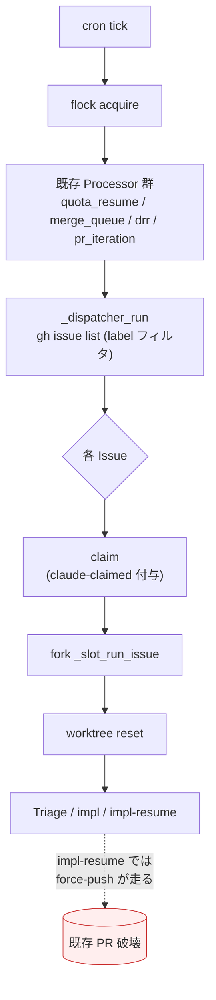
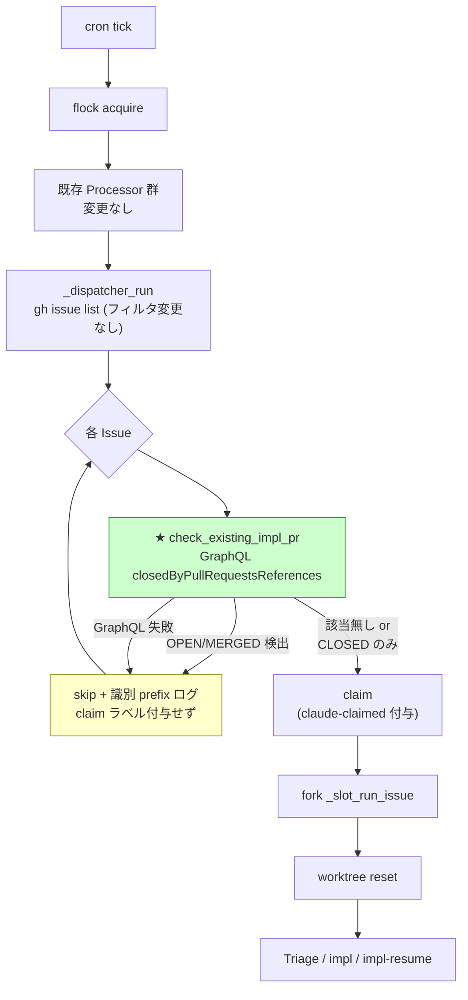
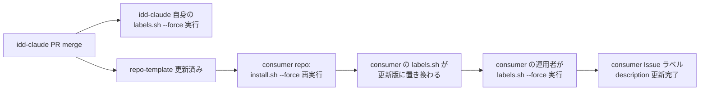

# Design Document

## Overview

**Purpose**: 本機能は、`claude-failed` ラベル付き Issue から人間が手動復旧した際に
watcher が次の cron tick で再 pickup して既存の手作りした実装 PR を `force-push` で
破壊する事故（2026-04-29 / Issue #52 復旧時に PR #62 が orphan 化）を、(a) 復旧手順の
明文化と、(b) Issue pickup 直後における **既存 impl PR 検出による skip ガード** の
2 層で再発防止することを、idd-claude 利用者（watcher 運用者）に提供する。

**Users**: idd-claude を repo に install して watcher を cron / launchd で稼働させて
いる運用者全員。特に、`claude-failed` 状態の Issue を手動復旧する場面で本変更の
ガード効果を享受する。

**Impact**: 現在の watcher は Issue claim 直前に既存 impl PR の存在を一切確認せず
impl-resume を起動するため、人間が復旧手順を間違えると force-push で既存 PR を
壊す。本変更により watcher は **Issue claim 前に linked impl PR を GraphQL で確認**
し、OPEN / MERGED があれば当該サイクル内で skip する。`claude-failed` 復旧時の
事故耐性を構造的に保証する。既存 env var / ラベル名 / cron 登録文字列 / exit code
意味は一切変更しない（NFR 1.1〜1.4）。

### Goals

- watcher が Issue claim 前に GraphQL で linked impl PR を検出し、OPEN / MERGED の
  ときは当該サイクルを skip する（Req 1.1〜1.7）
- `claude-failed` ラベル description / escalation コメント / README に手動復旧手順
  （`ready-for-review` 先付与 → `claude-failed` 除去）を明文化する（Req 2 / 3 / 4）
- 既存 OPEN impl PR / 既存 CLOSED impl PR の 2 ケースで dogfood test 手順を確立する
  （NFR 3.3 / 3.4）
- shellcheck / actionlint クリーン維持、既存 cron / launchd 登録文字列を 1 文字も
  変更しない（NFR 1, NFR 3.1, NFR 3.2）

### Non-Goals

- Reviewer parse-failed そのものの修正（Issue #63 の責務）
- impl-resume の force-push 挙動全般の見直し（impl-resume の正規動作として維持）
- 設計 PR (`claude/issue-<N>-design-*`) の close / merge 自動連動（Issue #40 / DRR 責務）
- `claude-failed` 除去時に `ready-for-review` を自動付与する仕組み（要件本文の対策 3。
  本要件では Req 1 の watcher 側 PR 検出で代替する）
- linked PR 検出 skip を bypass する明示的 opt-out フラグ（運用上必要になった時点で
  別 Issue で検討）
- 同一 Issue に複数 impl PR が存在する場合の優先度判定の詳細（state 判定上は OPEN >
  MERGED > CLOSED の包含関係で十分。MERGED 1 件 + CLOSED 1 件は MERGED で skip、
  OPEN 1 件 + 他は OPEN で skip）
- 過去の事故ログ（PR #62 orphan 化）のバックフィル / 修復

---

## Architecture

### Existing Architecture Analysis

現在の watcher は `local-watcher/bin/issue-watcher.sh` の単一 bash スクリプトで、
cron tick 単位で起動される pull 型ポーリング Worker。Phase C（#16 / `_dispatcher_run`）
で導入された Dispatcher → Slot Runner 構造を取る:

```
cron tick → flock → process_quota_resume → process_merge_queue
                  → process_merge_queue_recheck → process_pr_iteration
                  → process_design_review_release
                  → _dispatcher_run
                       ↓ gh issue list (フィルタ済み候補)
                       ↓ for each issue:
                       │   → claim (claude-claimed 付与)         ← ★ 事故起点
                       │   → fork ( _slot_run_issue )
                       │       → worktree reset
                       │       → SLOT_INIT_HOOK
                       │       → Triage / impl / impl-resume
                       │       → run_impl_pipeline
                       │           → Stage A → B → A' → B' → C
                       └ wait
```

事故根因（要件本文の整理）:

1. **Dispatcher の claim 前に linked impl PR の確認が無い**: `_dispatcher_run` は
   `gh issue list` のラベル排除フィルタ（`-label:auto-dev` 系）のみで pickup を判定
   しており、PR の存在は一切見ない。
2. **claude-failed 除去だけでは不十分**: 復旧時に `ready-for-review` が付かないと、
   `auto-dev` のみが残った Issue は次 tick で再 pickup される。
3. `_slot_run_issue` は `EXISTING_SPEC_DIR` で spec dir 検出 → impl-resume モード
   判定を行うが、これは「設計 PR merge 済みかつ docs/specs が main にある」かの
   判定であり、実装 PR の存在は見ていない。

尊重すべき制約:

- **既存 cron 登録文字列 / 既存 env var 名 / ラベル名 / exit code 意味の不変性**
  （NFR 1.1〜1.4）。
- **Phase C Dispatcher の API**: `_dispatcher_run` のループ構造、`_slot_acquire` /
  `_slot_release` のセマンティクス、`gh issue list` のフィルタ条件を変えない。
- **既存 Processor との直交性**: DRR / PR Iteration / Phase A は PR 集合を扱い、
  Dispatcher は Issue 集合を扱う。本機能は Dispatcher 内（Issue per-iteration）に
  追加するスキャン段階で、既存 Processor の挙動には触れない。

技術債解消:

- 既存 `stage_checkpoint_find_impl_pr`（`gh pr list --head "$BRANCH"`）は **Stage
  Checkpoint Resume (#68) の opt-in 機能** であり、worktree reset 後 / claim 後に
  動く。これは「同じ branch に既に PR があったらパイプライン途中で停止」の責務で、
  「claim 前に Issue ↔ PR 連携を見て Dispatcher を skip させる」責務とは別。本機能は
  GraphQL `closedByPullRequestsReferences` で Issue 視点の linked PR を取得する別経路を
  追加する（責務分離）。

### Architecture Pattern & Boundary Map

採用パターンは **既存 Phase C Dispatcher の per-issue ループ内に Pre-Claim Filter
を 1 段挿入する** 局所追加。

#### 変更前のフロー



#### 変更後のフロー



**Architecture Integration**:

- 採用パターン: **Pre-Claim Filter（Dispatcher 内 per-issue ループに新関数を 1 段挿入）**
  - 既存の Phase C Dispatcher セマンティクス（claim → fork → wait）を変えず、claim の
    前に「Issue → PR の整合性チェック」を 1 段追加するだけ。
- ドメイン／機能境界:
  - **Issue Linkage Probe**: GraphQL `closedByPullRequestsReferences` で linked PR を取得し、
    OPEN / MERGED / CLOSED の判定と impl PR / design PR 区別を行う。新規関数
    `check_existing_impl_pr` の単一責務。`_dispatcher_run` から呼ばれる。
  - **Recovery Documentation**: ラベル description / escalation コメント / README の
    文言更新。実装ロジックには触れず、文字列のみ変更する。
- 既存パターンの維持:
  - `dispatcher_log` / `dispatcher_warn` の logger 形式を踏襲（識別 prefix
    `pre-claim-probe:` を追加）
  - `timeout <sec> gh ...` ラッパの規律（DRR / Phase A 流用）
  - opt-in / opt-out 思想（本機能は **既定 ON**。要件 NFR 1.5 で「impl PR 不在の通常
    運用では本機能導入前と同一挙動」が要求されているため、existing PR 不在＝既存挙動
    100% 互換、existing PR ありのケースのみ skip。後方互換性を破らない設計）
- 新規コンポーネントの根拠:
  - `check_existing_impl_pr` 関数: Dispatcher の per-issue ループから 1 回呼ぶだけの
    単一目的。logger / GraphQL クエリ / 判別ロジックを 1 関数に閉じ込めることで責務
    境界を明確化し、shellcheck / dogfood test の対象を最小化する。
  - 既存の `stage_checkpoint_find_impl_pr` を再利用しない理由: それは
    `gh pr list --head "$BRANCH"` で branch 名から PR を引く（branch ベース）。本機能は
    Issue → PR の関連を GraphQL で正引きする（issue-number ベース）。スコープ・呼び
    出し位置・取得 API がすべて異なるため別関数として配置する。

### Technology Stack

| Layer | Choice / Version | Role in Feature | Notes |
|-------|------------------|-----------------|-------|
| CLI / Orchestration | bash 4+ | Dispatcher / Pre-Claim Filter / Logger | 既存スクリプトに追記 |
| External API | GitHub GraphQL (`gh api graphql`) | linked PR 取得 (`closedByPullRequestsReferences`) | 本 watcher で初の GraphQL 利用。Phase A / DRR は REST のみ |
| External API (補助) | GitHub REST (`gh issue list` / `gh issue edit` / `gh issue comment`) | 既存と同じ。本機能では **追加呼び出しなし** | Dispatcher が既に呼んでいる API のみ |
| Data Processing | jq | GraphQL response パース、impl/design 判別、複数 PR の state 集約 | 既存依存 |
| Time Control | timeout | GraphQL 呼び出しの hang ガード | 既存依存（Phase A / DRR と同じ規律） |
| Label Provisioning | bash + `gh label create --force` | `claude-failed` description 文言更新 | 既存スクリプト `idd-claude-labels.sh` に追記 |
| Documentation | Markdown | README に手動復旧節 / escalation コメントテンプレ更新 | 文言追加・追記のみ |

GraphQL を選択した根拠（Open Question 1 の確定）:

- impl PR は PjM template により本文に **`Closes #<N>`** で記述される
  （`repo-template/.claude/agents/project-manager.md:186` 確認済み。`Closes` は GitHub の
  auto-close キーワードの 1 つ）。よって `closedByPullRequestsReferences` に **必ず現れる**。
- design PR は `Refs #<N>` 形式（同 PjM template）で auto-close キーワード非該当の
  ため `closedByPullRequestsReferences` に **現れない**。これは設計上の好都合で、本機能では
  **GraphQL 結果に含まれた PR は impl 候補とみなしてよい**（design は構造的に弾かれる）。
  ただし安全側として head branch pattern `^claude/issue-<N>-impl(-resume)?-` での確認も
  行い、未知の branch pattern は **「impl とみなして skip」** に倒す（false positive
  許容、false negative = 既存 PR を壊す方を回避）。
- DRR (#40) は **設計 PR** を扱うため REST + head pattern + body Refs の組み合わせを
  採用したが、本機能は **実装 PR** を扱うため事情が逆になり GraphQL が最適。

---

## File Structure Plan

本機能はファイル新規作成は **なし**。既存ファイルへの追記のみ。

```
local-watcher/
└── bin/
    └── issue-watcher.sh          # ★ Pre-Claim Filter 関数 + Dispatcher への呼び出し挿入
                                  #   - 新規 logger: pclp_log / pclp_warn / pclp_error
                                  #   - 新規関数: check_existing_impl_pr
                                  #   - _dispatcher_run の per-issue ループに skip 分岐挿入
                                  #   - 既存 mark_issue_failed / _slot_mark_failed /
                                  #     pi_escalate_to_failed の escalation 文言を
                                  #     共通関数 build_recovery_hint に集約

.github/
└── scripts/
    └── idd-claude-labels.sh      # ★ claude-failed の description を更新
                                  #   (line 71: "自動実行が失敗" → 復旧手順を含む文言)

repo-template/
└── .github/
    └── scripts/
        └── idd-claude-labels.sh  # ★ 同上（template 側も同期更新）

README.md                         # ★ 手動復旧節を新規追加
                                  #   既存「失敗時」節（line 521-524）の直下に拡充
                                  #   ラベル状態遷移節 / "claude-failed" 既出箇所からの
                                  #   相互参照リンクを追加
```

### Modified Files

- `local-watcher/bin/issue-watcher.sh` — 以下を追記。**既存関数のシグネチャ・ログ
  prefix・呼び出し順序は変更しない**。
  - 新規 logger 関数 `pclp_log` / `pclp_warn` / `pclp_error`（prefix `pre-claim-probe:`）
  - 新規関数 `check_existing_impl_pr <issue_number>`（GraphQL クエリ + 判別 + ログ）
  - 新規関数 `build_recovery_hint`（`claude-failed` escalation コメントに含める手動
    復旧手順の共通文字列。`mark_issue_failed` / `_slot_mark_failed` /
    `pi_escalate_to_failed` の 3 経路から呼び出される）
  - `_dispatcher_run` の per-issue ループ先頭（line 4324 直後、`issue_number` 抽出
    直後、空き slot 探索の前）に Pre-Claim Filter を挿入
- `.github/scripts/idd-claude-labels.sh` — `claude-failed` ラベルの description
  文言を変更（line 71 の `"claude-failed|e74c3c|【Issue 用】 自動実行が失敗"` を
  Req 2.1 / 2.2 を満たす文言に変更）。**name と color は不変**（Req 2.4）。
- `repo-template/.github/scripts/idd-claude-labels.sh` — 同上の変更を template 側
  にも適用（line 67 の `"claude-failed|e74c3c|自動実行が失敗"` を更新）。
  consumer repo への波及は `install.sh --force` 再実行で行われる
  （既存運用パターン）。
- `README.md` — 既存「失敗時」節（line 521-524）を拡充して手動復旧手順を追加。
  「ラベル状態遷移まとめ」節（line 528-）の `claude-failed` 行に相互参照を追記。
  - 追加する節構成:
    1. PR が既に作成済みの場合（Req 4.3）: `ready-for-review` 先付与 →
       `claude-failed` 除去の順序、順序逆転時のリスク
    2. PR が無い場合（Req 4.4）: `claude-failed` 除去のみで再 pickup される旨
    3. watcher 側の自動ガード説明（Req 1）: 既存 PR がある場合は watcher 側でも
       skip するため事故耐性が二重化されている

---

## Requirements Traceability

| Requirement | Summary | Components | Files | Flows |
|-------------|---------|------------|-------|-------|
| 1.1 | claim 前に linked PR を確認 | `check_existing_impl_pr` / `_dispatcher_run` | `issue-watcher.sh` | Pre-Claim Filter |
| 1.2 | OPEN impl PR → skip + claim ラベル付与せず | `check_existing_impl_pr` / `_dispatcher_run` | `issue-watcher.sh` | Pre-Claim Filter |
| 1.3 | MERGED impl PR → skip + claim ラベル付与せず | `check_existing_impl_pr` / `_dispatcher_run` | `issue-watcher.sh` | Pre-Claim Filter |
| 1.4 | skip 理由（issue / PR / state）を識別 prefix でログ | `pclp_log` / `check_existing_impl_pr` | `issue-watcher.sh` | Pre-Claim Filter |
| 1.5 | 不在 / CLOSED のみは pickup 続行 | `check_existing_impl_pr` / `_dispatcher_run` | `issue-watcher.sh` | Pre-Claim Filter |
| 1.6 | impl PR と design PR を区別、design は判定対象外 | `check_existing_impl_pr` (head pattern + closedByPullRequestsReferences) | `issue-watcher.sh` | Pre-Claim Filter |
| 1.7 | API 失敗 → skip + 識別 prefix ログ（fail-safe） | `check_existing_impl_pr` / `pclp_warn` | `issue-watcher.sh` | Pre-Claim Filter |
| 2.1 | `claude-failed` description に復旧手順 | label spec (line 71) | `idd-claude-labels.sh` × 2 | Label Provisioning |
| 2.2 | description が 100 文字以内 | label spec | `idd-claude-labels.sh` × 2 | Label Provisioning |
| 2.3 | `--force` で description 上書き | 既存 `--force` 分岐 (line 113) | `idd-claude-labels.sh` × 2 | Label Provisioning |
| 2.4 | name / color 不変 | label spec の name + color フィールド | `idd-claude-labels.sh` × 2 | Label Provisioning |
| 3.1 | escalation コメントに「`ready-for-review` 先付与 → `claude-failed` 除去」 | `build_recovery_hint` | `issue-watcher.sh` | Recovery Hint |
| 3.2 | 順序間違いリスクの注意書き | `build_recovery_hint` | `issue-watcher.sh` | Recovery Hint |
| 3.3 | PR 無し復旧手順の補足 | `build_recovery_hint` | `issue-watcher.sh` | Recovery Hint |
| 3.4 | 既存 escalation 経路すべてに本文言を含める | `mark_issue_failed` / `_slot_mark_failed` / `pi_escalate_to_failed` | `issue-watcher.sh` | Recovery Hint |
| 4.1 | README に手動復旧節 | 新規節 | `README.md` | Documentation |
| 4.2 | 操作分岐の明示 | 新規節 | `README.md` | Documentation |
| 4.3 | PR 既存時の手順とリスク記述 | 新規節 | `README.md` | Documentation |
| 4.4 | PR 無時の手順記述 | 新規節 | `README.md` | Documentation |
| 4.5 | 相互参照リンク | 新規節 + 既存 line 528 / 521 / line 540 へのリンク | `README.md` | Documentation |
| NFR 1.1 | env var 名不変 | (本機能で env var を一切追加しない) | (該当なし) | - |
| NFR 1.2 | cron / launchd 登録文字列不変 | (本機能で env var を一切追加しない) | (該当なし) | - |
| NFR 1.3 | exit code 意味不変 | `check_existing_impl_pr` は skip 時も exit 0 で続行 | `issue-watcher.sh` | Pre-Claim Filter |
| NFR 1.4 | 既存ラベル name / color 不変 | label spec の `name|color` 部分 | `idd-claude-labels.sh` × 2 | Label Provisioning |
| NFR 1.5 | linked PR 不在時は本機能導入前と同一挙動 | `check_existing_impl_pr` の "PR 無し" path で素通り | `issue-watcher.sh` | Pre-Claim Filter |
| NFR 2.1 | grep 可能な識別 prefix | `pre-claim-probe:` prefix | `issue-watcher.sh` | Logger |
| NFR 2.2 | ログに issue / PR / state を含める | `pclp_log` 出力フォーマット | `issue-watcher.sh` | Logger |
| NFR 2.3 | 複数 Issue skip は独立行で記録 | per-issue ループ内 1 行ログ | `issue-watcher.sh` | Logger |
| NFR 3.1 | watcher shellcheck クリーン | 全変更箇所 | `issue-watcher.sh` | Static Analysis |
| NFR 3.2 | label script shellcheck クリーン | 全変更箇所 | `idd-claude-labels.sh` × 2 | Static Analysis |
| NFR 3.3 | dogfood test 手順（OPEN PR） | dogfood 節 | (Testing Strategy) | Test Plan |
| NFR 3.4 | dogfood test 手順（CLOSED PR） | dogfood 節 | (Testing Strategy) | Test Plan |
| NFR 4.1 | レート制限を超えない呼び出し制御 | `check_existing_impl_pr` (1 issue = 1 GraphQL call) | `issue-watcher.sh` | Pre-Claim Filter |
| NFR 4.2 | レート制限エラー時 skip + ログ | `check_existing_impl_pr` の error path | `issue-watcher.sh` | Pre-Claim Filter |

---

## Components and Interfaces

### Issue Linkage Probe（Pre-Claim Filter）

#### `check_existing_impl_pr`

| Field | Detail |
|-------|--------|
| Intent | 与えられた Issue 番号にリンクされた impl PR の有無と state を GraphQL で取得し、skip 判定の決定値を返す |
| Requirements | 1.1, 1.2, 1.3, 1.4, 1.5, 1.6, 1.7, NFR 1.5, NFR 2.1, NFR 2.2, NFR 4.1, NFR 4.2 |

**Responsibilities & Constraints**

- 主責務: GraphQL `closedByPullRequestsReferences` を 1 query 呼ぶ → linked PR の集合を
  取得 → impl / design 判別 → state 集約 → skip 判定値を stdout / exit code で返す。
- ドメイン境界: Issue 視点の linked PR 集合を扱う（branch 視点の
  `stage_checkpoint_find_impl_pr` とは別境界）。GraphQL 失敗 / 4xx / 5xx /
  timeout は **すべて skip 扱い** に倒す（fail-safe / Req 1.7 / NFR 4.2）。
- データ所有権: なし（読み取り専用、副作用は logger 出力のみ）。
- invariants:
  - 1 呼び出しあたり GraphQL 呼び出しは **最大 1 回**（NFR 4.1）
  - 入力 issue_number が空・非数値なら exit code "skip" + warn ログ（防衛的）
  - skip 判定理由は必ず 1 行のログとして残る（NFR 2.1〜2.3）

**Dependencies**

- Inbound: `_dispatcher_run` (per-issue ループから 1 回呼ぶ) — Critical
- Outbound: `gh api graphql` (GitHub GraphQL endpoint) — Critical
- External: GitHub GraphQL API — Critical（fail-safe で skip）

**Contracts**: Service [x] / API [ ] / Event [ ] / Batch [ ] / State [ ]

##### Service Interface

```bash
# 入力:  $1 = issue_number (数値)
# 出力:  exit code で判定結果を返す
#        - 0 = pickup 続行 OK（linked impl PR なし or CLOSED のみ）
#        - 1 = skip すべき（OPEN or MERGED の impl PR が存在 / API 失敗）
# 副作用:
#        - skip 判定行を pclp_log / pclp_warn で 1 行ログ出力（NFR 2.1〜2.3）
#        - GitHub GraphQL を timeout ラッパで 1 回呼ぶ（NFR 4.1）
check_existing_impl_pr() {
  local issue_number="$1"
  # ...（後述の判別ロジック）
}
```

- Preconditions:
  - `$REPO` が "owner/repo" 形式で設定済み
  - `gh` / `jq` / `timeout` が PATH にある（既存 `cmd` チェック済み）
- Postconditions:
  - exit code 0 / 1 のいずれか（exit code 1 は「skip すべき」を意味し、Dispatcher は
    claim ラベル付与をせず次 Issue へ）
  - 1 行以上の `pre-claim-probe:` prefix ログを stdout / stderr に残す
- Invariants:
  - GraphQL 呼び出し失敗 / timeout / 不正レスポンス → 必ず exit 1（skip 側）。fail-safe
    で「壊すリスク」を回避する（要件 1.7）

##### GraphQL Query

```graphql
query($owner: String!, $repo: String!, $number: Int!) {
  repository(owner: $owner, name: $repo) {
    issue(number: $number) {
      closedByPullRequestsReferences(first: 20, includeClosedPrs: true) {
        nodes {
          number
          state            # OPEN | CLOSED | MERGED
          headRefName      # claude/issue-<N>-impl-<slug> 等
        }
      }
    }
  }
}
```

- `closedByPullRequestsReferences` は GitHub の auto-close キーワード（`Closes` / `Fixes` /
  `Resolves`）に該当する PR のみを返す。
- impl PR は PjM template で `Closes #<N>` を使うので必ず含まれる。
- design PR は `Refs #<N>` のみ使用するので **構造的に含まれない** → 判別ロジック
  での誤検知耐性が高い。

##### 判別ロジック (impl / design)

```
linked_prs = (closedByPullRequestsReferences.nodes from GraphQL)

# 1. 構造的にすべて impl 候補（Refs # は含まれないため）。
#    安全側の二重ガードとして head pattern を併用。
for pr in linked_prs:
  if pr.headRefName matches /^claude\/issue-${N}-impl(-resume)?-/:
    → impl PR として採用
  elif pr.headRefName matches /^claude\/issue-${N}-design-/:
    → design PR（GraphQL の包含時点で異常。warn 出してから無視）
  else:
    → 未知 pattern → 安全側で impl 扱い（false positive で skip する側）

# 2. 採用された impl PR の state 集約（OPEN 優先 → MERGED → CLOSED）
states = (採用された PR の .state 集合)
if "OPEN" in states:
  → 最も若い OPEN PR 番号を ログ材料に → return 1 (skip)
elif "MERGED" in states:
  → 最大 PR 番号 = 最新 MERGED → log → return 1 (skip)
elif "CLOSED" in states (only):
  → log "linked impl PR exists but only CLOSED, continue" → return 0
else:
  → 採用なし → log "no linked impl PR" → return 0
```

##### Log Format

```
[YYYY-MM-DD HH:MM:SS] pre-claim-probe: skip issue=#65 pr=#62 state=OPEN reason=existing-impl-pr
[YYYY-MM-DD HH:MM:SS] pre-claim-probe: skip issue=#52 pr=#71 state=MERGED reason=existing-impl-pr
[YYYY-MM-DD HH:MM:SS] pre-claim-probe: continue issue=#80 reason=no-linked-impl-pr
[YYYY-MM-DD HH:MM:SS] pre-claim-probe: continue issue=#80 reason=closed-only pr=#79
[YYYY-MM-DD HH:MM:SS] pre-claim-probe: WARN: skip issue=#80 reason=graphql-failed (timeout/4xx/5xx)
[YYYY-MM-DD HH:MM:SS] pre-claim-probe: WARN: skip issue=#80 reason=rate-limited
```

- 識別 prefix `pre-claim-probe:` で grep 1 発抽出可能（NFR 2.1）。
- skip 判定行は `issue=#<N>` `pr=#<P>` `state=<S>` `reason=<R>` の固定 key=value 形式
  （NFR 2.2）。
- 1 cycle 内で複数 skip された場合、それぞれ独立行（NFR 2.3）。

##### Rate Limit 対策

- per cycle で `_dispatcher_run` が pickup 候補として渡す Issue 数は既存
  `gh issue list ... --limit 5`（line 4301）で **最大 5 件**。よって本機能による
  GraphQL 追加呼び出しも **最大 5 回 / cycle**。GitHub GraphQL の rate limit
  （5000 points/hour, primary 認証ユーザー）に対して圧倒的余裕（5 query × 60 cycle/h
  ≒ 300 calls/h）。
- timeout は既存規律に合わせて `${DRR_GH_TIMEOUT:-${MERGE_QUEUE_GIT_TIMEOUT:-60}}`
  を流用する（新規 env var を導入しない / NFR 1.1）。
- HTTP 429 / `RATE_LIMITED` GraphQL error を検出した場合は warn ログを出して skip
  （fail-safe）。Phase 1 では caching / per-cycle de-dup は不要（呼び出し量が少なすぎ
  て効果が無い）。

---

### Recovery Documentation（escalation コメント / ラベル description）

#### `build_recovery_hint`

| Field | Detail |
|-------|--------|
| Intent | `claude-failed` ラベル付与時に escalation コメントへ含める「手動復旧手順」共通文字列を組み立てる |
| Requirements | 3.1, 3.2, 3.3, 3.4 |

**Responsibilities & Constraints**

- 主責務: 「`ready-for-review` 先付与 → `claude-failed` 除去」の順序ガイダンスと、
  順序逆転リスク注意、PR 無し復旧手順を 1 まとまりの markdown として stdout に出す。
- 引数: `$1 = pr_present`（"yes" / "no" / "unknown"）。`unknown` は呼び出し側が判別
  しなかった場合の既定値で、両ケースの手順を併記する（既存 `mark_issue_failed` /
  `_slot_mark_failed` / `pi_escalate_to_failed` のうち、PR の存在が文脈で確実に
  判別できる経路では `yes` / `no` を渡す）。
- 副作用: なし（純粋関数 / heredoc 出力のみ）。

**Dependencies**

- Inbound: `mark_issue_failed` / `_slot_mark_failed` / `pi_escalate_to_failed` —
  Critical（escalation コメントの一部として埋め込む）

**Contracts**: Service [x] / API [ ] / Event [ ] / Batch [ ] / State [ ]

##### Service Interface

```bash
# 入力: $1 = pr_present ("yes"|"no"|"unknown"; 既定 "unknown")
# 出力: stdout に markdown 文字列（escalation コメント本文の一部）
build_recovery_hint() {
  local pr_present="${1:-unknown}"
  cat <<EOF
### 手動復旧の正しい手順

**ラベル操作の順序を間違えると、watcher が次サイクルで再 pickup し既存 PR を
\`force-push\` で破壊する事故が起こります**（過去事例: PR #62 orphan 化）。

#### このまま自動再実行はしない（recommended default）
- \`claude-failed\` ラベルを残したまま、人間が手動で続きを進めてください。

#### 自動再実行に戻したい場合（操作順序が重要）
... (pr_present 値で分岐: yes / no / unknown)
EOF
}
```

- Preconditions: `pr_present` は `yes` / `no` / `unknown` のいずれか（それ以外は
  `unknown` に倒す）
- Postconditions: 末尾改行付き markdown を stdout に出す
- Invariants:
  - 必ず「順序: `ready-for-review` 先付与 → `claude-failed` 除去」を含む（Req 3.1）
  - 必ず「順序逆転で再 pickup → 既存 PR orphan 化」リスク注意を含む（Req 3.2）
  - `pr_present=no` 時は「PR 無しの場合は `claude-failed` 除去のみで再 pickup」を
    補足する（Req 3.3）

##### 呼び出し側の改修

| 既存関数 | 改修内容 | pr_present 引数 | Req |
|---------|--------|----------------|-----|
| `mark_issue_failed` (line 2936) | body 末尾に `$(build_recovery_hint ...)` を append | "unknown"（呼び出し時点で PR 有無が確定しない経路もあるため） | 3.4 |
| `_slot_mark_failed` (line 3556) | body 末尾に `$(build_recovery_hint ...)` を append | "unknown" | 3.4 |
| `pi_escalate_to_failed` (line 1474) | body 末尾に `$(build_recovery_hint "yes")` を append（PR Iteration は PR 上限到達経路で必ず PR が存在） | "yes" | 3.4 |

`qa_build_escalation_comment` (line 446) は対象外。`needs-quota-wait` への遷移であり
`claude-failed` を付与しないため Req 3 のスコープから除外（既存コメントにも `claude-failed`
は付与されない旨が記述されている）。

---

### Label Provisioning Update

#### `claude-failed` description 更新

| Field | Detail |
|-------|--------|
| Intent | ラベル description に手動復旧の正しい順序を含めて、ラベル UI からだけでも誤操作を抑止する |
| Requirements | 2.1, 2.2, 2.3, 2.4, NFR 1.4, NFR 3.2 |

**Responsibilities & Constraints**

- 主責務: `idd-claude-labels.sh` の LABELS 配列の `claude-failed` 行
  （`name|color|description`）の **description のみ** を更新する。
- 制約: GitHub のラベル description 上限は **100 文字**（GitHub の API 制限）。
  これを超えると `gh label create --force` が失敗する。

##### 採用文言（候補と検討）

| 案 | 文字数 | Req 2.1 | Req 2.2 (≤100) | 判断 |
|----|--------|---------|----------------|------|
| 案 A: `【Issue 用】 自動実行が失敗（復旧時は ready-for-review を先に付与してから外す）` | 56 文字 | 含む | OK | **採用** |
| 案 B: `【Issue 用】 自動実行が失敗（手動復旧時はラベル除去順序に注意 / README 参照）` | 48 文字 | 順序の具体性が薄い | OK | 不採用 |
| 案 C: `【Issue 用】 自動実行が失敗。ready-for-review を先に付与してから claude-failed を外すこと` | 65 文字 | 含む | OK | 過剰冗長 |

**採用**: 案 A `【Issue 用】 自動実行が失敗（復旧時は ready-for-review を先に付与してから外す）`
（56 文字、半角 ASCII を含むので GitHub 内部のバイト数換算でも 100 制限内に収まる）。

##### 既存スクリプトの動作整合性

- 既存 `idd-claude-labels.sh` の `--force` 分岐（line 113）が `gh label create
  ... --description "$DESC" --force` で description を上書きする（Req 2.3）。
- name と color の `claude-failed|e74c3c|...` は不変（Req 2.4 / NFR 1.4）。
- `repo-template` 側の labels.sh も同期更新（consumer repo は `install.sh --force`
  または manual 再実行で取り込む）。

---

### Pre-Claim Filter Insertion in Dispatcher

#### `_dispatcher_run` 改修

| Field | Detail |
|-------|--------|
| Intent | per-issue ループの先頭に `check_existing_impl_pr` 呼び出しを 1 段挿入し、skip と continue を分岐 |
| Requirements | 1.1, 1.2, 1.3, 1.5, 1.7, NFR 1.5 |

**Responsibilities & Constraints**

- 既存 Dispatcher の構造（claim → fork → wait）を保ったまま、per-issue iteration の
  先頭に 4 行程度の if ブロックを追加するだけ。
- 既存 `gh issue list` のフィルタは **変更しない**（Req 4.5 の互換性 / NFR 1.5）。
  pickup 候補の絞り込みクエリで `closedByPullRequestsReferences` 起点の除外を server-side
  で表現する API は GitHub が提供していない（`-search` の `linked-pr:` 述語は無い）
  ため、client-side filter のみで実現する。

##### 挿入位置の擬似コード

`_dispatcher_run` の per-issue ループ（line 4322-4375 周辺）に以下を挿入:

```bash
# 既存 (line 4322-4326):
local issue
while IFS= read -r issue; do
  [ -z "$issue" ] && continue
  local issue_number
  issue_number=$(echo "$issue" | jq -r '.number')

  # ★ NEW: Pre-Claim Filter（Req 1.1〜1.7 / Issue #65）
  if ! check_existing_impl_pr "$issue_number"; then
    # check_existing_impl_pr 内で既に skip 判定行を pclp_log で記録済
    # （ラベル付与せず次 Issue へ / Req 1.2, 1.3, 1.4, 1.7）
    continue
  fi

  # 既存 (line 4329 以降): ── 空き slot 探索 ──
  local slot=""
  ...
```

- `continue` で次 Issue へ進む。既存の slot 確保 / claim ラベル付与
  （`gh issue edit ... --add-label claude-claimed`）は **一切実行されない**
  （Req 1.2 / 1.3 充足）。
- worktree 操作前に skip するため、worktree reset / Hook 起動のコストもかからない。

##### 既存挙動との互換性

- `check_existing_impl_pr` が exit 0（pickup 続行）を返すケース = linked impl PR が
  存在しない or CLOSED のみ = **本機能導入前と同一の運用条件**。この場合 if 分岐は
  通過するだけで、後続の slot 確保・claim・fork・worktree reset は本機能導入前と
  完全同一に動作する（NFR 1.5 を構造的に保証）。
- exit 1（skip）= **本機能導入前は事故が起きるケース**。本機能はこのケースで claim
  を抑止し、人間判断に委ねる。

---

## Data Models

### GraphQL Response Shape

```json
{
  "data": {
    "repository": {
      "issue": {
        "closedByPullRequestsReferences": {
          "nodes": [
            {
              "number": 62,
              "state": "OPEN",
              "headRefName": "claude/issue-52-impl-feat-watcher-..."
            },
            {
              "number": 71,
              "state": "MERGED",
              "headRefName": "claude/issue-52-impl-resume-..."
            }
          ]
        }
      }
    }
  }
}
```

- `nodes` は Issue 1 件あたり最大 20 件取得（first: 20）。idd-claude の運用で同じ
  Issue に 20 を超える linked PR が紐付くケースは現実的には発生しない（typical で
  1〜2 件、impl-resume を繰り返しても数件レベル）。
- `state` は GraphQL の `PullRequestState` enum: `OPEN` / `CLOSED` / `MERGED` の 3 値。
- `headRefName` は branch 名（`refs/heads/` prefix なし）。

### State 集約規則

要件 1.2 / 1.3 / 1.5 に対応する集約:

| 採用 impl PR の state 集合 | 判定 |
|---------------------------|------|
| 含む `OPEN` | skip（事故防止優先 / Req 1.2） |
| 含む `MERGED` かつ `OPEN` 無し | skip（既に merged 済み Issue を再処理しない / Req 1.3） |
| `CLOSED` のみ | continue（人間が意図的に PR を close した可能性。再起動を尊重 / Req 1.5。要件 Out of Scope 末尾の包含関係も整合） |
| 集合空（採用 PR が無い） | continue（PR 不在の通常フロー / Req 1.5） |

---

## Error Handling

### Error Strategy

`check_existing_impl_pr` は **fail-safe（skip 側に倒す）** を貫く。理由は要件 1.7 /
NFR 4.2 に明記の通り、誤って claim して既存 PR を破壊するリスクを最小化するため。
GraphQL 結果が信頼できないなら **判定を見送って人間に委ねる** のが正解。

### Error Categories and Responses

| カテゴリ | 例 | 対応 |
|---------|----|----|
| API Network Error | timeout / DNS 失敗 / TCP リセット | warn ログ + skip（exit 1）。次 cycle で再試行 |
| API HTTP Error | 4xx (auth) / 5xx (server) | warn ログ + skip。`gh api graphql` の exit code を観測 |
| GraphQL Error | `errors[].type == "RATE_LIMITED"` / `"NOT_FOUND"` | warn ログ + skip |
| Schema Mismatch | `closedByPullRequestsReferences` 不在 / 型不正 | warn ログ + skip。GraphQL schema は GitHub 側で安定（GA 済み API）だが防衛的に handle |
| jq Parse Error | レスポンス JSON 不正 | warn ログ + skip |
| Empty issue_number | 呼び出し側ミス | error ログ + skip + return 1 |

### Logging discipline

- `pclp_log "$msg"` → stdout（既存 cron mailer に流れる）
- `pclp_warn "$msg"` → stderr（`>&2`、既存 watcher 規律と整合）
- `pclp_error "$msg"` → stderr
- すべての行に `pre-claim-probe:` prefix を含めて grep 集計可能にする（NFR 2.1）

### 既存 mark_issue_failed 系との直交

本機能は claim 前の skip なので、`mark_issue_failed` / `_slot_mark_failed` /
`pi_escalate_to_failed` を **呼ばない**。これらは「実装中の Stage 失敗時の遷移」で
あり、本機能の skip は claim すら行わないため `claude-failed` 化の対象外。

---

## Testing Strategy

### Unit / Static

1. **shellcheck**: `local-watcher/bin/issue-watcher.sh` / `.github/scripts/idd-claude-labels.sh` /
   `repo-template/.github/scripts/idd-claude-labels.sh` の 3 ファイルで warning ゼロ
   （NFR 3.1 / 3.2）
2. **`build_recovery_hint` の出力確認**: bash で関数を直接呼んで stdout を `grep`
   検証（`ready-for-review` / `claude-failed` / "force-push" / "orphan" 等の必須
   キーワードが含まれるか）
3. **`check_existing_impl_pr` の引数検証**: 空文字 / 非数値で exit 1 + warn を返す
   ことを確認
4. **GraphQL クエリ単体 dry-run**: `gh api graphql -f query=... -F number=...` を
   手動実行し、本リポジトリの実 Issue で response shape が想定通りか確認
5. **`build_recovery_hint` の文字列分岐**: pr_present=yes/no/unknown でそれぞれ
   出力差分が要件 3.1〜3.3 を満たすか目視

### Integration / Dogfood Test

idd-claude は test framework を持たないため、self-hosting の dogfood 検証で代替する。
本リポジトリ上に test issue を 2 種類立てて確認する:

1. **dogfood-A: OPEN PR + `claude-failed` 復旧シナリオ（NFR 3.3）**
   - test Issue を立てて `auto-dev` 付与 → impl PR を手動作成（branch
     `claude/issue-<N>-impl-test-` で空 commit、PR 本文に `Closes #<N>`）→ Issue に
     `claude-failed` を付ける
   - `claude-failed` を除去し（`ready-for-review` は付与しない、誤操作シナリオ）、
     watcher を 1 cycle 走らせる
   - 期待: `pre-claim-probe: skip issue=#N pr=#P state=OPEN` ログが出る、
     `claude-claimed` ラベルが付与されない、worktree が触られない
2. **dogfood-B: CLOSED (非 merge) PR + 復旧シナリオ（NFR 3.4）**
   - dogfood-A と同様に PR を作って `gh pr close <N>` で merge せず close
   - watcher を 1 cycle 走らせる
   - 期待: `pre-claim-probe: continue issue=#N reason=closed-only pr=#P` ログ →
     既存フローに進み Triage / impl-resume が走る（適切に Triage で needs-decisions
     付与など継続することを確認）
3. **dogfood-C: linked PR 不在の通常フロー（NFR 1.5 構造的検証）**
   - 既存の任意 auto-dev Issue で 1 cycle 走らせ、`pre-claim-probe: continue
     issue=#N reason=no-linked-impl-pr` ログ → 本機能導入前と同一の Triage 起動が
     行われることを確認

### E2E / Documentation

1. `idd-claude-labels.sh --force` を本リポジトリで実行し、`claude-failed` ラベルの
   description が新文言になっていることを `gh label list --json name,description |
   jq '.[] | select(.name=="claude-failed")'` で確認（Req 2.3）
2. README に追加した手動復旧節からの相互参照リンク（Req 4.5）が
   `markdown-link-check` 系で壊れていないことを目視確認
3. escalation コメント文言は dogfood-A シナリオで実際に投稿された Issue コメントを
   目視確認し、Req 3.1 / 3.2 / 3.3 のキーワードが含まれているかを確認

### Performance / Load

本機能は per-cycle 最大 5 GraphQL call の追加のみ（既存の `gh issue list` の
`--limit 5` に紐づく）。GitHub GraphQL primary rate limit (5000 points/h) に対して
過剰な余裕があるためロードテストは不要。timeout は既存 60 秒規律を流用するので
新規ハングリスクなし。

---

## Migration Strategy（ラベル description 更新の波及）

### 段階的展開



### 互換性配慮

- 既存ラベル `claude-failed` は **name と color が不変**（Req 2.4 / NFR 1.4）なので、
  description 文言だけが変わる。GitHub UI 上のラベル表示色やフィルタ条件は影響を
  受けない。
- consumer repo が `--force` を実行しなくても本機能の watcher 側ガード（Req 1）は
  動作する。description 更新は補助的な人間向けガイダンスで、watcher の動作には
  依存しない。
- README の手動復旧節は idd-claude 自身の README にのみ追加し、consumer repo には
  波及しない（consumer repo のラベル表記はテンプレ非依存）。`repo-template/CLAUDE.md`
  には **追記しない**（CLAUDE.md は consumer のプロジェクトガイドであり、
  watcher 運用手順とは別レイヤー）。

---

## Performance & Scalability

### 呼び出し量見積もり

| 軸 | 値 |
|----|----|
| watcher cycle 周期 | 最短 2 分 (cron `*/2`) |
| 1 cycle あたりの pickup 候補上限 | 5 件 (`gh issue list --limit 5`) |
| 1 cycle あたりの GraphQL 追加呼び出し | **最大 5 回** |
| 1 hour あたりの追加呼び出し | 30 cycle × 5 = **最大 150 calls/h** |
| GitHub GraphQL primary rate limit | 5000 points/h（typical query 1 point） |
| 余裕度 | 約 33 倍の安全マージン |

複数 repo 運用（cron で複数 REPO_DIR を回す）でも同 GitHub アカウントなら
rate limit は account-wide。10 repo 同時運用でも 1500 calls/h で余裕は十分。

Phase 1 では **per-cycle キャッシュは導入しない**（YAGNI）。pickup 候補は cycle 毎に
変動し、5 件以下では cache hit 機会も少ない。仮に将来 `--limit 5` を引き上げる場合
（別 Issue 範疇）、キャッシュ導入を再検討する。

---

## Design Decisions Summary（Open Questions の確定）

要件 Open Questions に対する Architect の決定。

| # | 論点 | 採用 | 根拠 |
|---|------|------|------|
| 1 | linked impl PR 検出 API 方式 | **GraphQL `closedByPullRequestsReferences`** | impl PR は PjM template で `Closes #<N>`（auto-close キーワード）を必ず使うため、GraphQL に確実に現れる。design PR は `Refs #<N>` のみ使うため構造的に弾かれる。1 query で完結し、REST `gh pr list --search` のような text search の token 分解事故（Issue #80）も起きない |
| 2 | 判定タイミング | **Dispatcher の per-issue ループ先頭（claim 前）** | 要件 1.1 で「claim する前」が要求。worktree 操作前に skip して resource 消費を回避。Slot Runner 内ではなく Dispatcher 内に置くことで、Phase C 並列化の per-slot 競合を生まない |
| 3 | impl / design 判別 | **GraphQL の包含 + head pattern `^claude/issue-<N>-impl(-resume)?-` 二重ガード** | GraphQL 包含で structural に弾かれるが、未知 branch pattern を **「impl とみなして skip」** に倒す（false positive 許容、false negative＝既存 PR 破壊 を回避） |
| 4 | CLOSED PR (非 merge) の扱い | **続行（pickup する）** | 要件 1.5 / Out of Scope と整合。人間が意図的に PR を close した場合の再起動を尊重する |
| 5 | API レート制限対策 | **per-issue 1 query + fail-safe skip** | NFR 4.1 で「呼び出し回数を制御」が要求。1 issue = 1 GraphQL call の単純設計。レート上限への余裕は 33 倍。失敗時は skip + warn でログを残す（Req 1.7） |
| 6 | escalation 共通化 | **共通関数 `build_recovery_hint` を導入し 3 経路（`mark_issue_failed` / `_slot_mark_failed` / `pi_escalate_to_failed`）で利用** | Req 3.4「すべての経路」の機械的網羅。1 経路ずつコピペすると drift が起きる。`qa_build_escalation_comment` は claude-failed 経路でないため対象外（quota wait は別ラベル） |
| 7 | opt-in env var の有無 | **opt-in / opt-out フラグを **導入しない**（既定 ON）** | NFR 1.5 で「PR 不在時は本機能導入前と同一挙動」が要求。本機能が active になるのは PR 存在時のみで、常時有効でも無害。新 env var 導入は cron 登録文字列を膨らませる事故リスクが高く、将来 bypass が必要になった時点で別 Issue で導入する（要件 Out of Scope と整合） |
| 8 | ラベル description 文言 | **案 A: 56 文字** | 案検討の表参照。順序の具体性 + 100 文字制限 + 既存日本語スタイル（`【Issue 用】 ...`）の維持 |

---

## PM への質問（設計中に発生した疑問点）

なし。Open Questions はすべて Architect 判断で確定でき、要件と矛盾なく実装可能。
