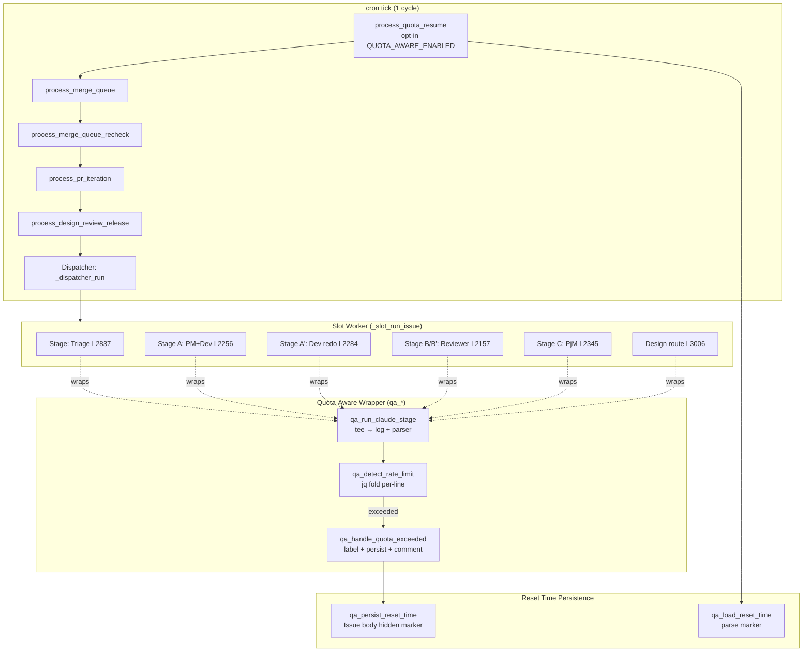
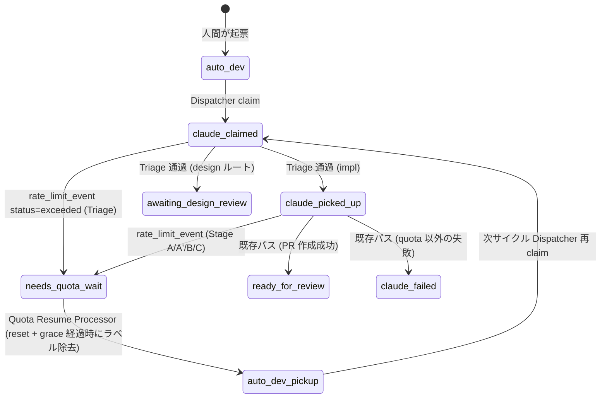
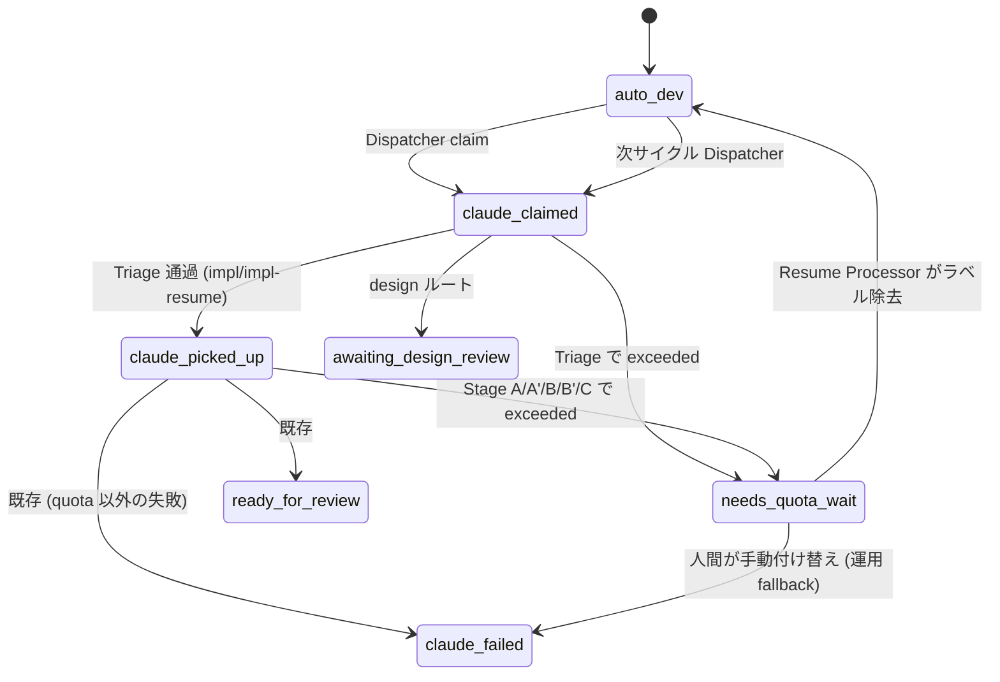
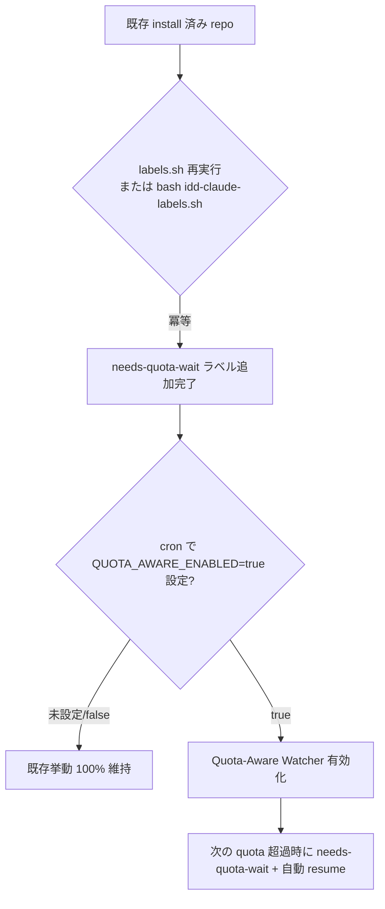

# Design Document

## Overview

**Purpose**: 本機能は、Claude Max の 5 時間ローリング quota が claude CLI の `rate_limit_event` JSON で
通知されることを利用し、watcher が **quota 起因の停止と他失敗を専用ラベル `needs-quota-wait` で分離** し、
**reset 予定時刻経過後に自動で `needs-quota-wait` を除去して通常 pickup ループへ復帰** させる仕組みを、
idd-claude 本番運用者と本リポジトリ自身（dogfooding）に提供する。

**Users**:
- cron / launchd で `issue-watcher.sh` を回している既存 install 済みリポジトリの運用者
  （夜間 quota 切れの Issue を翌朝手動復旧している現状を、自動 resume に置き換えたい）
- 本リポジトリの Issue 起票者・レビュワー（`claude-failed` 一律 escalation の中に紛れた quota 待ちを
  ラベル一目で識別したい）

**Impact**: 現在 quota 超過は CLI の非ゼロ exit を介して `claude-failed` に丸められ、運用者が手動で
ラベル除去するまで停止し続ける。本機能は **既存 Stage 実行点（Triage / Stage A / Stage A' /
Reviewer / Stage C / design 経路）の claude CLI 呼び出しを薄い wrapper で包み、stream-json 出力から
`rate_limit_event` (`status=exceeded`) を抽出**して `needs-quota-wait` ラベル + reset 時刻永続化に
分岐し、各 cron tick 冒頭の **Quota Resume Processor** が reset 経過判定でラベルを自動除去する。
**`QUOTA_AWARE_ENABLED=false`（既定）では新パスを完全 skip** し、既存挙動（CLI 非ゼロ → `claude-failed`）を
そのまま維持する。

### Goals

- claude CLI の `rate_limit_event` (`status=exceeded`) を Stage 実行中に検知するヘルパー関数
  `qa_detect_rate_limit()` を追加し、Triage / Stage A / Stage A' / Reviewer / Stage C / design 経路の
  6 箇所すべての claude 呼び出しに非破壊的に適用する
- 検知時に **`needs-quota-wait` 付与 + 進行中ラベル除去 + escalation コメント投稿 + reset 時刻永続化**
  を 1 関数 `qa_handle_quota_exceeded()` で原子的に実行する
- reset 時刻を Issue body の hidden marker（`<!-- idd-claude:quota-reset:<epoch>:v1 -->`）として
  永続化し、cron tick 越境で読み出し可能にする
- cron tick 冒頭で **Quota Resume Processor**（`process_quota_resume()`）を実行し、reset +
  `QUOTA_RESUME_GRACE_SEC` 秒経過した Issue から `needs-quota-wait` を自動除去する
- ピックアップ exclusion query に `needs-quota-wait` を追加し、wait 中の Issue が再 claim されない
  ようにする
- ラベル定義スクリプト（`idd-claude-labels.sh` および `repo-template/` 同等品）に
  `needs-quota-wait` を冪等追加する
- README に `## Quota-Aware Watcher` 節と env / ラベル一覧 / 状態遷移更新を反映する
- `QUOTA_AWARE_ENABLED=false` 既定で 100% 既存挙動互換（NFR 2.1 / 2.2）

### Non-Goals

- partial work（Stage 途中までの進捗 commit）の保護・復元
- Stage 単位の自動 retry（Stage 全体の再実行は通常 pickup ループ経由）
- quota 以外の rate-limit（API rate-limit / token rate-limit / burst limit 等）の検知
- overage / 課金プラン変更通知への自動切り替え
- 多 repo 運用での grace period 動的調整（`QUOTA_RESUME_GRACE_SEC` 固定値で対応）
- GitHub Actions 版ワークフロー（`.github/workflows/issue-to-pr.yml`）への同等導入
- Reviewer Gate / PR Iteration Processor / Merge Queue Processor 等、PR 系 Processor 内の
  quota 検知（本 Issue は Issue Stage 系のみ）
- `needs-quota-wait` 長期化時の自動エスカレーション（reset から N 時間経過しても resume されない
  場合の `claude-failed` 昇格）
- Stage 内部での部分 retry（Stage 全体の再実行は通常 pickup ループ経由）

## Architecture

### Existing Architecture Analysis

`local-watcher/bin/issue-watcher.sh`（約 3200 行）の構造（PR #51 / #52 / #54 後の現状）:

- **cron tick 冒頭の Processor 群**（順序固定）: Merge Queue Processor → Merge Queue Re-check →
  PR Iteration Processor → Design Review Release Processor → Dispatcher（Issue Pickup）
  - 各 Processor は opt-in env で gating され、無効時は即時 return 0 で skip する pattern
- **Dispatcher**（L3093-3194）: `gh issue list` の exclusion query で除外対象ラベルを列挙し、
  `auto-dev` 付き Issue を `--limit 5` で取得 → slot 単位で `_slot_run_issue` を fork
- **Slot Runner `_slot_run_issue`**（L2733-3034）: Triage 実行 → mode 判定（design / impl / impl-resume）→
  branch 切り替え → `run_impl_pipeline` または design ルート発火
- **Stage 実行点**: 6 箇所の `claude --print ... --output-format stream-json --verbose` が存在
  （Triage L2837 / Stage A L2256 / Stage A' L2284 / Reviewer L2157 / Stage C L2345 / design L3006）
- **失敗遷移ヘルパー**: `_slot_mark_failed`（pre/post-Triage 両系統除去）と `mark_issue_failed`
  （impl pipeline 用、Stage A 開始時点で `claude-claimed` は除去済み前提）

**尊重すべきドメイン境界**:
- 既存 6 箇所の claude 呼び出しの **prompt / model / max-turns / permission-mode / 出力宛先** は変更しない。
  wrapper は claude を起動する箇所を最小限ラップして、stream-json を tee で並列に解析するだけに留める
- `_slot_mark_failed` / `mark_issue_failed` の責務分離（pre-Triage / post-Triage）を破壊しない。
  quota 検知時は両ヘルパーとは **別経路** `qa_handle_quota_exceeded()` を呼び、`claude-failed` ラベルへの
  遷移を踏まない（Req 3.2）
- Dispatcher の atomic claim 不変条件（`claude-claimed` 付与は単一プロセス）を維持する
- Processor 群の opt-in pattern（先頭の `if [ "$X_ENABLED" != "true" ]; then return 0; fi`）を踏襲する

**解消する technical debt**: なし。本機能は新 Stage を追加するのではなく、既存 Stage 失敗の
**原因分類軸**を `claude-failed` 単一から `needs-quota-wait` / `claude-failed` の 2 軸に拡張する追加機能。

### Architecture Pattern & Boundary Map





**Architecture Integration**:
- 採用パターン: **Cross-cutting Wrapper + State Refinement**
  - 6 箇所の claude 呼び出しを `qa_run_claude_stage` で一律ラップする横断的アスペクト
  - 既存 `claude-failed` 単一終端を `needs-quota-wait` / `claude-failed` の 2 系統に細分化
- ドメイン／機能境界:
  - **Quota Stream Parser**（`qa_detect_rate_limit`）: stream-json の per-line jq fold で
    `type=="rate_limit_event"` かつ `status=="exceeded"` を抽出。最後に観測した reset 時刻を
    保持（Req 2.4）
  - **Quota Persistence**（`qa_persist_reset_time` / `qa_load_reset_time`）: Issue body の
    hidden marker（後述 Data Models 参照）で永続化
  - **Quota Handler**（`qa_handle_quota_exceeded`）: ラベル付与・除去・コメント投稿・永続化を
    1 関数で原子的に実行
  - **Quota Resume Processor**（`process_quota_resume`）: cron tick 冒頭で `needs-quota-wait`
    付き Issue を走査し、reset + grace 経過分のラベルを除去
  - **Stage Wrapper**（`qa_run_claude_stage`）: 既存 6 stage の `claude --print ... >> "$LOG"` を
    `claude --print ... 2>&1 | tee -a "$LOG" | qa_detect_rate_limit > "$reset_file"` に置き換える
    薄いラッパー
- 既存パターンの維持:
  - claim atomicity（Dispatcher 単一プロセス）
  - サブシェル隔離（NUMBER / MODE / LOG 等のグローバル変数の親への伝播禁止）
  - opt-in gate pattern（`QUOTA_AWARE_ENABLED != "true"` で全 quota コードパス skip）
  - ピックアップ exclusion query への 1 ラベル追加（Issue #54 で `needs-iteration` を追加した
    のと同形式、Req 3.6）
- 新規コンポーネントの根拠:
  - `qa_run_claude_stage` wrapper: 6 箇所の claude 呼び出しに同一の解析ロジックを適用するための
    DRY 化（コピペすると 6 箇所の更新漏れリスクが高い）
  - `process_quota_resume`: cron tick 越境で reset 判定を行う唯一の場所（NFR 3.1: 0 件時は
    `gh issue list` 1 回のみ）

### Technology Stack

| Layer | Choice / Version | Role in Feature | Notes |
|-------|------------------|-----------------|-------|
| Runtime | bash 4+ | wrapper / processor / persistence helper | 既存スクリプトに同居（新ファイル無し） |
| GitHub I/O | `gh` CLI | Issue body read/write・ラベル付与・comment 投稿 | `gh issue view --json body` / `gh issue edit --body` で hidden marker を更新 |
| JSON parsing | `jq` 1.6+ | stream-json 1 行ごとの fold で `rate_limit_event` 抽出、reset 時刻 epoch 取り出し | `jq -r 'select(.type=="rate_limit_event") | select(.status=="exceeded") | .resetsAt'` 等 |
| Stream tee | bash `tee` + pipe | 既存 `>> "$LOG" 2>&1` を維持しつつ、検知用 stream を並走させる | tee で 2 系統に分岐、検知側はバックグラウンド `<( )` プロセス置換 |
| Time / formatting | `date` (GNU / BSD 互換) | ISO 8601 (`date -d @<epoch> -Iseconds`) と現在時刻比較 | macOS/Linux 互換性のため `date -u +%s` / `date -d @N` の差異を吸収するヘルパーを置く |
| Static analysis | `shellcheck` | NFR 4.1 / 4.2 警告 0 件維持 | 既存 CI 規約 |

## File Structure Plan

本機能は新規ファイル無し。既存 6 ファイルへの追加変更のみ。

### Modified Files

```
local-watcher/bin/issue-watcher.sh
  ├─ Config 節に QUOTA_AWARE_ENABLED / QUOTA_RESUME_GRACE_SEC / LABEL_NEEDS_QUOTA_WAIT を追加
  ├─ 新規セクション「Quota-Aware Watcher Helpers」を Phase A セクションの直前に挿入
  │   ├─ qa_log / qa_warn / qa_error                   # 専用ロガー（既存 mq_log / pi_log と同形式）
  │   ├─ qa_detect_rate_limit                          # stream-json から exceeded を fold 抽出
  │   ├─ qa_run_claude_stage                           # claude 呼び出し wrapper（6 箇所共通）
  │   ├─ qa_persist_reset_time                         # Issue body hidden marker 書き込み
  │   ├─ qa_load_reset_time                            # Issue body hidden marker 読み出し
  │   ├─ qa_format_iso8601                             # epoch → ISO 8601 (macOS/Linux 互換)
  │   ├─ qa_handle_quota_exceeded                      # ラベル + コメント + 永続化を 1 関数で
  │   └─ process_quota_resume                          # cron tick 冒頭の Resume Processor
  ├─ cron tick 冒頭の Processor 順序に process_quota_resume を Merge Queue より前に挿入
  ├─ Dispatcher exclusion query に -label:needs-quota-wait を追加（Req 3.6）
  ├─ Triage L2837 を qa_run_claude_stage 経由に置き換え
  ├─ Stage A L2256 を qa_run_claude_stage 経由に置き換え
  ├─ Stage A' L2284 を qa_run_claude_stage 経由に置き換え
  ├─ Reviewer L2157 を qa_run_claude_stage 経由に置き換え
  ├─ Stage C L2345 を qa_run_claude_stage 経由に置き換え
  └─ design 経路 L3006 を qa_run_claude_stage 経由に置き換え

repo-template/.github/scripts/idd-claude-labels.sh
  └─ LABELS 配列に "needs-quota-wait|c5def5|【Issue 用】 ..." を 1 行追加（Req 6.1 / 6.5）

.github/scripts/idd-claude-labels.sh
  └─ 同上（self-hosting / dogfooding 用 / Req 6.4 既存ラベル不変）

README.md
  ├─ 「ラベル一括作成」表（L295-306）に needs-quota-wait の行を追加
  ├─ 「手動で作成する場合」コマンド例（L311-321）に gh label create needs-quota-wait を追加
  ├─ 「ラベル状態遷移まとめ」表（L531-542）に needs-quota-wait 行を追加
  ├─ ポーリングクエリ（L544-555）に -label:needs-quota-wait を追加
  ├─ 状態遷移図（L561-585）に needs-quota-wait 経路を追加
  ├─ 「opt-in（既定 OFF）」表（L605-613）に Quota-Aware Watcher 行を追加
  └─ 新規節「## Quota-Aware Watcher」を「## Reviewer Gate」直前に挿入
       （opt-in 手順 / env 一覧 / 検知契約 / reset 時刻永続化方式 / migration note）
```

### File Structure Plan の根拠

- `local-watcher/bin/issue-watcher.sh` 単一ファイルへの追加は、既存 Processor（mq_* / pi_* / drr_*）が
  すべて同居している慣習に従う。新規ファイル分割は CI / cron 配置を増やすため避ける
- 新規セクションは **Phase A セクション直前**（L221 周辺）に挿入することで、cron tick 順に
  「(opt-in) Resume → (opt-in) Merge Queue → ... → Dispatcher」と上から下に読める配置になる
- ラベル定義は `repo-template/` と root 両方を同期更新する（self-hosting 規約、CLAUDE.md 参照）

## Requirements Traceability

| Requirement | Summary | Components | Interfaces | Flows |
|-------------|---------|------------|------------|-------|
| 1.1 | opt-out 時 quota 機能 skip | Config gate, qa_run_claude_stage, process_quota_resume | `QUOTA_AWARE_ENABLED` env | wrapper / Resume Processor 先頭で early return |
| 1.2 | opt-in 時 Req 2-5 を有効化 | Config gate | `QUOTA_AWARE_ENABLED=true` | 全 qa_* 関数を活性化 |
| 1.3 | 既定 false | Config gate | `QUOTA_AWARE_ENABLED:-false` | 既存 opt-in pattern と同形式 |
| 1.4 | 既存 env var 名不変 | Config 節 | 既存 `REPO` / `REPO_DIR` 等 | 追加のみ、変更なし |
| 1.5 | 既存 cron 文字列で起動可 | Config gate | env override pattern | opt-in が default false で skip |
| 1.6 | 既存ラベル意味不変 | Label Setup Script | LABELS 配列追加のみ | 既存 10 ラベル行不変 |
| 2.1 | stream から rate_limit_event 抽出 | qa_detect_rate_limit | stream-json fold | tee で並走解析 |
| 2.2 | status=exceeded を quota 超過と分類 | qa_detect_rate_limit | jq select | exceeded のみ epoch を出力 |
| 2.3 | reset 時刻 epoch 抽出 | qa_detect_rate_limit | jq `.resetsAt`/`.resets_at` 互換抽出 | epoch を $reset_file へ書き出し |
| 2.4 | 複数 event 時は最新採用 | qa_detect_rate_limit | tail -1 / awk END | $reset_file を上書きで最新値のみ残す |
| 2.5 | parse 失敗時は分類しない | qa_detect_rate_limit | jq 失敗を 0 行扱い | $reset_file 空 → 既存 Stage 失敗フロー |
| 2.6 | allowed のみは分類しない | qa_detect_rate_limit | jq select status=="exceeded" | allowed は無視 |
| 3.1 | needs-quota-wait 付与 | qa_handle_quota_exceeded | gh issue edit --add-label | 検知時 atomic 実行 |
| 3.2 | claude-failed を付与しない | qa_handle_quota_exceeded | qa 経路は mark_issue_failed を呼ばない | 別経路で完結 |
| 3.3 | 進行中ラベル除去 | qa_handle_quota_exceeded | gh issue edit --remove-label CLAIMED --remove-label PICKED | 1 PATCH で原子的 |
| 3.4 | escalation コメント (Stage / ISO 8601) | qa_handle_quota_exceeded | gh issue comment + qa_format_iso8601 | Stage 種別を引数で受け取る |
| 3.5 | wait 中は pickup 対象外 | Dispatcher exclusion query | -label:needs-quota-wait | gh issue list の search に追加 |
| 3.6 | 既存除外条件不変 | Dispatcher exclusion query | 既存 7 条件保持 + 1 追加 | search 文字列を 1 条件追加 |
| 3.7 | needs-quota-wait と claude-failed 同時付与なし | qa_handle_quota_exceeded / Resume Processor | gh issue edit --remove-label FAILED は不要（qa 経路は failed を一切付与しない） | qa 経路は mark_issue_failed を呼ばない |
| 4.1 | reset 時刻を Issue 紐付けで永続化 | qa_persist_reset_time | Issue body hidden marker | 既存 body に marker 行追加 |
| 4.2 | 後続 cron で読み出し可能 | qa_load_reset_time | gh issue view --json body | Resume Processor が読み出し |
| 4.3 | 1 Issue 1 件のみ保持 | qa_persist_reset_time | sed で旧 marker 行を削除 → 新 marker 追記 | 同一 marker 行を上書き |
| 4.4 | 不正値時は自動除去せず | qa_load_reset_time | epoch numeric 検証失敗時は -1 を返し Resume Processor が skip | warn ログのみ、ラベル維持 |
| 5.1 | cron tick 冒頭で Resume Processor 実行 | process_quota_resume | cron tick 順序に挿入 | Merge Queue より前 |
| 5.2 | reset+grace 経過時にラベル除去 | process_quota_resume | gh issue edit --remove-label | 経過判定後の単一 PATCH |
| 5.3 | grace 未到達時は除去せず | process_quota_resume | epoch 比較 | continue で次 Issue へ |
| 5.4 | 除去後は通常 pickup 対象 | process_quota_resume | 副作用はラベル除去のみ | claim や Stage 実行をしない |
| 5.5 | grace 既定 60 秒、env 上書き可 | Config | `QUOTA_RESUME_GRACE_SEC:-60` | 既存 opt-in pattern |
| 5.6 | API 失敗時も後続 Processor 継続 | process_quota_resume | gh 失敗を `\|\| qa_warn` で吸収 | return 0 を保証 |
| 6.1 | labels.sh 実行で needs-quota-wait 追加 | Label Setup Script | LABELS 配列に 1 行追加 | 冪等 |
| 6.2 | 既存ラベルは冪等 skip | Label Setup Script | 既存 EXISTING_LABELS 機構 | 変更なし |
| 6.3 | --force で更新 | Label Setup Script | 既存 --force 機構 | 変更なし |
| 6.4 | 既存 10 ラベル行不変 | Label Setup Script | 配列追加のみ | 既存行の name/color/desc を編集しない |
| 6.5 | 【Issue 用】prefix | Label Setup Script | 行内 description に prefix 含める | Issue #54 規約準拠 |
| 7.1 | README に Quota-Aware 節追加 | README.md | 新規節挿入 | Reviewer Gate 節の前 |
| 7.2 | ラベル一覧に needs-quota-wait | README.md | 既存表に行追加 | ラベル状態遷移表 |
| 7.3 | env 一覧記載 | README.md | 新規節内 env 表 | QUOTA_AWARE_ENABLED / QUOTA_RESUME_GRACE_SEC |
| 7.4 | 状態遷移更新 | README.md | 状態遷移図に経路追加 | claude-claimed / picked-up → needs-quota-wait |
| 7.5 | opt-out で無効である旨明示 | README.md | 新規節冒頭注記 | 既定 false の文言 |
| 8.1 | fixture で needs-quota-wait 付与 | Testing Strategy | dogfood 手順 | claude モック / FIFO 駆動 |
| 8.2 | reset+grace 経過で自動除去 | Testing Strategy | 時刻操作 fixture | epoch を過去にずらして検証 |
| 8.3 | 除去後の pickup 候補化 | Testing Strategy | dogfood 手順 | 次サイクル Dispatcher で再 claim |
| 8.4 | PR Test plan に dogfood 記載 | Testing Strategy / impl-notes.md | PR 本文への転記 | 観測ログ・ラベル遷移を含む |
| NFR 1.1 | 各イベントを LOG_DIR に記録 | qa_log / process_quota_resume | $LOG_DIR/issue-*.log への append | 既存ロガー pattern |
| NFR 1.2 | grep 可能な行構造 | qa_log | "[%F %T] quota-aware: <event> #<N> stage=<S> reset_epoch=<E> reset_iso=<I>" | 単一行 / fixed prefix |
| NFR 2.1 | opt-out で従来挙動維持 | Config gate | wrapper の opt-out 分岐 | 旧 `claude --print ... >> $LOG 2>&1` を保持 |
| NFR 2.2 | claude-failed Issue 経路不変 | mark_issue_failed | qa 経路は failed を経由しない | 別関数なので影響なし |
| NFR 2.3 | 既存 install repo はスクリプト再実行のみで足りる | Label Setup Script | 既存冪等機構 | 追加手作業なし |
| NFR 3.1 | 0 件時 API 1 回 | process_quota_resume | gh issue list --label needs-quota-wait 1 回 | 0 件なら return 0 |
| NFR 3.2 | cron 起動間隔の半分以内 | process_quota_resume | --limit 制御 / continue で API 呼び出し最小化 | 1 Issue あたり 1〜2 API call |
| NFR 3.3 | 同一 cron tick 内で付与/除去往復禁止 | process_quota_resume | grace 60 秒で同 tick での即時付け直し抑止 | grace 時間で構造的に保証 |
| NFR 4.1 | watcher script shellcheck 0 件 | qa_* 関数群 | quote / `[[ ]]` 統一 | 既存規約踏襲 |
| NFR 4.2 | labels.sh shellcheck 0 件 | Label Setup Script | 既存 quote pattern | 1 行追加のみ |

## Components and Interfaces

### Quota-Aware Stage Wrapper

#### qa_run_claude_stage

| Field | Detail |
|-------|--------|
| Intent | 既存 6 stage の claude 呼び出しを横断ラップし、`rate_limit_event` 検知時に exit code を 99 に置き換えて呼び出し側に通知する |
| Requirements | 1.1, 1.2, 2.1, 2.2, 2.3, 2.4, 2.5, 2.6, NFR 1.1, NFR 2.1 |

**Responsibilities & Constraints**
- `QUOTA_AWARE_ENABLED != "true"` のとき、引数を素通しで `claude` 起動するだけ（既存挙動完全互換）
- opt-in 時は stream-json を tee で 2 系統に分岐:
  - 系統 1: 既存 `>> "$LOG" 2>&1`（観測ログを破壊しない）
  - 系統 2: `qa_detect_rate_limit` への pipe（`exceeded` 検出時に reset epoch を $reset_file へ書き出し）
- 終了後、$reset_file に値があれば exit 99（quota 検出シグナル）を返し、なければ claude の元 exit
  code を返す（呼び出し側は 99 を special case で扱う）
- 引数: `qa_run_claude_stage <stage_label> <reset_file> -- claude <claude args...>`
  - `<stage_label>`: "Triage" / "StageA" / "StageA-redo" / "Reviewer-r1" / "Reviewer-r2" / "StageC" / "design"
  - `<reset_file>`: 1 stage 限定の一時ファイル（slot ごとに `/tmp/qa-reset-${REPO_SLUG}-${NUMBER}-${stage}-${TS}` 等）
  - `--` 以降は claude コマンド本体

**Dependencies**
- Inbound: `_slot_run_issue` の Triage / design / Stage A / Stage A' / Stage C 呼び出し点、`run_reviewer_stage` の Reviewer 呼び出し点
- Outbound: `qa_detect_rate_limit`, `claude` CLI, bash `tee`, process substitution `<(...)`
- External: claude CLI が `--output-format stream-json --verbose` で 1 行 1 JSON を出すこと（既存依存）

**Contracts**: Service [x] / API [ ] / Event [ ] / Batch [ ] / State [ ]

##### Service Interface

```bash
# Returns:
#   0   : claude 正常終了 + quota 検出なし（既存挙動互換）
#   99  : claude 終了後 reset epoch が $reset_file に書かれている（quota 超過検出）
#   N≠0,99 : claude 自体の非ゼロ exit（quota 超過とは別の失敗、既存フロー委譲）
qa_run_claude_stage() {
  local stage_label="$1"
  local reset_file="$2"
  shift 2  # 残り引数は -- claude ...
  # 引数 separator '--' を skip
  [ "${1:-}" = "--" ] && shift
  # opt-out: 旧パスをそのまま実行
  if [ "$QUOTA_AWARE_ENABLED" != "true" ]; then
    "$@"
    return $?
  fi
  # opt-in: tee で並走
  : > "$reset_file"  # 一時ファイル初期化
  local claude_rc=0
  "$@" 2>&1 \
    | tee -a "$LOG" \
    | qa_detect_rate_limit > "$reset_file" \
    || claude_rc=$?
  # claude_rc は pipe 末尾（qa_detect_rate_limit）の exit code を拾う点に注意。
  # PIPESTATUS[0] で claude 本体の exit を取り直す（実装時に明示化）。
  if [ -s "$reset_file" ] && [ "$(cat "$reset_file")" != "" ]; then
    return 99
  fi
  return ${PIPESTATUS[0]:-$claude_rc}
}
```

- Preconditions: `LOG` グローバル設定済み、claude CLI が PATH 上に存在
- Postconditions: $reset_file は空または `<epoch_seconds>` 1 行
- Invariants: stream-json の 1 行も $LOG から失わない

#### qa_detect_rate_limit

| Field | Detail |
|-------|--------|
| Intent | stdin の stream-json を 1 行ごとに jq fold し、`type=="rate_limit_event"` かつ `status=="exceeded"` の最新 reset epoch を stdout に出力する |
| Requirements | 2.1, 2.2, 2.3, 2.4, 2.5, 2.6 |

**Responsibilities & Constraints**
- 入力 1 行が JSON でないか jq parse 失敗した場合は **その行を無視して継続**（NFR: stream を停止させない）
- `rate_limit_event` 以外の type は filter で除外
- `status=="allowed"` は除外（Req 2.6）
- reset epoch 候補フィールド名は claude CLI のスキーマに合わせて `.resetsAt`（または `.reset_at` /
  `.resets_at`）の **複数候補を順に試す**（CLI 側の表記揺れに対する防御）。実装時は最初に
  truthy な値を採用
- 同一 stream に複数 exceeded があった場合、最後の行の reset 値が stdout に最終的に書かれる
  （`tail -1` または `awk END` で最終行のみ採用）

**Dependencies**
- Inbound: `qa_run_claude_stage` のパイプ
- Outbound: `jq` 1.6+
- External: claude stream-json schema（`type` / `status` / `resetsAt` キー）

**Contracts**: Service [x]

##### Service Interface

```bash
# stdin: stream-json (1 行 1 JSON)
# stdout: 最後の exceeded event の reset epoch (UNIX seconds, integer) または空
# return: 常に 0（解析失敗で stream を止めない）
qa_detect_rate_limit() {
  jq -r --unbuffered '
    select(type == "object")
    | select(.type? == "rate_limit_event")
    | select(.status? == "exceeded")
    | (.resetsAt // .reset_at // .resets_at // empty)
    | (if type == "number" then . | floor
       elif type == "string" then (try (. | fromdateiso8601) catch (try (. | tonumber) catch empty))
       else empty end)
  ' 2>/dev/null \
  | tail -1
}
```

- Preconditions: stdin が claude stream-json または line-delimited JSON
- Postconditions: stdout は空 or 単一行 epoch
- Invariants: parse 失敗で exit !=0 を返さない（`2>/dev/null` で抑止）

### Quota Persistence

#### qa_persist_reset_time

| Field | Detail |
|-------|--------|
| Intent | Issue body の hidden marker として reset 予定時刻を 1 件のみ保持する形で永続化する |
| Requirements | 4.1, 4.3 |

**Responsibilities & Constraints**
- Issue body の既存内容を保持しつつ、`<!-- idd-claude:quota-reset:<epoch>:v1 -->` という 1 行 marker
  を末尾に追加する
- 既存 marker（任意 epoch）が body に存在する場合は **削除してから新値を追記**（Req 4.3 の「最新値 1 件」）
- 書き込み失敗時は qa_warn を出すが exit はしない（Resume Processor が次回 cycle で再評価可能）

**Dependencies**
- Outbound: `gh issue view --json body` / `gh issue edit --body`
- External: GitHub Issues API

**Contracts**: Service [x] / State [x]

##### Service Interface

```bash
# Args: $1 = issue number, $2 = reset epoch (integer)
# Return: 0 = persisted, 1 = gh failure (warn only, do not fail caller)
qa_persist_reset_time() {
  local issue_number="$1"
  local epoch="$2"
  local body
  body=$(gh issue view "$issue_number" --repo "$REPO" --json body --jq '.body' 2>/dev/null) || return 1
  # 既存 marker 行を全削除（複数あったとしても落とす）
  local cleaned
  cleaned=$(printf '%s\n' "$body" | sed -E '/<!-- idd-claude:quota-reset:[0-9]+:v1 -->/d')
  local new_body="${cleaned}

<!-- idd-claude:quota-reset:${epoch}:v1 -->"
  gh issue edit "$issue_number" --repo "$REPO" --body "$new_body" >/dev/null 2>&1 || return 1
  return 0
}
```

#### qa_load_reset_time

| Field | Detail |
|-------|--------|
| Intent | Issue body から hidden marker を読み出して reset epoch を返す |
| Requirements | 4.2, 4.4 |

**Responsibilities & Constraints**
- marker 不在 / 不正値 / API 失敗いずれの場合も **数値以外を返さない**（呼び出し側で `[ "$v" =~ ^[0-9]+$ ]` で
  防御できる形式）
- 不正値検出時は qa_warn を出し、stdout に空 or `-1` を返す。**ラベル除去はしない**（Req 4.4）

**Dependencies**
- Outbound: `gh issue view --json body`

**Contracts**: Service [x]

##### Service Interface

```bash
# Args: $1 = issue number
# Stdout: epoch (integer) or empty
# Return: 0 = found, 1 = absent or malformed (caller skips removal)
qa_load_reset_time() {
  local issue_number="$1"
  local body
  body=$(gh issue view "$issue_number" --repo "$REPO" --json body --jq '.body' 2>/dev/null) || return 1
  local epoch
  epoch=$(printf '%s' "$body" | sed -nE 's/.*<!-- idd-claude:quota-reset:([0-9]+):v1 -->.*/\1/p' | tail -1)
  if [[ "$epoch" =~ ^[0-9]+$ ]]; then
    printf '%s' "$epoch"
    return 0
  fi
  return 1
}
```

### Quota Handler

#### qa_handle_quota_exceeded

| Field | Detail |
|-------|--------|
| Intent | quota 検知時の副作用（ラベル + コメント + 永続化）を 1 関数で原子的に実行する |
| Requirements | 3.1, 3.2, 3.3, 3.4, 3.7, 4.1, NFR 1.1, NFR 1.2 |

**Responsibilities & Constraints**
- 副作用順序（重要、Req 3.7 担保）:
  1. `qa_persist_reset_time`（永続化失敗してもラベル付与に進む。次 tick で再判定可能）
  2. `gh issue edit --remove-label CLAIMED --remove-label PICKED --add-label NEEDS_QUOTA_WAIT`（atomic
     1 PATCH。`claude-failed` は **付与しない**、Req 3.2）
  3. `gh issue comment` で escalation コメントを 1 件投稿（後述 escalation フォーマット）
  4. qa_log（NFR 1.1 / 1.2）
- escalation コメント本文（後述 Data Models 「Escalation Comment Template」）には Stage 種別 と
  reset の epoch・ISO 8601・grace の値を含める
- 失敗時は qa_warn でログのみ。**呼び出し側に exit code 1 を返す**（Stage の終了処理を続行させる
  ため）。呼び出し側は 99 受領時に `return 0` で `_slot_run_issue` から正常終了することで
  `_slot_mark_failed` を回避する

**Dependencies**
- Outbound: qa_persist_reset_time, gh issue edit, gh issue comment, qa_log
- External: GitHub Issues API

**Contracts**: Service [x] / State [x]

##### Service Interface

```bash
# Args:
#   $1 = issue number
#   $2 = stage label ("Triage" / "StageA" / ...)
#   $3 = reset epoch
# Return: 0 always (副作用失敗は warn でログ、呼び出し側はラベル付与済み前提で続行)
qa_handle_quota_exceeded() {
  local issue_number="$1" stage_label="$2" epoch="$3"
  local iso8601
  iso8601=$(qa_format_iso8601 "$epoch")
  qa_persist_reset_time "$issue_number" "$epoch" \
    || qa_warn "issue=$issue_number stage=$stage_label reset 永続化に失敗（ラベル付与は継続）"
  gh issue edit "$issue_number" --repo "$REPO" \
    --remove-label "$LABEL_CLAIMED" \
    --remove-label "$LABEL_PICKED" \
    --add-label "$LABEL_NEEDS_QUOTA_WAIT" >/dev/null 2>&1 \
    || qa_warn "issue=$issue_number ラベル付け替えに失敗"
  gh issue comment "$issue_number" --repo "$REPO" \
    --body "$(qa_build_escalation_comment "$stage_label" "$epoch" "$iso8601")" \
    >/dev/null 2>&1 \
    || qa_warn "issue=$issue_number escalation コメント投稿に失敗"
  qa_log "exceeded #$issue_number stage=$stage_label reset_epoch=$epoch reset_iso=$iso8601 grace_sec=$QUOTA_RESUME_GRACE_SEC"
  return 0
}
```

#### qa_format_iso8601

| Field | Detail |
|-------|--------|
| Intent | epoch 秒 を ISO 8601（タイムゾーン付き）文字列に変換する。macOS/Linux の date 差異を吸収 |
| Requirements | 3.4, NFR 1.2 |

**Responsibilities & Constraints**
- Linux GNU date は `date -d "@${epoch}" -Iseconds`、macOS / BSD date は `date -r "${epoch}" "+%Y-%m-%dT%H:%M:%S%z"` を使用
- いずれの実装でもタイムゾーンオフセット付きで出力（"2026-04-29T15:00:00+09:00" 等）
- 失敗時は epoch をそのまま返す（escalation コメント整合性を保つため空にしない）

### Quota Resume Processor

#### process_quota_resume

| Field | Detail |
|-------|--------|
| Intent | cron tick 冒頭で `needs-quota-wait` 付き Issue を走査し、reset+grace 経過分のラベルを除去する |
| Requirements | 5.1, 5.2, 5.3, 5.4, 5.5, 5.6, NFR 1.1, NFR 3.1, NFR 3.2, NFR 3.3 |

**Responsibilities & Constraints**
- opt-out gate: `QUOTA_AWARE_ENABLED != "true"` で即時 `return 0`（NFR 2.1）
- 走査クエリ: `gh issue list --label needs-quota-wait --state open --json number,labels --limit 50`
  （NFR 3.1: 0 件時 1 回の API call）
- 各 Issue について `qa_load_reset_time` で reset epoch を取得
  - 取得失敗 / 不正値 → qa_warn + skip（Req 4.4: ラベルを除去せず人間判断へ）
  - 現在時刻 < reset+grace → skip（Req 5.3）
  - 現在時刻 ≥ reset+grace → `gh issue edit --remove-label NEEDS_QUOTA_WAIT`（Req 5.2）
    + qa_log（Req NFR 1.1）
- ラベル除去後は **何もしない**（claim も Stage 実行もトリガーしない、Req 5.4）。次サイクルの
  Dispatcher が通常クエリで pickup する
- API 失敗時は `qa_warn || true` で吸収し、return 0（Req 5.6: 後続 Processor 継続）
- 既存 Processor 群（mq_* / pi_* / drr_*）と同一 logger フォーマット（NFR 1.2 grep 容易性）

**Dependencies**
- Inbound: cron tick の冒頭呼び出し（Merge Queue より前）
- Outbound: qa_load_reset_time, gh issue list, gh issue edit, qa_log
- External: GitHub Issues API

**Contracts**: Service [x] / Batch [x]

##### Service Interface

```bash
# Return: 常に 0（後続 Processor を阻害しない、Req 5.6）
process_quota_resume() {
  if [ "$QUOTA_AWARE_ENABLED" != "true" ]; then
    return 0
  fi
  qa_log "Resume Processor 開始 (grace=${QUOTA_RESUME_GRACE_SEC}s)"
  local issues_json
  if ! issues_json=$(gh issue list --repo "$REPO" \
        --label "$LABEL_NEEDS_QUOTA_WAIT" --state open \
        --json number --limit 50 2>/dev/null); then
    qa_warn "needs-quota-wait Issue 取得に失敗（後続 Processor 継続）"
    return 0
  fi
  local count
  count=$(printf '%s' "$issues_json" | jq 'length')
  [ "$count" -eq 0 ] && { qa_log "対象 Issue なし"; return 0; }
  local now_epoch
  now_epoch=$(date -u +%s)
  local issue_number reset_epoch threshold
  while IFS= read -r issue_number; do
    [ -z "$issue_number" ] && continue
    if ! reset_epoch=$(qa_load_reset_time "$issue_number"); then
      qa_warn "issue=$issue_number reset 時刻読み出し失敗 → ラベル維持"
      continue
    fi
    threshold=$((reset_epoch + QUOTA_RESUME_GRACE_SEC))
    if [ "$now_epoch" -lt "$threshold" ]; then
      qa_log "issue=$issue_number reset_epoch=$reset_epoch now=$now_epoch wait_sec=$((threshold - now_epoch))"
      continue
    fi
    if gh issue edit "$issue_number" --repo "$REPO" \
        --remove-label "$LABEL_NEEDS_QUOTA_WAIT" >/dev/null 2>&1; then
      qa_log "resumed #$issue_number reset_epoch=$reset_epoch reset_iso=$(qa_format_iso8601 "$reset_epoch") elapsed_sec=$((now_epoch - reset_epoch))"
    else
      qa_warn "issue=$issue_number ラベル除去に失敗（次サイクルで再評価）"
    fi
  done < <(printf '%s' "$issues_json" | jq -r '.[].number')
  return 0
}
```

### Stage Wrapping Pattern（適用パターン）

各既存 Stage 呼び出し箇所での書き換えパターンは以下のテンプレートに統一する。

```bash
# 既存
if ! claude --print "$prompt" --model "$MODEL" --max-turns N \
    --output-format stream-json --verbose >> "$LOG" 2>&1; then
  echo "❌ #$NUMBER: <Stage> 失敗" | tee -a "$LOG"
  mark_issue_failed "<stage>" ""    # または _slot_mark_failed
  return 1
fi

# 新規（QUOTA_AWARE_ENABLED 有効時のみ分岐挿入）
local _qa_reset_file="/tmp/qa-reset-${REPO_SLUG}-${NUMBER}-<stage>-${TS}"
qa_run_claude_stage "<StageLabel>" "$_qa_reset_file" -- \
  claude --print "$prompt" --model "$MODEL" --max-turns N \
    --output-format stream-json --verbose
local _rc=$?
case "$_rc" in
  0)  : ;;  # 既存成功パスへ
  99) # quota detected
    local _epoch; _epoch=$(cat "$_qa_reset_file")
    qa_handle_quota_exceeded "$NUMBER" "<StageLabel>" "$_epoch"
    rm -f "$_qa_reset_file"
    return 0   # _slot_mark_failed を踏まずに sub-shell 正常終了
    ;;
  *)  rm -f "$_qa_reset_file"
    echo "❌ #$NUMBER: <Stage> 失敗" | tee -a "$LOG"
    mark_issue_failed "<stage>" ""    # または _slot_mark_failed
    return 1
    ;;
esac
```

**重要**: opt-out 時は `qa_run_claude_stage` 内で `"$@"` を素通し実行するため、stream-json の tee
や jq 解析は走らない。**99 exit は opt-in 時にしか発生しない**ため、case の `99)` 分岐は opt-out
時には到達しない（既存の 0 / 非 0 の二分岐と等価）。

## Data Models

### Domain Model

- 集約: 「Issue」が quota 状態（`needs-quota-wait` 有無 / reset epoch）の唯一の所有者
- 値オブジェクト:
  - **ResetEpoch**（UNIX 秒、整数）
  - **StageLabel**（列挙: `Triage` / `StageA` / `StageA-redo` / `Reviewer-r1` / `Reviewer-r2` / `StageC` / `design`）
  - **GraceSeconds**（既定 60、env で上書き可）

### Reset Time Hidden Marker（永続化フォーマット）

reset 時刻は **Issue body の末尾に hidden HTML コメント 1 行** として永続化する:

```text
<!-- idd-claude:quota-reset:<epoch_seconds>:v1 -->
```

- `<epoch_seconds>`: UNIX 秒（10 桁。例: `1745928000`）
- `:v1` サフィックス: 将来スキーマ変更時に旧形式を grep で発見できるようにする version tag
- マッチ正規表現: `<!-- idd-claude:quota-reset:[0-9]+:v1 -->`
- **1 Issue につき 1 個のみ**: 書き込み時は既存 marker 行を sed で全削除してから新値を追記（Req 4.3）

**選定理由（Open Question 1 への回答）**:

| 候補 | 長所 | 短所 | 採否 |
|---|---|---|---|
| Issue body hidden marker | gh CLI 1 回（view + edit）で読み書き可能 / GitHub UI に表示されない / 既存 PR コメント運用と衝突しない / API rate quota 効率良い | body 改行 1 行が末尾に常駐 / body 競合更新時に上書きリスク（が、本機能以外で body を編集する経路は少ない） | **採用** |
| 専用コメント | コメントログとして残り経過追跡が容易 | コメント取得 API が pagination を要する場合がある / 「最新 1 件」semantic を担保するため毎回 list + filter が必要 / `claude-failed` escalation コメントとの混在で grep 困難 | 不採用 |
| label description | gh CLI 1 回で読み書き可能（label edit）/ Issue 数 N 件分の独立管理は不可能（label は repo グローバル） | 同一 label を全 Issue で共有するため複数 Issue が同時 quota 待ちのとき衝突 | 不採用（共有競合） |
| ローカルファイル | ファイル read/write のみで API call 不要 | cron tick 別プロセス間で参照しても可能だが、**多 repo cron / 複数ホスト** で共有不可 / `LOG_DIR` 配下の永続性が保証されない | 不採用（多ホスト不可） |

採用根拠: 多 repo cron + dogfooding（同一 idd-claude アカウントが複数 repo cron を持つ）の制約下で、
**Issue 単位の隔離 + cron tick 越境の永続性** を最小コストで満たすのは Issue body marker のみ。

### Escalation Comment Template

`qa_handle_quota_exceeded` が投稿するコメント本文は以下の固定テンプレートを使用する。Stage 種別表記
の揺れを防ぐため、**`StageLabel` の文字列リテラルは StageLabel 値オブジェクトの 6 値のみ**を許容する。

```markdown
## ⏸️ Claude Max quota exceeded（quota wait）

watcher が `<StageLabel>` 実行中に Claude CLI から `rate_limit_event (status=exceeded)` を検知しました。
当該 Issue を一時的に **`needs-quota-wait`** 状態にしています。Claude Max の 5 時間ローリング quota
が reset された後、watcher が自動的に通常 pickup ループへ戻します。

### 検知情報

- 検知 Stage: `<StageLabel>`
- reset 予定時刻 (UNIX epoch): `<epoch_seconds>`
- reset 予定時刻 (ISO 8601): `<iso8601_with_tz>`
- 適用 grace 秒数: `<QUOTA_RESUME_GRACE_SEC>` 秒（reset 後この秒数を経過するまで pickup を抑止）

### 自動復帰の条件

- 次サイクルの Quota Resume Processor が、現在時刻が `reset 予定時刻 + grace` を超えていることを
  検知すると、`needs-quota-wait` ラベルを自動除去します
- ラベル除去後の cron tick で Dispatcher が通常 pickup 候補として再選定します
- `claude-failed` ラベルは付与していません（quota 起因と他失敗の混同を避けるため、Req 3.2）

### 手動介入したい場合

- 即時再開: `needs-quota-wait` ラベルを手動で外すと次サイクルで pickup されます
- quota 起因でないと判断する場合: 当該 Issue body の `<!-- idd-claude:quota-reset:...:v1 -->` 行を
  削除した上で `needs-quota-wait` を `claude-failed` に手動付け替えしてください

---

_本コメントは Quota-Aware Watcher（Issue #66）が自動投稿しました。_
```

### Logical Model（State Transitions）



## Error Handling

### Error Strategy

quota-aware 機能の失敗モードは以下 4 カテゴリ。すべて **既存運用への影響を最小化** することを最優先と
し、quota 機能自体の失敗で watcher 全体を止めない設計とする。

### Error Categories and Responses

- **Detection Errors（解析失敗）**:
  - 該当: `qa_detect_rate_limit` の jq parse 失敗 / claude stream-json schema 変更 / 部分 JSON
  - 応答: stream を止めず、当該行を無視。$reset_file は空のまま → wrapper は claude 元 exit を
    返す → 既存 Stage 失敗フローに委譲（Req 2.5）
  - ログ: 行レベルの WARN は出さない（noise を抑制）。Stage 終了後、$reset_file 空 + claude 非 0
    exit のときに既存ログが既に書かれている

- **Persistence Errors（永続化失敗）**:
  - 該当: `gh issue edit --body` の API 失敗 / body 競合更新 / 認可失敗
  - 応答: `qa_warn` でログを出し、ラベル付与は継続する（Req 4.4 担保: 不正値で除去しない原則を
    保持しつつ、ラベル状態は付与済みになる。次 cron tick で `qa_load_reset_time` 失敗 → ラベル
    維持で人間判断に委ねる）
  - ログ: `quota-aware: WARN: issue=<N> reset 永続化に失敗 (gh stderr=...)`

- **API / Network Errors（GitHub API 失敗）**:
  - 該当: `gh issue list` / `gh issue edit` / `gh issue comment` の HTTP 失敗
  - 応答: Resume Processor は当該 Issue を skip して次 Issue へ。Processor 全体は `return 0` を
    保証（Req 5.6 / NFR 3.1: 後続 Merge Queue / Dispatcher を阻害しない）
  - ログ: `qa_warn` で reset 値・stage を含めて grep 可能形式

- **Schema / Format Errors（marker / epoch 不正値）**:
  - 該当: 人間が手動で marker を編集 / 旧バージョン marker / 数値以外 epoch
  - 応答: `qa_load_reset_time` が return 1 → Resume Processor が **skip + ラベル維持**（Req 4.4）。
    自動除去せず人間判断に委ねる
  - ログ: `qa_warn` で「reset 時刻読み出し失敗 → ラベル維持」

## Testing Strategy

idd-claude には unit test framework が無いため、検証は **fixture-based dogfooding + shellcheck**
の組み合わせで行う（CLAUDE.md「テスト・検証」節準拠）。

### Unit Tests（fixture-based shell 試験、impl-notes.md に手順記載）

1. `qa_detect_rate_limit` 単体: claude stream-json fixture 3 種（exceeded のみ / allowed のみ /
   exceeded 複数）を pipe で流し、stdout が期待 epoch（または空）になることを検証
2. `qa_persist_reset_time` 単体: 既存 marker 無し body / 既存 marker 1 個 body / 既存 marker 複数
   body の 3 ケースで「最終 body に marker が 1 行のみ」を確認
3. `qa_load_reset_time` 単体: marker 不在 / 不正値 (`abc`) / 正常値の 3 ケースで戻り値と stdout
4. `qa_format_iso8601` 単体: GNU date と BSD date の両方で同一の epoch を入れて TZ オフセット付き
   出力を検証（macOS/Linux 互換、CLAUDE.md 準拠）
5. `qa_run_claude_stage` 単体: opt-out 時に既存 claude 起動コマンドが素通しされること（mock claude
   で stdout に固定文字列を出させ、$LOG にそのまま append されるかを確認）

### Integration Tests（dogfooding fixture, Req 8.1〜8.3）

1. **AC 8.1 検証**: claude モック（`PATH` を上書きして fixture stream-json を出すスクリプトを
   置く）+ test Issue を立て、watcher 1 cron tick 実行 → Issue に `needs-quota-wait` 付与・
   `claude-failed` 不在・body に hidden marker・escalation コメント 1 件を確認
2. **AC 8.2 検証**: 1 の状態で `<epoch>` を `now - 3600` に手動書き換え（または fixture
   epoch を過去にして再実行）→ `process_quota_resume` 単体起動で `needs-quota-wait` 除去を確認
3. **AC 8.3 検証**: 2 の状態で次 cron tick → Dispatcher の query で当該 Issue が候補化される
   ことを `gh issue list` 同等クエリで確認
4. **opt-out 互換**: `QUOTA_AWARE_ENABLED` 未設定 で fixture exceeded stream を流し、既存挙動
   （`claude-failed` 付与）が変わらないことを確認（NFR 2.1）
5. **Resume Processor 0 件時**: `gh issue list --label needs-quota-wait` が 0 件のとき API call
   1 回で return 0（NFR 3.1）

### E2E Tests（dogfooding 全周回, Req 8.4）

1. 本リポジトリ #66 自身の test 用 fork または scratch repo に `auto-dev` Issue を立て、
   `QUOTA_AWARE_ENABLED=true` の cron で watcher を 2〜3 tick 走らせる E2E
2. quota 検知 → 永続化 → 自動 resume → 通常 pickup までのラベル遷移と Issue body の marker
   変化を観測ログ（`$LOG_DIR/issue-*.log`）として PR 本文 Test plan に転記（Req 8.4）

### Static Analysis（NFR 4.1 / 4.2）

1. `shellcheck local-watcher/bin/issue-watcher.sh` で新規警告 0 件
2. `shellcheck repo-template/.github/scripts/idd-claude-labels.sh .github/scripts/idd-claude-labels.sh` で
   新規警告 0 件

## Migration Strategy

本機能は **opt-in（既定 OFF）かつラベル追加のみ** のため、migration step は最小化される。



### Migration Steps（既存ユーザー向け）

1. `local-watcher/bin/issue-watcher.sh` および `repo-template/.github/scripts/idd-claude-labels.sh`
   が更新された idd-claude 本体を取得（既存 `install.sh` または `setup.sh` 再実行で配置）
2. ラベル一括作成スクリプト再実行: `bash .github/scripts/idd-claude-labels.sh`
   - 既存 10 ラベルは「already exists (skipped)」となる
   - `needs-quota-wait` のみ「created」となる
3. opt-in したい場合は cron / launchd 登録文字列に `QUOTA_AWARE_ENABLED=true` を追加（既存変数の
   後ろに 1 個足すだけ。grace を変えたい場合は `QUOTA_RESUME_GRACE_SEC=120` 等を追記）
4. opt-in しない場合は **何もしなくて良い**（NFR 2.1 / 2.2: 既存挙動完全互換）

### Backward Compatibility 確認項目

- `QUOTA_AWARE_ENABLED` を環境に渡さない → wrapper が opt-out 分岐で claude を素通し
- 既存 cron 文字列（`*/2 * * * * REPO=... REPO_DIR=... $HOME/bin/issue-watcher.sh`）は不変で動作
- 既存 10 ラベルの name / color / description は不変（Req 6.4）
- 既存 `claude-failed` 付与経路（`mark_issue_failed` / `_slot_mark_failed`）は不変
- Dispatcher exclusion query への 1 ラベル追加は、既 install 済み repo に `needs-quota-wait` が
  存在しなくても GitHub search 構文として有効（無効ラベル除外は no-op）

## Security Considerations

本機能の追加は **GitHub API 呼び出しの種別を増やさず**、既存 `gh issue edit` / `gh issue comment` /
`gh issue list` / `gh issue view --json body` のみを使用する。Issue body への hidden marker 書き込みは
public visibility である（hidden HTML コメントは GitHub API 越しに参照可能）が、含まれる情報は
**UNIX epoch 整数のみ**で機密性は無い（quota reset 時刻自体が claude CLI が公開する情報）。

## Performance & Scalability

- **Resume Processor の API コスト**（NFR 3.1）:
  - 0 件時: `gh issue list` 1 回 + return 0
  - N 件時: `gh issue list` 1 回 + 各 Issue について `gh issue view` 1 回 + 必要なら `gh issue edit` 1 回
  - 通常運用で N=1〜2、上限を `--limit 50` で抑止
- **Stage Wrapper のオーバーヘッド**:
  - opt-out 時: 0（`"$@"` 素通し）
  - opt-in 時: tee 1 段 + jq 1 プロセス追加。stream-json の throughput が low（数 KB/s）のため
    実測影響は無視できる範囲
- **grace period 競合**（NFR 3.3 / Open Question 5）:
  - 単一 repo cron では `QUOTA_RESUME_GRACE_SEC=60` が同 tick 内の付与/除去往復を防ぐのに十分
  - 多 repo cron で同一 Anthropic アカウント token を共有する場合、reset 直後に複数 repo の
    Issue が同時 resume されて再度全員が exceeded になる可能性がある。**本 Issue では 60 秒固定**
    で対応し、将来の動的調整は Out of Scope（要件で明記）。将来拡張時は `QUOTA_RESUME_GRACE_SEC`
    を Issue 単位 / repo 単位で differentiate する余地を残す（env override で repo ごとに違う値を
    渡せる現状の設計が拡張ポイント）

## Self-Review (Design Review Gate)

### Mechanical Checks

- **Requirements traceability**: Requirement 1.1〜1.6 / 2.1〜2.6 / 3.1〜3.7 / 4.1〜4.4 / 5.1〜5.6 /
  6.1〜6.5 / 7.1〜7.5 / 8.1〜8.4 / NFR 1.1〜1.2 / 2.1〜2.3 / 3.1〜3.3 / 4.1〜4.2 のすべての numeric ID を
  Requirements Traceability 表で参照済み。未参照 ID なし
- **File Structure Plan の充填**: 6 ファイル（issue-watcher.sh / labels.sh × 2 / README.md）全てに
  具体的な変更箇所を記述。"TBD" なし
- **orphan component なし**: Components セクションに挙げた 8 関数（qa_detect_rate_limit /
  qa_run_claude_stage / qa_persist_reset_time / qa_load_reset_time / qa_format_iso8601 /
  qa_handle_quota_exceeded / process_quota_resume / qa_log）すべてが File Structure Plan の
  `local-watcher/bin/issue-watcher.sh` 内 Quota-Aware Watcher Helpers セクションに対応

### 判断レビュー

- 6 stage の wrapping pattern は Section "Stage Wrapping Pattern" に統一テンプレートを 1 度だけ
  記述し、6 箇所の繰り返し記述を避けた → tasks.md でも「6 箇所適用」を 1 task で扱える
- Open Question 4 つ（永続化媒体 / 解析方式 / Processor 配置順 / escalation フォーマット）すべてに
  Architect が決定を与え、根拠を表で残した
- 投機的抽象化なし（quota 以外の rate-limit 種別の汎用化は Out of Scope に従って導入していない）
