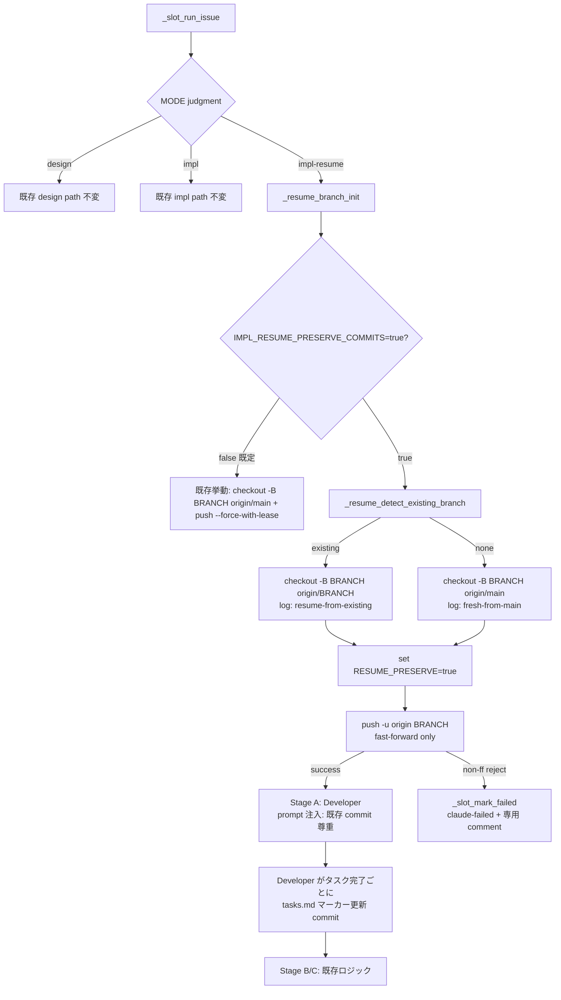
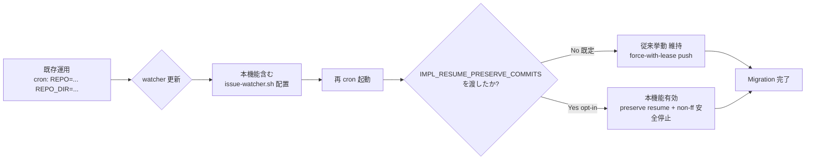

# Design Document

## Overview

**Purpose**: 本機能は `impl-resume` モードを「`origin/main` 起点での強制リセット + force-with-lease push」から
「既存 origin branch を尊重した resume + fast-forward 制約 push + tasks.md 進捗追跡」へ拡張する手段を、
opt-in env var `IMPL_RESUME_PRESERVE_COMMITS=true` 配下で提供する。これによりリポジトリ運用者・Issue 担当者が
quota 切れ後の途中 commit 喪失や、人間が手動で積んだ commit の force-push 上書き事故を回避できる
（PR #62 / #64 が事例）。

**Users**: 本リポジトリおよび他の idd-claude installed repo の運用者・Issue 担当者。Reviewer の
`claude-failed` 後に手動 PR を作成して再 pickup させる workflow、Claude Max quota 中断後の再開 workflow、
`impl-resume` 実行中の人間補完 commit を保護したい workflow の 3 つを対象とする。

**Impact**: 既存の `impl-resume` worktree 初期化シーケンス（`local-watcher/bin/issue-watcher.sh` line 2944-2953）
を「opt-in flag があるとき」に限り別ブランチへ分岐させる。既定値 OFF (`IMPL_RESUME_PRESERVE_COMMITS=false`)
では既存 force-with-lease push 経路を一切変えず、cron / launchd 登録文字列・既存 env var 名・既存ラベル
遷移契約を保つ。Developer subagent prompt（local-watcher 内 heredoc）にも resume 用の指示分岐を追加する
が、こちらも opt-in flag 経由でのみ injectable とする。

### Goals
- `IMPL_RESUME_PRESERVE_COMMITS=true` 下で `impl-resume` モードが既存 origin branch を尊重して resume できる
- `tasks.md` 進捗マーカーを Developer 完了タスク単位で永続化し、quota 切れ後の再開点を機械的に判定可能にする
- 人間 commit を含むブランチへの force-push を抑制し、非 fast-forward 検出時に `claude-failed` で安全停止する
- 既定値 OFF / 既存 env var 名固定 / 既存ラベル遷移契約維持により、既存 install 済みリポジトリへの移行コストをゼロに保つ
- 本リポジトリでの dogfooding（途中 commit fixture / 人間 commit fixture）で 3 シナリオ全てを観測検証する

### Non-Goals
- 人間 commit が混在したブランチに対する自動 merge / 自動 rebase（Out of Scope: requirements.md L98）
- Reviewer 判定段階の resume（Out of Scope: requirements.md L99、#63 範疇）
- Claude Max quota の自動検知と auto-resume 判定（Out of Scope: requirements.md L100、#66 範疇）
- 作業ブランチ上の untracked / commit 未確定ファイルの保護（requirements.md AC 2.5 で除外明示）
- 既存ラベル名の rename・廃止
- GitHub Actions 版 `.github/workflows/issue-to-pr.yml` への同等導入（Out of Scope: requirements.md L103）
- `IMPL_RESUME_PRESERVE_COMMITS=true` 既定化への移行スケジュール設計（Out of Scope: requirements.md L104）

## Architecture

### Existing Architecture Analysis

`impl-resume` モードは Slot Runner サブシェル内 (`local-watcher/bin/issue-watcher.sh` の `_slot_run_issue`)
で以下を直線的に実行している:

1. `_worktree_ensure` / `_worktree_reset`（detached HEAD を `origin/main` 強制リセット + `clean -fdx`）
   — Phase C 共通インフラなので本機能では触らない
2. 既存 spec dir 検出 (`docs/specs/<N>-*/requirements.md` 存在で `MODE="impl-resume"`)
3. ラベル付け替え `claude-claimed → claude-picked-up`
4. **branch 切り替え**: `git checkout -B "$BRANCH" "origin/main"` → `git push -u origin --force-with-lease`
   ← **本機能の主要変更点（line 2944 〜 2953）**
5. `run_impl_pipeline`（Stage A: Developer / Stage B: Reviewer / Stage C: PjM）
   — Stage A の Developer prompt（`build_dev_prompt_a "impl-resume"`）に resume 指示を追加する

尊重すべきドメイン境界:
- **Slot Runner サブシェル境界**: 環境変数変更は親に伝播しない設計を維持（Phase C / Req 3.5）
- **Reviewer Gate**: Stage A → B → C の状態遷移は本機能で変更しない
- **Issue ラベル状態機械**: `claude-claimed` / `claude-picked-up` / `claude-failed` の遷移を変えない
- **既存 force-with-lease push 経路**: opt-out 時は完全等価に保つ

維持すべき統合点:
- `mark_issue_failed` / `_slot_mark_failed`（`claude-failed` 遷移ヘルパ）— 非 fast-forward 検出時にも再利用
- Slot worktree の per-slot 永続性（worktree の追加作成・破棄は行わない）
- 既存の Stage B (Reviewer) / Stage C (PjM) push（`git push origin "$BRANCH"`）が成功する状態を保つ
  — 本機能は branch 初期化のみを変更し、後続 push は既存ロジックに任せる

解消・回避する technical debt:
- 「`origin/main` 起点で強制リセット」が impl-resume の暗黙仕様だった点を、env var で明示的に切り替え可能にする

### Architecture Pattern & Boundary Map

採用パターン: **Strategy Pattern (env-flag dispatch)**。`impl-resume` の branch 初期化を 2 つの戦略（既存 fresh
init / 新規 preserve resume）に分け、`IMPL_RESUME_PRESERVE_COMMITS` の値で切り替える。Slot Runner 内の単一の
helper 関数 `_resume_branch_init` を呼び出す形に refactor し、関数内部で 2 戦略を分岐する。



**Architecture Integration**:
- 採用パターン: Strategy Pattern (env-flag dispatch) + 1 つの新規 helper 関数
- ドメイン／機能境界: `_resume_branch_init` を Slot Runner と Stage A の中間に挟むことで「branch 初期化」と
  「Developer 起動」を疎結合に保つ。Reviewer / PjM は本変更の影響を受けない
- 既存パターンの維持: Phase C の Slot Runner サブシェル境界・既存 `mark_issue_failed` パス・既存ラベル付け替え
- 新規コンポーネントの根拠: 既存 line 2944-2953 を `_resume_branch_init` に切り出すことで、(a) 戦略分岐が可読化、
  (b) shellcheck の警告を局所化、(c) opt-out 時の挙動が「同じ関数の既定 branch」として証跡可能になる

### Technology Stack

| Layer | Choice / Version | Role in Feature | Notes |
|-------|------------------|-----------------|-------|
| Frontend / CLI | bash 4+ | Slot Runner / `_resume_branch_init` 実装言語 | CLAUDE.md 既存規約 |
| Backend / Services | `gh` CLI / `git` CLI | branch 検出・push・ラベル操作 | `flock`/`jq`/`timeout` も従来どおり |
| Data / Storage | `tasks.md`（リポジトリ内 markdown） | 進捗マーカーの永続化媒体 | `- [ ]` → `- [x]` 行内編集 |
| Messaging / Events | GitHub Issue ラベル / Issue コメント | non-ff 検出時の人間通知 | 既存 `_slot_mark_failed` 流用 |
| Infrastructure / Runtime | cron / launchd / Phase C Slot Worktree | env var 注入経由で本機能を opt-in | 既存登録文字列を変更しない |

## File Structure Plan

本機能はバックエンド配置のみで、新規ディレクトリは作成しない。既存ファイルへの追記/編集が中心。

### Modified Files

```
local-watcher/bin/
├── issue-watcher.sh        # 主要編集対象
│   ├── Config block (~L46-167) に IMPL_RESUME_PRESERVE_COMMITS / IMPL_RESUME_PROGRESS_TRACKING を追加
│   ├── 新規関数 _resume_normalize_flag        : env 値を厳格に true/false 正規化
│   ├── 新規関数 _resume_detect_existing_branch : origin に branch があるか git ls-remote --exit-code で判定
│   ├── 新規関数 _resume_branch_init            : Strategy 分岐の本体（既存 line 2944-2953 を内包）
│   ├── 新規関数 _resume_push                  : fast-forward push と non-ff 検出を行う
│   ├── 新規関数 _resume_mark_nonff_failed     : non-ff 専用の claude-failed 遷移ヘルパ
│   ├── _slot_run_issue 内の line 2944-2953 を _resume_branch_init 呼び出しに置き換え
│   └── build_dev_prompt_a "impl-resume" 内に resume 指示の inline 追記（IMPL_RESUME_PRESERVE_COMMITS=true 時）
│
├── triage-prompt.tmpl       # 変更なし
└── (no new files)

repo-template/
└── .claude/agents/
    └── developer.md        # tasks.md 進捗マーカー更新と「既存 commit を温存」指示を追記

.claude/agents/
└── developer.md            # 上記 repo-template と同等の追記（idd-claude 自身用）

repo-template/CLAUDE.md     # impl-resume の branch policy セクションに 1 段落追記（任意）
README.md                   # Phase C / impl-resume 節に opt-in 手順 + Migration Note + opt-in 後の挙動説明
```

各 Component と File の対応:

| Component | 配置ファイル | 行レベル位置 |
|---|---|---|
| `_resume_normalize_flag` | `local-watcher/bin/issue-watcher.sh` | Config block 直後の helper セクション |
| `_resume_detect_existing_branch` | `local-watcher/bin/issue-watcher.sh` | `_resume_normalize_flag` の直下 |
| `_resume_branch_init` | `local-watcher/bin/issue-watcher.sh` | 上記 2 つの直下 |
| `_resume_push` | `local-watcher/bin/issue-watcher.sh` | `_resume_branch_init` の直下 |
| `_resume_mark_nonff_failed` | `local-watcher/bin/issue-watcher.sh` | `_resume_push` の直下 |
| `Slot Runner Resume Hook` | `local-watcher/bin/issue-watcher.sh` | 既存 line 2944-2953 の置換点 |
| `Developer Resume Prompt Injection` | `local-watcher/bin/issue-watcher.sh` | `build_dev_prompt_a` 内 (`impl-resume` ブランチ) |
| `Tasks Progress Tracker (規約)` | `.claude/agents/developer.md` / `repo-template/.claude/agents/developer.md` | 「実装フロー」節への追記 |
| `Documentation Updates` | `README.md` | Phase C / impl-resume 節 |

## Requirements Traceability

| Requirement | Summary | Components | Interfaces | Flows |
|---|---|---|---|---|
| 1.1 | 既定 (`PRESERVE_COMMITS=false`) で旧挙動維持 | `_resume_normalize_flag` / `_resume_branch_init` | env → flag normalization → fresh-init branch | 既存 fresh-init 経路を温存 |
| 1.2 | `PRESERVE_COMMITS=true` で保護挙動有効化 | `_resume_branch_init` | flag dispatch | 新規 preserve-resume 経路 |
| 1.3 | 受理値 `true`/`false` の 2 値、それ以外は `false` 等価 | `_resume_normalize_flag` | strict whitelist 比較 | env 値正規化 |
| 1.4 | 既存 env var 名の意味と受理形式を改変しない | (無変更を保証) | 触らない | — |
| 1.5 | 既存 cron / launchd 登録文字列を変えなくても動作 | `_resume_normalize_flag`（unset → false） | env 既定値で no-op | — |
| 2.1 | 既存 origin branch から resume | `_resume_detect_existing_branch` / `_resume_branch_init` | `git ls-remote --exit-code origin <branch>` | preserve-resume 経路 |
| 2.2 | branch 不在時は `origin/main` 起点で初期化 | `_resume_branch_init` | detection が unfound 返却時 | fresh-init 経路 (preserve flag on でも) |
| 2.3 | 「既存 branch から resume 中」を事後判別可能ログに記録 | `_resume_branch_init` / Slot Runner Resume Hook | `slot_log` で `resume-mode=existing-branch sha=<sha>` 等 | NFR 2.1 観測ログ |
| 2.4 | Developer prompt に resume 指示を渡す | `Developer Resume Prompt Injection` | `build_dev_prompt_a "impl-resume"` 内分岐 | Stage A prompt に文字列追加 |
| 2.5 | untracked / 一時ファイルは保護対象外 | `_resume_branch_init`（既存 `clean -fdx` を温存しない方針は別） | `git reset --hard` 後の clean -fdx | requirements.md と整合 |
| 3.1 | `PROGRESS_TRACKING` 既定 / `true` 時にマーカー更新 | `Tasks Progress Tracker` 規約 | Developer subagent が markdown 編集 + commit | Developer に flag 値を inline 通知 |
| 3.2 | `PROGRESS_TRACKING=false` で更新無効化 | `Tasks Progress Tracker` 規約 | Developer prompt に「skip 進捗更新」を inline 通知 | Stage A prompt 分岐 |
| 3.3 | 未完了マーカー残存時、先頭タスクから再開 | `Tasks Progress Tracker` 規約 / Developer Resume Prompt Injection | `developer.md` の実装フロー追記 | Developer 行動規約 |
| 3.4 | 全完了時は追加実装をしない | 同上 | 同上 | Developer 行動規約 |
| 3.5 | マーカー部分のみ書き換え、本文/順序/アノテーションは不変 | 同上 | `developer.md` の実装フロー追記（規約） | Developer 行動規約 |
| 3.6 | `PROGRESS_TRACKING` 受理値 `true`/`false`、それ以外は `true` 等価 | `_resume_normalize_flag`（既定値 true mode） | strict whitelist + 既定 true | env 値正規化 |
| 4.1 | 既存 origin branch resume 時の push は fast-forward 制約 | `_resume_push` | `git push -u origin <branch>`（force 系オプション無し） | preserve-resume 経路 |
| 4.2 | non-ff reject 時はリトライせず `claude-failed` | `_resume_push` / `_resume_mark_nonff_failed` | exit code → `_slot_mark_failed` | non-ff failure path |
| 4.3 | non-ff failure 時に専用 Issue コメント投稿 | `_resume_mark_nonff_failed` | `gh issue comment` template | NFR 2.2 観測ログ |
| 4.4 | `PRESERVE_COMMITS=false` 時は force-push 抑制対象外 | `_resume_branch_init`（既定 branch） | 既存 `--force-with-lease` を温存 | 既存挙動 |
| 4.5 | non-ff 安全停止時に既存 commit を改変・削除・rebase しない | `_resume_push`（reset/rebase を行わない設計） | 戻り値で停止 | non-ff failure path |
| 5.1 | README に env var 用途・既定値・有効化方法 | `Documentation Updates` | README 編集 | docs |
| 5.2 | README に opt-in 時の新挙動を運用者視点で記述 | 同上 | 同上 | docs |
| 5.3 | README Migration Note: 既定で旧挙動維持・新規 branch は従来通り・進行中 Issue は無影響 | 同上 | 同上 | docs |
| 6.1 | 途中 commit fixture シナリオの観測検証 | dogfood test | 本リポジトリで実 Issue + branch fixture | E2E 検証 |
| 6.2 | 人間 commit fixture シナリオで non-ff 安全停止検証 | dogfood test | 同上 | E2E 検証 |
| 6.3 | 既定 OFF で旧挙動維持を再現検証 | dogfood test | 同上 | E2E 検証 |
| NFR 1.1 | 既定値下で既存 Issue / PR / cron が無影響 | `_resume_normalize_flag`（unset → false） | env 既定 = false | 既存経路を温存 |
| NFR 1.2 | 既存ラベル名・意味・遷移契約を変えない | (無変更を保証) | 触らない | — |
| NFR 1.3 | 既存 exit code / `LOG_DIR` フォーマット契約を変えない | `_resume_branch_init` / `_resume_mark_nonff_failed` | 既存 `slot_log` / `_slot_mark_failed` 流用 | 既存ログ書式維持 |
| NFR 2.1 | 3 イベント（resume / fresh-init / non-ff 検出）をログに記録 | `_resume_branch_init` / `_resume_push` | `slot_log` / `slot_warn` | 観測ログ |
| NFR 2.2 | non-ff failure を ログ単独で原因と Issue 番号特定可能 | `_resume_mark_nonff_failed` | `slot_warn` + `_slot_mark_failed` 内コメント | 観測ログ |
| NFR 3.1 | shellcheck 新規警告 0 件 | 全 5 関数 | shellcheck の検査 | 静的解析 |
| NFR 3.2 | actionlint 新規警告 0 件 | (workflow 変更なし) | — | 静的解析 |

## Components and Interfaces

### Watcher / Slot Runner

#### `_resume_normalize_flag`

| Field | Detail |
|---|---|
| Intent | env var の生値を厳密に `true` / `false` の 2 値に正規化（典型的 typo を安全側に倒す） |
| Requirements | 1.3, 1.5, 3.6, NFR 1.1 |

**Responsibilities & Constraints**
- 主責務: `IMPL_RESUME_PRESERVE_COMMITS` / `IMPL_RESUME_PROGRESS_TRACKING` の生値を bash 変数として受け取り、
  whitelist 比較で `true`/`false` のいずれかを stdout に echo する
- ドメイン境界: env 入出力のみ。副作用なし（純粋関数）
- データ所有権: 入力 env を変更しない / グローバル変数を編集しない
- invariants:
  - `PRESERVE_COMMITS` モード: `true` 完全一致のみ `true`、空文字 / `True` / `1` / `yes` / 不明値はすべて `false`
  - `PROGRESS_TRACKING` モード: `false` 完全一致のみ `false`、空文字（unset 含む） / その他値はすべて `true`

**Dependencies**
- Inbound: `_resume_branch_init`, `Developer Resume Prompt Injection` — 既定値解決のため (Critical)
- Outbound: なし
- External: なし

**Contracts**: Service [x]

##### Service Interface

```bash
# 第 1 引数: 正規化モード（"preserve_default_off" or "tracking_default_on"）
# 第 2 引数: 生 env 値（unset を許容 = 空文字として渡す）
# stdout: "true" または "false"
# stderr: なし
# exit code: 常に 0
_resume_normalize_flag <mode> <raw_value>
```

- Preconditions: なし（任意の文字列を受理）
- Postconditions: stdout は `true`|`false` のいずれか
- Invariants: 副作用なし

#### `_resume_detect_existing_branch`

| Field | Detail |
|---|---|
| Intent | 対象 branch が origin に存在するかを `git ls-remote --exit-code` で確実に検出 |
| Requirements | 2.1, 2.2 |

**Responsibilities & Constraints**
- 主責務: `git ls-remote --exit-code origin "refs/heads/$BRANCH"` を実行し、exit code 0 = 存在、非 0 = 不在
  と判定。`gh pr list` linked PR は使わない（理由: 設計論点 1 の決定を参照）
- ドメイン境界: git remote 問い合わせのみ。Issue / PR API には触れない
- 失敗時: ネットワーク失敗・タイムアウト等で exit code が 0/2 以外の場合、安全側に倒し「不在」扱い
  （= fresh-init 経路）+ WARN ログを出す（NFR 2.1 / 観測可能性）
- timeout: 既存 `MERGE_QUEUE_GIT_TIMEOUT`（既定 60 秒）を参照しない（impl-resume 用は新規 env を作らず
  `timeout 30` をハードコード相当とする — bash 変数で defer する程度。これも env で over-write 不要が結論）

**Dependencies**
- Inbound: `_resume_branch_init` — 戦略分岐の入力 (Critical)
- Outbound: `git`（CLI コマンド呼び出し） (Critical)
- External: GitHub remote (HTTPS) — タイムアウト時は不在扱いで継続 (Important)

**Contracts**: Service [x]

##### Service Interface

```bash
# 引数: $1 = branch name（例: "claude/issue-67-impl-..."）
# 戻り値: 0 = origin に存在、1 = 不在 / 検出失敗（呼び出し元では同等扱い）
# 副作用: なし（git ls-remote は read-only）
_resume_detect_existing_branch <branch>
```

#### `_resume_branch_init`

| Field | Detail |
|---|---|
| Intent | `impl-resume` モードの branch 初期化を opt-in flag によって 2 戦略のいずれかにディスパッチ |
| Requirements | 1.1, 1.2, 2.1, 2.2, 2.3, 2.5, 4.4, NFR 1.3, NFR 2.1 |

**Responsibilities & Constraints**
- 主責務: 既存の `git checkout -B "$BRANCH" "origin/main"` + `git push -u origin "$BRANCH" --force-with-lease`
  シーケンス（line 2944-2953）を内包。`IMPL_RESUME_PRESERVE_COMMITS=true` ＋ origin branch 存在のときのみ
  `git checkout -B "$BRANCH" "origin/$BRANCH"` に切り替え、push は `_resume_push` に委譲
- ドメイン境界: branch 切り替えと初期 push のみ。タスク実装フェーズ以降には踏み込まない
- グローバル変数: `RESUME_PRESERVE` を export（Slot Runner 内のサブシェル変数。`build_dev_prompt_a` が
  prompt 注入判断に使う）
- 失敗時: 既存と同じく `_slot_mark_failed "branch-checkout"` または `"branch-push"` で claude-failed 化
- ログ:
  - `slot_log "resume-mode=existing-branch branch=$BRANCH origin_sha=<short>"`（preserve resume 時）
  - `slot_log "resume-mode=fresh-from-main branch=$BRANCH"`（既定または branch 不在時）
  - `slot_log "resume-mode=legacy-force-push branch=$BRANCH"`（PRESERVE_COMMITS=false 時）

**Dependencies**
- Inbound: Slot Runner Resume Hook（line 2944 の置換呼び出し点） (Critical)
- Outbound: `_resume_normalize_flag`, `_resume_detect_existing_branch`, `_resume_push`, `_slot_mark_failed`,
  `git checkout -B` (Critical)
- External: なし

**Contracts**: Service [x] / State [x]

##### Service Interface

```bash
# 入力 (環境変数経由):
#   BRANCH                          : claude/issue-N-impl-<slug> 形式
#   IMPL_RESUME_PRESERVE_COMMITS    : "true" / "false" / unset
#   MODE                            : "impl-resume" 前提（呼び出し元で gate 済み）
# 戻り値: 0 = init 成功（HEAD = $BRANCH）, 非 0 = 失敗（既に claude-failed 付与済み）
# 副作用:
#   - git checkout -B（local branch 作成）
#   - git push -u origin（fast-forward または force-with-lease。flag 値で分岐）
#   - $LOG にイベントログ append
#   - 失敗時 _slot_mark_failed が gh issue edit + gh issue comment を発射
# State:
#   呼び出し後 export 状態の RESUME_PRESERVE = "true" | "false"
_resume_branch_init
```

- Preconditions: `MODE="impl-resume"`, `BRANCH` 設定済み, `git fetch origin --prune` 済み
  （`_worktree_reset` が事前に呼ばれている）
- Postconditions: 成功時、worktree HEAD は `$BRANCH`、origin 上に同名 branch が push 済み
- Invariants: `PRESERVE_COMMITS=false` 時の挙動は本機能導入前と完全等価

#### `_resume_push`

| Field | Detail |
|---|---|
| Intent | preserve-resume 経路における fast-forward 制約 push と non-ff reject 検出 |
| Requirements | 4.1, 4.2, 4.3, 4.5 |

**Responsibilities & Constraints**
- 主責務: `git push -u origin "$BRANCH"`（force 系オプションを一切付けない）を実行。stderr に
  "non-fast-forward" / "rejected" / "Updates were rejected" のいずれかが現れたら non-ff と判定
- ドメイン境界: push 実行と結果判定のみ。reset / rebase / merge を行わない（AC 4.5）
- リトライしない（AC 4.2）
- 失敗時: stderr 内容を `slot_warn` で構造化ログ化 → `_resume_mark_nonff_failed` 呼び出し → 戻り値 1

**Dependencies**
- Inbound: `_resume_branch_init`（preserve resume 経路） (Critical)
- Outbound: `git push`, `_resume_mark_nonff_failed` (Critical)

**Contracts**: Service [x]

##### Service Interface

```bash
# 引数: $1 = branch
# 戻り値: 0 = push 成功, 1 = non-ff reject, 2 = その他のネットワーク等エラー
# 副作用: 失敗時 _resume_mark_nonff_failed が claude-failed + Issue コメント投稿
# stderr 解析パターン (POSIX ERE):
#   ^[[:space:]]*!.*non-fast-forward$  または  rejected.*non-fast-forward
_resume_push <branch>
```

#### `_resume_mark_nonff_failed`

| Field | Detail |
|---|---|
| Intent | non-ff 専用の `claude-failed` 遷移ヘルパ。Issue コメントに「force-push 抑制で停止した」旨と人間操作手順を記載 |
| Requirements | 4.2, 4.3, NFR 2.2 |

**Responsibilities & Constraints**
- 主責務: `_slot_mark_failed "branch-nonff" "<message>"` を呼び出し、message に以下を含める:
  - 「自動 force-push を抑制したため停止しました」
  - 「人間が手動で衝突解消後、`claude-failed` ラベルを除去すると次サイクルで再 pickup されます」
  - 「対象 branch: `$BRANCH`」「対象 Issue: #$NUMBER」
- ドメイン境界: 既存 `_slot_mark_failed` の薄い wrapper。直接 `gh` 呼び出しはしない（責務分離）

**Dependencies**
- Inbound: `_resume_push` (Critical)
- Outbound: `_slot_mark_failed` (Critical)

**Contracts**: Service [x]

##### Service Interface

```bash
# 引数: $1 = branch, $2 = stderr の tail（任意。診断情報として Issue コメントに含める）
# 戻り値: 常に 0（呼び出し元は別途 1 を返す）
_resume_mark_nonff_failed <branch> [<stderr_tail>]
```

### Slot Runner / Stage A Prompt 注入

#### `Slot Runner Resume Hook`

| Field | Detail |
|---|---|
| Intent | 既存 line 2944-2953 を `_resume_branch_init` 1 行呼び出しに置き換える接続点 |
| Requirements | 1.1, 1.2, 2.1, 2.2 |

**Responsibilities & Constraints**
- 主責務: `MODE` が `impl-resume` のときのみ `_resume_branch_init` を呼び出す。`design` / `impl` モードでは
  既存の `git checkout -B "$BRANCH" "origin/main"` + `git push -u origin --force-with-lease` を呼ぶ
  （= 既存挙動完全維持）
- ドメイン境界: switch/case の追加のみ。新規ロジックは `_resume_branch_init` 内に閉じる
- 失敗時: 既存と同じく非 0 終了で `_slot_run_issue` が return 1

**Dependencies**
- Inbound: `_slot_run_issue` 本体 (Critical)
- Outbound: `_resume_branch_init` (Critical)

**Contracts**: State [x]

#### `Developer Resume Prompt Injection`

| Field | Detail |
|---|---|
| Intent | `build_dev_prompt_a "impl-resume"` の heredoc 内に、preserve-resume / progress-tracking の追加指示を inline で挿入 |
| Requirements | 2.4, 3.1, 3.2, 3.3, 3.4, 3.5 |

**Responsibilities & Constraints**
- 主責務: bash 関数 `build_dev_prompt_a` の `impl-resume` ケース内で以下 2 つの inline 文字列を組み立てる:
  - `RESUME_PRESERVE=true` のとき: 「既存 branch から resume 中。tasks.md の未完了マーカー先頭から実装を継続。
    既存 commit を温存し、reset / rebase は行わない」
  - `IMPL_RESUME_PROGRESS_TRACKING=true`（既定）のとき: 「タスク完了ごとに `tasks.md` の対応マーカーを
    `- [ ]` → `- [x]` に書き換え、`docs(tasks): mark <task-id> as done` という commit を別途積むこと。
    タスク本文 / `_Requirements:_` / `_Boundary:_` / `_Depends:_` / 順序を改変しない」
  - `IMPL_RESUME_PROGRESS_TRACKING=false` のとき: 「進捗マーカーの書き換えは行わない」
- ドメイン境界: prompt 文字列の組み立てのみ。Developer subagent の実行は既存 `claude --print` に任せる
- 既存 prompt（impl-resume の Step 1）は変えず、末尾に追加セクションを差し込む形にする

**Dependencies**
- Inbound: `run_impl_pipeline` Stage A (Critical)
- Outbound: Developer subagent（claude CLI） (Critical)

**Contracts**: API [x] (heredoc-based prompt contract)

### Tasks Progress Tracker (規約: Developer 行動規約)

#### `Tasks Progress Tracker (規約)`

| Field | Detail |
|---|---|
| Intent | Developer subagent が tasks.md の進捗マーカーを更新する作法を `developer.md` に明記する |
| Requirements | 3.1, 3.3, 3.4, 3.5 |

**Responsibilities & Constraints**
- 主責務: タスク完了 commit と独立に、`tasks.md` の `- [ ] N.M ...` を `- [x] N.M ...` に行内編集する commit
  （`docs(tasks): mark N.M as done`）を発射する規約
- マーカー format（設計論点 2 の決定を参照）: `- [x]` / `- [ ]` の **markdown checkbox 1 種のみ**
  （hidden marker は導入しない）
- マーカーの粒度: tasks-generation.md の階層 ID（`1`, `1.1`, `1.2`, `2`, ...）の **全行**を対象。
  親タスクは子タスクが全て `- [x]` になったタイミングで親側も `- [x]` に更新（既存 `- [ ]*` deferrable
  テストタスクは未完了でも親完了に進める。tasks-generation.md の deferrable 規約を維持）
- 改変してはならない領域: タスク本文・`_Requirements:_` / `_Boundary:_` / `_Depends:_` の各行・タスク順序
  （AC 3.5）
- 進捗開始位置: tasks.md を Read し、最初の `- [ ]` 行の numeric ID から再開（AC 3.3）
- 全完了時: 追加実装をせず、impl-notes.md にその旨記録（AC 3.4）

**Dependencies**
- Inbound: Stage A Developer subagent（local-watcher prompt 経由） (Critical)
- Outbound: tasks.md（既存ファイル）への Edit ツール操作 (Critical)

**Contracts**: Batch [x] (per-task commit batch)

### Documentation Updates

#### `Documentation Updates`

| Field | Detail |
|---|---|
| Intent | README に opt-in 手順 / 新挙動 / Migration Note を追記し、運用者が単独で適用判断できる状態にする |
| Requirements | 5.1, 5.2, 5.3 |

**Responsibilities & Constraints**
- 主責務: README の Phase C / impl-resume 節に以下を追記:
  - opt-in 手順: cron / launchd 側で `IMPL_RESUME_PRESERVE_COMMITS=true` を渡す方法
  - opt-in 後の挙動: 既存 origin branch から resume / tasks.md 進捗マーカー更新 / force-push 抑制と
    `claude-failed` 遷移
  - Migration Note: 「既定では従来挙動が維持される」「opt-in 後も新規 branch（origin に branch 無し）は
    従来通り初期化」「進行中 Issue は本変更で中断・再 claim されない」
- ドメイン境界: ドキュメントのみ（コード変更なし）
- repo-template/CLAUDE.md にも同等の 1 段落を追記（任意 / consumer repo 配布用）

**Dependencies**
- Inbound: PjM が PR 本文で参照
- Outbound: README.md / repo-template/CLAUDE.md

**Contracts**: なし（ドキュメント）

## 設計論点の決定

### 論点 1: 既存 branch detection の信頼性（`gh pr list` linked PR 検出 vs `git ls-remote --heads` 単独 vs 両方の組合せ）

**決定**: `git ls-remote --exit-code origin refs/heads/<branch>` 単独。

**理由**:
- (a) **対象が branch 存在の真実値**: 要件 2.1 / 2.2 は「対象 Issue の作業ブランチが origin に既存するか」を
  判定基準としている。これは PR の有無とは独立で、PR が close されていても branch が残っているケース・
  Reviewer の `claude-failed` 後に PR が未作成のままのケース・人間が直接 push した branch などすべてを
  カバーする必要がある。`gh pr list` は PR が存在しない場合に false negative を返す
- (b) **依存最小化**: `git ls-remote` は git 標準コマンドで、`gh` API トークン状態に依存しない。
  CLAUDE.md 「依存 CLI: `gh`, `jq`, `flock`, `git`」の前提下で、`gh` 障害時にも動作する
- (c) **タイムアウト/失敗時の挙動が明快**: 不在扱い（fresh-init）に倒すルールが、PR API の rate limit や
  query 仕様変更に影響されない
- 代替案 `gh pr list` linked PR 検出は採用しない（PR が close 済 / 未作成 / 別 branch から merge 済みなど
  branch の真実値と乖離するパスが多い）。組合せも複雑性が増えるだけで信頼性向上に寄与しない

### 論点 2: tasks.md 進捗マーカー format（`- [x]` のみ vs hidden marker `<!-- progress: 1.3 -->` 併用 vs 両方）

**決定**: `- [x]` の markdown checkbox のみ。hidden marker は導入しない。

**理由**:
- (a) **既存 tasks.md format と直接整合**: tasks-generation.md は `- [ ] 1.1 <子タスク>` 形式を規定。
  `- [x]` 化はこの規約に対する自然な変更で、Developer / Reviewer / 人間レビュワー全員が一目で進捗を把握できる
- (b) **書き換え範囲の局所化**: hidden HTML コメントは生成・更新・削除タイミングがマーカー本体と
  ずれやすく、AC 3.5「マーカー部分のみ書き換え」を機械検証する難易度が上がる。`- [x]` だけなら 1 行内の
  4 文字差分（`[ ]`→`[x]`）に閉じる
- (c) **GitHub UI での可視性**: GitHub の markdown renderer は `- [x]` を checkbox として描画する。
  PR レビュー画面でも進捗が即座にわかる
- (d) **障害ケースの単純化**: hidden marker と本体マーカーの整合性破綻（片方だけ更新失敗等）が起こり得ない
- 代替案 hidden marker 併用は採用しない（複雑性増大に対する恩恵が小さい）

### 論点 3: resume vs fresh の判定（`IMPL_RESUME_FORCE_FRESH=true` 等の override flag を導入するか）

**決定**: 導入しない。`IMPL_RESUME_PRESERVE_COMMITS=false`（既定）に倒すことで「強制 fresh」と等価の効果が
得られるため、追加 flag は不要とする。

**理由**:
- (a) **要件側で要請されていない**: requirements.md は `IMPL_RESUME_PRESERVE_COMMITS` の 1 個 + `IMPL_RESUME_PROGRESS_TRACKING`
  の 1 個（計 2 個）の env のみ規定。Architect が要件を発明しないという design-review-gate.md の指針に従う
- (b) **既存 cron / launchd で代替可能**: 強制 fresh が必要な場合、cron 側で `IMPL_RESUME_PRESERVE_COMMITS=false`
  を一時的に渡すか、env を unset すれば既定の force-with-lease 経路に戻る。new flag を増やすのは UX 上の冗長
- (c) **後方互換性の単純化**: env var を 1 個増やすごとに「既存 cron 文字列を変えない」要件 (1.5) の検証範囲が
  広がる。最小セットに保つ
- (d) **branch 個別の override が必要なら別 Issue**: 「特定 Issue だけ強制 fresh したい」は人間が手動で
  origin branch を `git push origin :<branch>` 削除する運用で対応可能（Migration Note に記載）
- 代替案 `IMPL_RESUME_FORCE_FRESH` 追加は採用しない

## Error Handling

### Error Strategy

エラーは Slot Runner の既存パス（`_slot_mark_failed` → `claude-failed` ラベル + Issue コメント + 次サイクル
へ持ち越し）に統合する。新規エラー種別を作らず、既存 stage 名（`branch-checkout` / `branch-push`）に
`branch-nonff` を追加するだけに留める。

### Error Categories and Responses

- **User Errors (4xx 相当)**:
  - **env 値が不正（`IMPL_RESUME_PRESERVE_COMMITS=Yes` / `1` / 空文字）**:
    `_resume_normalize_flag` が安全側（`false`）に倒す。WARN ログは出さない（既定が `false` で運用者期待値と
    乖離しないため。要件 1.3 と整合）
- **System Errors (5xx 相当)**:
  - **`git ls-remote` タイムアウト / ネットワーク失敗**:
    `_resume_detect_existing_branch` が「不在」を返し、`slot_warn "ls-remote failed; treat as fresh-init"`
    を出力。fresh-init 経路に倒れる（fail-safe）
  - **`git checkout -B "$BRANCH" "origin/$BRANCH"` 失敗（broken ref / SHA 欠損）**:
    `_resume_branch_init` が `_slot_mark_failed "branch-checkout"` で claude-failed 化（既存の挙動と同等）
- **Business Logic Errors (422 相当)**:
  - **non-ff push reject（人間 commit を含むケース、AC 4.2）**:
    `_resume_push` が `_resume_mark_nonff_failed` 経由で claude-failed 化。Issue コメントに「force-push を
    抑制した」旨と「人間が衝突解消後 `claude-failed` 除去で再 pickup される」旨を記載

### 観測ログ仕様（NFR 2.1 / 2.2）

すべて `slot_log` / `slot_warn` 経由（既存 `[YYYY-MM-DD HH:MM:SS] slot-N: #N: <text>` 書式に従う）:

| イベント | ログ行（例） | NFR ID |
|---|---|---|
| 既存 branch から resume | `slot_log "resume-mode=existing-branch branch=claude/issue-67-impl-... origin_sha=abc1234"` | 2.1 |
| fresh init（branch 不在 or PRESERVE=false） | `slot_log "resume-mode=fresh-from-main branch=..."` または `slot_log "resume-mode=legacy-force-push branch=..."` | 2.1 |
| non-ff push 検出 | `slot_warn "non-ff push detected; aborting (branch=...)"` + `slot_log "resume-failure=non-ff issue=#67"` | 2.1 / 2.2 |

## Testing Strategy

> 本リポジトリにユニットテストフレームワークは存在しない（CLAUDE.md「テスト・検証」節）。検証は静的解析 +
> 手動スモーク + dogfooding の 3 段で行う。

### Unit (Static Analysis + Smoke)
1. `shellcheck local-watcher/bin/issue-watcher.sh` で新規警告ゼロ（NFR 3.1）
2. cron-like 最小 PATH での起動確認: `env -i HOME=$HOME PATH=/usr/bin:/bin bash -c '$HOME/bin/issue-watcher.sh'`
   が `処理対象の Issue なし` を出して正常終了する（既存 smoke を退行させない）
3. `_resume_normalize_flag` を bash inline で呼び出し、6 ケース（`true` / `false` / 空 / `True` / `1` / `yes`）
   が仕様どおりに正規化されることを確認
4. `_resume_detect_existing_branch` を本 repo の任意 origin branch / 存在しない branch で呼び出し、exit code が
   期待通りであることを確認
5. `IMPL_RESUME_PRESERVE_COMMITS` 未設定で watcher を起動し、impl-resume 経路の log に `resume-mode=legacy-force-push`
   が出ることを目視確認

### Integration (Slot Runner / Stage A 連携)
1. PRESERVE=true + branch 不在 → `slot_log "resume-mode=fresh-from-main"` のみが出力され、`git push -u origin`
   が成功する
2. PRESERVE=true + branch 存在 + ff push 可能 → `slot_log "resume-mode=existing-branch"` 出力、push が
   `force-with-lease` を含まないコマンドで成功する
3. PRESERVE=true + branch 存在 + ローカル/リモートが diverge → `_resume_push` が non-ff を検出し、
   `_resume_mark_nonff_failed` が `claude-failed` ラベル付与 + Issue コメント投稿
4. PRESERVE=false（既定）→ 本機能導入前と完全等価のシーケンスがログに残る（`legacy-force-push` 行のみ）
5. `build_dev_prompt_a "impl-resume"` を bash inline で呼び出し、`RESUME_PRESERVE=true` 時に prompt 末尾に
   resume 指示節 + tasks.md 更新指示節が含まれることを目視確認

### E2E (Dogfood)
1. **シナリオ A（途中 commit 保護）**: 本リポジトリで `auto-dev` Issue を立て、watcher が impl-resume に入る
   状態にする。手動で branch に空 commit を push（quota 切れ相当）→ Issue から `claude-failed` 削除して
   再 pickup → `IMPL_RESUME_PRESERVE_COMMITS=true` で実行 → 既存 commit が保持されたまま実装が継続される
   ことを確認（AC 6.1）
2. **シナリオ B（人間 commit 保護）**: 同じ Issue に人間が直接補完 commit を push（fast-forward 不可な
   状態を作るため、watcher 側のローカルを意図的に古い HEAD に固定）→ 再起動 → non-ff 検出で
   `claude-failed` 遷移 + Issue コメント投稿（AC 6.2）
3. **シナリオ C（既定 OFF 等価性）**: 上記同シナリオを `IMPL_RESUME_PRESERVE_COMMITS=false`（既定）で実行
   → 本機能導入前と同一の force-with-lease 上書き push 挙動になり、既存 commit が破棄される（AC 6.3）

### Performance / Load
- 本機能は `git ls-remote` 1 回 + `git checkout -B` 1 回 + `git push` 1 回の追加で、Slot Runner の総実行時間
  に対して数秒未満の増分。Performance 目標は設定しない（要件側に記載なし）

## Migration Strategy

opt-in flag のみで導入し、既存 install 済みリポジトリは何もしなければ無影響。



Migration Note（README に記載される内容）:
- 既定では従来挙動が維持される（cron 文字列を変えなくて良い）
- opt-in 後も新規 branch（origin にブランチが無い Issue）は従来どおり `origin/main` 起点で初期化される
- 進行中 Issue は本変更で中断・再 claim されない（既存 stage / pipeline は変えない）
- 強制 fresh が一時的に必要なケースは、cron 側で `IMPL_RESUME_PRESERVE_COMMITS=false` に戻すか、
  対象 origin branch を手動削除する運用で対応する
