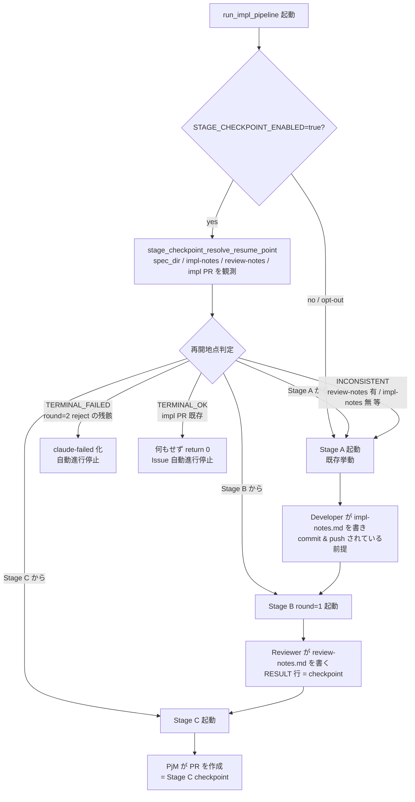
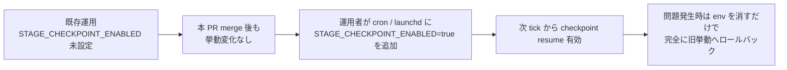

# Design Document

<!-- Issue #68 / requirements.md と対で読むこと。本書は Architect が Developer 着手前の
     設計レビューに供する。要件 ID（1.1 / 2.3 等）は本文中で明示参照する。 -->

## Overview

**Purpose**: idd-claude watcher の `impl` / `impl-resume` モードに **Stage 単位の checkpoint** を
導入し、失敗 Stage 以降のみを再実行することで Developer / Reviewer / PjM の重複呼び出しを
排除して token を節約する。`STAGE_CHECKPOINT_ENABLED=true` で opt-in する後方互換設計。

**Users**: idd-claude を本番運用しているローカル watcher オペレーター（cron / launchd 経由で
`issue-watcher.sh` を回している運用者）。直接の利用者は機械（watcher 自身）だが、failure mode
の解釈・ログ閲覧・新 env var 投入の判断は人間が行う。

**Impact**: 現状はどの Stage で失敗しても次 tick で **Stage A から再実行**されるため、
Stage B（Reviewer 異常終了）/ Stage C（PjM PR 作成失敗）で落ちただけでも Developer の重い実装が
再走する。本機能で「成果物（`impl-notes.md` / `review-notes.md` / 既存 impl PR）の存在」を
検知し、適切な Stage から resume できるようにする。`STAGE_CHECKPOINT_ENABLED=false`（既定）
では既存挙動を 1 行も変えない。

### Goals

- Stage A 完了 = `<spec_dir>/impl-notes.md` の **当該 Issue ブランチ commit 上の存在** を成果物
  checkpoint として採用する（Req 1.1）
- Stage B 完了 = `<spec_dir>/review-notes.md` の最終行 `RESULT: approve|reject` パース成功を
  checkpoint として採用する（Req 1.2）
- Stage C 完了 = 当該 Issue について open / merged 状態の impl PR の存在を観測する（Req 1.3, 2.6）
- `STAGE_CHECKPOINT_ENABLED=false`（既定）で 1 行も挙動を変えない opt-in（Req 3.1, 3.2, NFR 1.1）
- Stage B 単独失敗の場合 Stage A の Developer claude 呼び出しを 0 回にする（NFR 3.1）
- Stage C 単独失敗の場合 Stage A / B の claude 呼び出しを 0 回にする（NFR 3.2）

### Non-Goals

- Stage A 内部（PM 実行と Developer 実行の分割 checkpoint 化）
- Stage A' / Stage B (round=2) の中間状態の checkpoint 化（Reviewer reject round=1 後の
  Developer 再実行は同一 tick 内で完結させる既存挙動を維持）
- design ルート（Architect 起動を伴うルート）の checkpoint 化
- checkpoint の暗号学的署名や改竄検知
- Triage 結果の checkpoint 化
- PR Iteration Processor との連動制御（独立 opt-in を維持）
- 外部 Feature Flag SaaS 連携

## Architecture

### Existing Architecture Analysis

現在の impl pipeline は `local-watcher/bin/issue-watcher.sh` 内の以下の関数群で構成される:

- `_slot_run_issue`（L2733 付近）: 1 Issue を 1 worktree で処理する Worker。Mode 判定後に
  `run_impl_pipeline` を呼ぶ（impl / impl-resume 経路）
- `run_impl_pipeline`（L2249 付近）: 直線的な状態機械。Stage A → Stage B(round=1) →
  (reject なら Stage A' → Stage B(round=2)) → Stage C を呼ぶ
- `build_dev_prompt_a` / `build_dev_prompt_redo` / `build_reviewer_prompt` / `build_dev_prompt_c`
  の 4 つの prompt builder
- `run_reviewer_stage` / `parse_review_result`: Reviewer の起動と RESULT 行抽出
- `mark_issue_failed`: claude-failed 遷移の集約

**尊重すべき制約**:

- 既存 env var 名（`REPO` / `REPO_DIR` / `LOG_DIR` / `LOCK_FILE` / `TRIAGE_MODEL` / `DEV_MODEL` /
  `PR_ITERATION_ENABLED` 等）の意味と既定値（Req 3.4）
- 既存ラベル名（`claude-claimed` / `claude-picked-up` / `claude-failed` /
  `awaiting-design-review` / `needs-iteration` / `needs-decisions`）の意味・遷移契約（Req 3.5）
- Dispatcher の Issue 取得 exclusion query（`claude-picked-up` 付きは新規 pickup から除外
  される設計）。本機能は impl-resume 起動経路（既存 `claude-picked-up` を持つ Issue が
  自然には再 pickup されない事実）を破壊しない方針で設計する
- `_slot_run_issue` の MODE 判定ロジック（既存 spec dir 検出で `impl-resume` 判定）

**解消・回避する technical debt**: なし（本機能は既存挙動の add-on）。

### Architecture Pattern & Boundary Map

**採用パターン**: **State Refinement**（既存の直線状態機械に "skip predicate" を前置）。
新規モジュールは作らず、`run_impl_pipeline` の各 Stage 起動ブロックの直前に「Stage 完了
checkpoint があるなら skip」という小さなガードを入れる戦略。Stage 状態管理に既存の
シェル関数構造（直列に case 分岐を呼ぶ）を維持しつつ、resume 入口だけを追加する。



**Architecture Integration**:

- 採用パターン: State Refinement（既存状態機械の各 Stage 起動前に skip ガードを足す）
- ドメイン／機能境界: 「checkpoint 検知」は新規ヘルパ関数群、「Stage 起動」は既存ブロック。
  既存ブロックは flag-on/off いずれの経路からも同一引数で呼び出せるよう副作用を保つ
- 既存パターンの維持:
  - mq_log / pi_log と同じ命名（`sc_log` / `sc_warn` / `sc_error` プレフィックス）
  - mark_issue_failed / `_slot_mark_failed` の既存遷移契約を変更しない
  - parse_review_result の既存出力フォーマット（TSV）を変更しない
- 新規コンポーネントの根拠: checkpoint 検知は per-Issue ブランチの commit 履歴と GitHub PR 状態を
  読み取る独立した query 群で、prompt 組み立てや Stage 実行とは責務が異なるため独立関数とする

### Technology Stack

| Layer | Choice / Version | Role in Feature | Notes |
|-------|------------------|-----------------|-------|
| Frontend / CLI | bash 4+ | 関数追加先 | 既存 `issue-watcher.sh` を拡張 |
| Backend / Services | gh CLI | impl PR の検出（Stage C checkpoint 観測）| `gh pr list --search head:<branch>` |
| Backend / Services | git | spec_dir のファイル存在 / branch commit の確認 | 既存と同じ |
| Data / Storage | repo working tree（worktree）| `impl-notes.md` / `review-notes.md` の存在検知 | path: `$WT/$SPEC_DIR_REL/...` |
| Data / Storage | Issue branch 上の commit | 新鮮度判定の根拠（Req 4.1, 4.2）| `git log -1 --format=%H -- <path>` で当該ファイルの最終 commit を取得 |
| Messaging / Events | （なし）| - | - |
| Infrastructure / Runtime | cron / launchd | 起動経路（既存）| 起動文字列に env を 1 個追加するだけで opt-in（Req 3.6）|

## File Structure Plan

本機能は **新規ファイルを作らず**、既存 `local-watcher/bin/issue-watcher.sh` 内に
モジュール（コメント区切りの section）として追加する。idd-claude のコアは bash 単一ファイル
構成のため、関数粒度の分離で責務を表現する。

### Modified Files

- `local-watcher/bin/issue-watcher.sh` — 以下の追加・修正:
  - **(新) ヘッダ Config ブロック**（L60〜L165 周辺）: `STAGE_CHECKPOINT_ENABLED` の env 既定 false
  - **(新) Stage Checkpoint Module**（既存 reviewer block の **直前** に挿入: L1820 前後）:
    新規関数 `sc_log` / `sc_warn` / `sc_error` / `stage_checkpoint_has_impl_notes` /
    `stage_checkpoint_read_review_result` / `stage_checkpoint_find_impl_pr` /
    `stage_checkpoint_resolve_resume_point`
  - **(改) `run_impl_pipeline`**: 関数冒頭で `STAGE_CHECKPOINT_ENABLED=true` のとき
    `stage_checkpoint_resolve_resume_point` を呼び出し、結果を local 変数 `START_STAGE` に格納。
    既存の Stage A / B(round=1) / C 起動ブロックを `case "$START_STAGE" in ... esac`
    形式で `if` ガードする（A スキップ時は Stage A の `claude` を呼ばずに次へ進む）
  - **(改) ヘッダコメント**（L1〜L24 周辺）: 状態機械説明に「checkpoint resume 経路」を追記
- `README.md` — 以下を更新:
  - L598 周辺の opt-in 表に `STAGE_CHECKPOINT_ENABLED` 行を追加（Req 6.1）
  - L1255 以降に新セクション `### Stage Checkpoint (#68)` を追加（Req 6.2, 6.3）

### Directory Structure（追加なし）

```
local-watcher/
└── bin/
    └── issue-watcher.sh     # ★ 追加・修正対象（単一ファイル拡張）
README.md                    # ★ ドキュメント追加（opt-in 表 + 新セクション）
docs/specs/68-feat-watcher-stage-checkpoint-reviewer-p/
├── requirements.md          # PM 作成済み
├── design.md                # 本書
└── tasks.md                 # 本書とセット
```

### `issue-watcher.sh` 内の論理セクション構造（追加後）

```
issue-watcher.sh
├── Config ブロック                              # +1 env var (STAGE_CHECKPOINT_ENABLED)
├── 前提ツールチェック / lock / repo 最新化      # 不変
├── Phase A: Merge Queue Processor              # 不変
├── Re-check Processor                          # 不変
├── PR Iteration Processor                      # 不変
├── Design Review Release Processor             # 不変
├── Stage Checkpoint Module（新規 section）      # ★ 追加
│   ├── sc_log / sc_warn / sc_error
│   ├── stage_checkpoint_has_impl_notes
│   ├── stage_checkpoint_read_review_result
│   ├── stage_checkpoint_find_impl_pr
│   └── stage_checkpoint_resolve_resume_point
├── Reviewer Stage Pipeline                     # build_*_prompt / run_reviewer_stage
│   └── run_impl_pipeline                       # ★ 冒頭に skip ガード追加
├── Phase C Slot / Dispatcher                   # 不変
└── _dispatcher_run / 起動                       # 不変
```

## Requirements Traceability

| Requirement | Summary | Components | Interfaces / 動作 |
|---|---|---|---|
| 1.1 | Stage A 完了 = impl-notes.md の存在 | Stage Checkpoint Module / Developer agent (既存)| `stage_checkpoint_has_impl_notes` |
| 1.2 | Stage B 完了 = review-notes.md の RESULT 行 | Stage Checkpoint Module / Reviewer agent (既存)| `stage_checkpoint_read_review_result` |
| 1.3 | Stage C 完了 = impl PR の存在 | Stage Checkpoint Module | `stage_checkpoint_find_impl_pr` |
| 1.4 | checkpoint を branch に commit / push して別 worktree から観測可能 | run_impl_pipeline / Developer agent / Reviewer agent | impl-notes / review-notes は Developer / Reviewer + PjM Stage C で commit & push される既存契約を活用（Stage A 直後に commit が無いケースは「checkpoint 不採用」として扱う、後述の Risk） |
| 1.5 | Stage 異常終了時に checkpoint を記録しない | run_impl_pipeline | 既存契約（Stage 失敗時は `mark_issue_failed` で claude-failed 化、impl-notes が書かれていなければ後続 tick で stage_checkpoint_has_impl_notes が false） |
| 2.1 | impl-resume 起動時の resume point 判定 | stage_checkpoint_resolve_resume_point | `START_STAGE` を返す |
| 2.2 | A/B/C いずれの checkpoint も無い → Stage A | resolve_resume_point | branch="A" |
| 2.3 | A 有 / B 無 → Stage B | resolve_resume_point | branch="B" |
| 2.4 | A,B 有 + B が approve / C 未完 → Stage C | resolve_resume_point | branch="C" |
| 2.5 | B が round=2 reject 残骸 → claude-failed | resolve_resume_point | branch="TERMINAL_FAILED" |
| 2.6 | impl PR が既に open / merged → Stage C 再実行せず stop | stage_checkpoint_find_impl_pr | branch="TERMINAL_OK" |
| 2.7 | 判定根拠を 1 ブロックでログ記録 | sc_log | `stage-checkpoint:` prefix |
| 3.1 | env 既定値 false | Config | `STAGE_CHECKPOINT_ENABLED="${STAGE_CHECKPOINT_ENABLED:-false}"` |
| 3.2 | false 時は完全に旧挙動 | run_impl_pipeline 冒頭ガード | `[ "$STAGE_CHECKPOINT_ENABLED" = "true" ]` でのみ resolve を呼ぶ |
| 3.3 | "true" 以外（空 / 0 / False / typo）は opt-out 解釈 | Config / ガード | bash の `=` は完全一致。"true" のみ採用 |
| 3.4 | 既存 env var 不変 | Config | 追加のみ |
| 3.5 | 既存ラベル不変 | run_impl_pipeline | 既存遷移点は不変 |
| 3.6 | env 1 個追加で済む | Config | cron 起動文字列の例を README に追記 |
| 4.1 | branch commit 履歴ベースの新鮮度判定 | stage_checkpoint_has_impl_notes / read_review_result | `git log -1 --format=%H HEAD -- <path>` が空でなければ「当該 branch HEAD で path が tracked」= 新鮮 |
| 4.2 | branch に checkpoint が無い（main 由来でも） → 不採用 | 同上 | path が main にしか存在しないケース: `git log <branch> -- <path>` が空 / もしくは current branch で `git ls-tree HEAD -- <path>` が空 → 不採用（後述 Decisions D-2） |
| 4.3 | RESULT 行欠落 → Stage B 未完了扱い | parse_review_result（既存）+ read_review_result | parse_review_result が return 2 → Stage B から再実行 |
| 4.4 | main merge 済み過去 spec を誤採用しない | 同上 | 当該 Issue 用 branch の commit に当該 path が含まれているかで判定（Decisions D-2）|
| 5.1 | 矛盾状態（B 有 / A 無 等）→ Stage A から | resolve_resume_point | branch="A"（INCONSISTENT として扱う） |
| 5.2 | resume 後再失敗 → 既存 claude-failed 契約に従う | run_impl_pipeline / mark_issue_failed | 既存遷移を継承 |
| 5.3 | 判定失敗を silent fail させない | sc_error / resolve_resume_point | 異常時は ERROR ログ + safe fallback="A" |
| 5.4 | 判定異常終了時は安全側に倒し Stage A から | resolve_resume_point | trap / errexit で fallback |
| 6.1 | README 更新（env 一覧）| README.md | opt-in 表に行追加 |
| 6.2 | README に Stage Checkpoint セクション | README.md | 新セクション追加 |
| 6.3 | opt-in 採用時の影響範囲明示 | README.md | 互換性記述 |
| NFR 1.1 | 外形的に旧挙動と同一 | run_impl_pipeline ガード | flag false 時は resolve を呼ばない |
| NFR 1.2 | repo-template への破壊的変更なし | （対象外）| repo-template 配下を変更しない |
| NFR 2.1 | 1 ブロックで input / output ログ | sc_log + resolve_resume_point | ログを 1 まとまりで出す |
| NFR 2.2 | grep 抽出可能 prefix | sc_log | `stage-checkpoint:` prefix |
| NFR 3.1 | Stage B 単独失敗時に Developer 0 呼び出し | resolve_resume_point="B" 経路 | Stage A の `claude` ブロックをスキップ |
| NFR 3.2 | Stage C 単独失敗時に A/B claude 0 呼び出し | resolve_resume_point="C" 経路 | Stage A / B の `claude` ブロックをスキップ |
| NFR 4.1 | shellcheck 警告ゼロ | 全関数 | レビュー時 shellcheck 実行 |

## Components and Interfaces

### Stage Checkpoint Module（新規）

#### `sc_log` / `sc_warn` / `sc_error`

| Field | Detail |
|-------|--------|
| Intent | mq_log / pi_log と同形式の Stage Checkpoint 専用ロガー |
| Requirements | NFR 2.1, NFR 2.2, 5.3 |

**Responsibilities & Constraints**: prefix を `stage-checkpoint:` とし、grep 抽出可能。`sc_warn` /
`sc_error` は stderr へ。

**Contracts**: Service [x]

```bash
sc_log()   # echo "[$(date '+%F %T')] stage-checkpoint: $*"
sc_warn()  # echo "[$(date '+%F %T')] stage-checkpoint: WARN: $*" >&2
sc_error() # echo "[$(date '+%F %T')] stage-checkpoint: ERROR: $*" >&2
```

#### `stage_checkpoint_has_impl_notes`

| Field | Detail |
|-------|--------|
| Intent | Stage A 完了 checkpoint（impl-notes.md）の **当該 Issue branch 上での存在** を判定 |
| Requirements | 1.1, 4.1, 4.2, 4.4 |

**Responsibilities & Constraints**:
- `$REPO_DIR/$SPEC_DIR_REL/impl-notes.md` がワーキングツリーに存在することと、それが
  **当該 branch HEAD の commit に tracked されている**ことを両方確認する（後述 Decisions D-2）
- working tree のみに存在し commit されていないファイル（partial work）は **不採用**
  → Stage A から再実行（Req 4.4 / 5.1）

**Dependencies**:
- Inbound: `stage_checkpoint_resolve_resume_point` — checkpoint 判定 (High)
- Outbound: `git ls-tree` — branch HEAD の path tracked 判定 (High)
- External: working directory（cwd は `$WT` を前提）

##### Service Interface

```bash
# 引数: なし（環境変数 REPO_DIR / SPEC_DIR_REL を参照）
# 戻り値: 0 = checkpoint 採用 / 1 = 不採用
# 副作用: なし
stage_checkpoint_has_impl_notes() {
  local path="$REPO_DIR/$SPEC_DIR_REL/impl-notes.md"
  [ -f "$path" ] || return 1
  # branch HEAD で tracked であることを確認（main 由来の path は不採用）
  git -C "$REPO_DIR" ls-tree --name-only HEAD -- "$SPEC_DIR_REL/impl-notes.md" >/dev/null 2>&1
}
```

- Preconditions: `REPO_DIR` と `SPEC_DIR_REL` が設定済み、cwd が impl branch を持つ worktree
- Postconditions: 副作用なし、return code のみ
- Invariants: working tree only / 未 commit のファイルは不採用

#### `stage_checkpoint_read_review_result`

| Field | Detail |
|-------|--------|
| Intent | Stage B 完了 checkpoint（review-notes.md）の RESULT 行を抽出 |
| Requirements | 1.2, 4.3, 4.4, 2.5 |

**Responsibilities & Constraints**:
- 既存 `parse_review_result` を再利用（既存契約: TSV `<result>\t<categories>\t<targets>` /
  return 2 = 不正）
- ただし review-notes.md が **branch HEAD に tracked**（Req 4.4）であることを先に確認

##### Service Interface

```bash
# 引数: なし
# 戻り値: 0 = approve / 1 = reject / 2 = checkpoint 不在 or RESULT 欠落
# stdout: TSV (parse_review_result と同形式)
stage_checkpoint_read_review_result() {
  local path="$REPO_DIR/$SPEC_DIR_REL/review-notes.md"
  [ -f "$path" ] || return 2
  git -C "$REPO_DIR" ls-tree --name-only HEAD -- "$SPEC_DIR_REL/review-notes.md" >/dev/null 2>&1 || return 2
  # 既存 parse_review_result は approve=stdout / reject=stdout / 異常=return 2 だが
  # result が "approve|reject" のどちらかは stdout の 1 列目で判定する
  local parsed result
  parsed=$(parse_review_result "$path") || return 2
  result=$(echo "$parsed" | cut -f1)
  echo "$parsed"
  case "$result" in
    approve) return 0 ;;
    reject)  return 1 ;;
    *)       return 2 ;;
  esac
}
```

#### `stage_checkpoint_find_impl_pr`

| Field | Detail |
|-------|--------|
| Intent | Stage C 完了（impl PR の存在）を観測 |
| Requirements | 1.3, 2.4, 2.6 |

**Responsibilities & Constraints**:
- `gh pr list --repo $REPO --head $BRANCH --state all --json number,state` を実行
- state in {OPEN, MERGED} のものが 1 件でもあれば「Stage C 完了」と判定
- CLOSED（merge せず close）も Stage C 後の人間判断による状態と解釈し、自動進行は停止する
  （Req 2.6 の「自動進行停止」に統合: Stage C 後の状態は人間の領分）

##### Service Interface

```bash
# 引数: なし（環境変数 REPO / BRANCH を参照）
# 戻り値: 0 = 既存 impl PR あり / 1 = なし / 2 = gh API エラー
# stdout: pr_number,state（複数の場合は最新 1 件のみ）
stage_checkpoint_find_impl_pr() {
  local prs
  prs=$(gh pr list --repo "$REPO" --head "$BRANCH" --state all \
        --json number,state --limit 5 2>/dev/null) || return 2
  local found
  found=$(echo "$prs" | jq -r '[.[] | select(.state == "OPEN" or .state == "MERGED" or .state == "CLOSED")] | .[0] // empty')
  [ -z "$found" ] && return 1
  echo "$found" | jq -r '"\(.number),\(.state)"'
  return 0
}
```

#### `stage_checkpoint_resolve_resume_point`

| Field | Detail |
|-------|--------|
| Intent | 観測した checkpoint から resume Stage を 1 つに決める |
| Requirements | 2.1, 2.2, 2.3, 2.4, 2.5, 2.6, 2.7, 5.1, 5.3, 5.4, NFR 2.1, NFR 2.2 |

**Responsibilities & Constraints**:
- 出力 `START_STAGE` の domain は `{"A", "B", "C", "TERMINAL_FAILED", "TERMINAL_OK"}`
- 観測内容と判定を **1 ログブロック**で出す（NFR 2.1）
- 判定中に内部エラー（git / gh の致命的失敗）が起きたら `START_STAGE="A"` に倒す（Req 5.4）
- 行番号順に decide table を評価する（最も特異的な branch を先に取る）

**Dependencies**:
- Inbound: `run_impl_pipeline` — 開始 Stage の決定 (High)
- Outbound: `stage_checkpoint_has_impl_notes` / `stage_checkpoint_read_review_result` /
  `stage_checkpoint_find_impl_pr` — checkpoint 観測 (High)

**Contracts**: Service [x] / State [x]

##### Service Interface

```bash
# 引数: なし
# 戻り値: 0 = 判定成功（START_STAGE 設定済）/ 1 = 内部エラー（START_STAGE="A" にフォールバック）
# 副作用: グローバル変数 START_STAGE に "A" / "B" / "C" / "TERMINAL_FAILED" / "TERMINAL_OK" を代入
#         $LOG / stdout に 1 ブロックの判定根拠ログを出力
stage_checkpoint_resolve_resume_point() {
  # 1) 既存 impl PR があれば TERMINAL_OK
  # 2) impl-notes.md なし → A（B/C の checkpoint があっても矛盾状態 = Req 5.1）
  # 3) impl-notes.md あり / review-notes.md なし → B
  # 4) impl-notes.md あり / review-notes.md = approve → C
  # 5) impl-notes.md あり / review-notes.md = reject (round=2) → TERMINAL_FAILED
  # 6) impl-notes.md あり / review-notes.md = reject (round=1) → A（既存挙動: 同 tick 内で
  #    Stage A' で完結する設計のため、間で watcher が落ちている = 矛盾扱い）
  # 7) read_review_result が return 2（RESULT 行欠落）→ B から再実行（Req 4.3）
}
```

##### State Transitions / Decision Table

| impl-notes 有? | review-notes 有? | review.RESULT | impl PR 有? | START_STAGE | 根拠 Req |
|---|---|---|---|---|---|
| × | × | - | × | A | 2.2 |
| × | ○ | (any) | × | A | 5.1 (INCONSISTENT) |
| ○ | × | - | × | B | 2.3 |
| ○ | ○ | (parse 失敗) | × | B | 4.3 |
| ○ | ○ | approve | × | C | 2.4 |
| ○ | ○ | reject (round=1 と推定) | × | A | (Decisions D-3) |
| ○ | ○ | reject (round=2 と推定) | × | TERMINAL_FAILED | 2.5 |
| (any) | (any) | (any) | ○ | TERMINAL_OK | 2.6 |

**round=1 vs round=2 の判別**: `review-notes.md` 内の `<!-- idd-claude:review round=N -->`
コメント or `round=N` 文字列の grep で読み取る（既存 Reviewer agent の出力フォーマットに
頼る、Decisions D-3 参照）。

##### Log Format（NFR 2.1, NFR 2.2）

```
[2026-04-29 12:00:00] stage-checkpoint: --- begin resolve (issue=#68 branch=claude/issue-68-impl-...) ---
[2026-04-29 12:00:00] stage-checkpoint: input: spec_dir=docs/specs/68-feat-...
[2026-04-29 12:00:00] stage-checkpoint: input: impl-notes.md tracked=yes
[2026-04-29 12:00:00] stage-checkpoint: input: review-notes.md tracked=yes result=approve round=1
[2026-04-29 12:00:00] stage-checkpoint: input: existing-impl-pr=none
[2026-04-29 12:00:00] stage-checkpoint: decision: START_STAGE=C reason=approve+no-pr
[2026-04-29 12:00:00] stage-checkpoint: --- end resolve ---
```

### `run_impl_pipeline`（既存・改修）

| Field | Detail |
|-------|--------|
| Intent | Stage 状態機械。本機能で `START_STAGE` ガードを追加 |
| Requirements | 2.1, 2.2, 2.3, 2.4, 2.5, 2.6, 3.2, 5.2, 5.4, NFR 1.1, NFR 3.1, NFR 3.2 |

**Responsibilities & Constraints**:

- 関数冒頭で **flag false なら何もしない**（既存挙動維持、Req 3.2 / NFR 1.1）
- flag true のときのみ `stage_checkpoint_resolve_resume_point` を呼び `START_STAGE` を得る
- 各 Stage 起動ブロックを `case "$START_STAGE" in ...` で skip 制御
- `START_STAGE="TERMINAL_FAILED"` のときは `mark_issue_failed "stage-checkpoint-terminal-failed" ...` で claude-failed 化
- `START_STAGE="TERMINAL_OK"` のときは `sc_log` で「impl PR 存在のため停止」を残し `return 0`
- B から resume したとき、Stage B reject 後の Stage A' / Stage B(round=2) は同 tick 内で
  既存挙動どおり完結させる（Out of Scope: 中間状態の checkpoint 化はしない）

##### Pseudocode（差分のみ抜粋）

```bash
run_impl_pipeline() {
  local START_STAGE="A"
  if [ "${STAGE_CHECKPOINT_ENABLED:-false}" = "true" ]; then
    if ! stage_checkpoint_resolve_resume_point; then
      sc_warn "resolve 異常 → Stage A 起点で安全フォールバック" >> "$LOG"
      START_STAGE="A"
    fi
    case "$START_STAGE" in
      TERMINAL_OK)
        sc_log "既存 impl PR 検出 → Stage C 再実行を停止 (Req 2.6)" >> "$LOG"
        return 0
        ;;
      TERMINAL_FAILED)
        mark_issue_failed "stage-checkpoint-terminal-failed" \
          "Reviewer round=2 reject の checkpoint が残っているため自動進行を停止します。"
        return 1
        ;;
    esac
  fi

  case "$START_STAGE" in
    A)
      # 既存 Stage A ブロック（変更なし）
      ;;
    B|C)
      sc_log "Stage A skip（START_STAGE=$START_STAGE）" >> "$LOG"
      ;;
  esac

  case "$START_STAGE" in
    A|B)
      # 既存 Stage B(round=1) ブロック + 既存 reject → Stage A' → Stage B(round=2) ブロック
      ;;
    C)
      sc_log "Stage B skip（START_STAGE=C）" >> "$LOG"
      ;;
  esac

  # 既存 Stage C ブロック（unconditional に呼ぶのは A/B/C のいずれの経路でも同じ）
}
```

### Existing dependencies (untouched)

- `parse_review_result` — 既存契約を変更せず再利用
- `mark_issue_failed` — TERMINAL_FAILED 経路で stage 識別子 `"stage-checkpoint-terminal-failed"` を渡す（既存関数の引数 contract を守る）
- `_slot_run_issue` — 変更なし（MODE 判定は既存ロジックを使う）
- Developer / Reviewer / PjM agents — **agent 定義（`.claude/agents/*.md`）は変更しない**。
  既存の「Developer が impl-notes.md を書き push する」「Reviewer が review-notes.md を書く」
  「PjM が PR を作る」契約をそのまま再利用する

## Decisions

設計論点（Issue 本文 / Open Questions）への決定:

### D-1: checkpoint の新鮮度検知方法（Open Question 1）

**採用**: **branch HEAD で tracked かどうか**を `git ls-tree --name-only HEAD -- <path>` で判定する。

**却下した代替案**:
- mtime（ファイル時刻）: cron / launchd の異 host や別 worktree でばらつく。touch で容易に
  捏造される
- commit 時刻: branch 上のどの commit が path を tracked か判定するのに `git log` が必要で
  逆に複雑
- hash: 「正しい hash」の供給源がなく検証不能
- Issue 番号文字列照合: spec ディレクトリ名 `<NUMBER>-<slug>` に Issue 番号が含まれている
  ため、`SPEC_DIR_REL` を使えば自動的に Issue 番号と紐付く（Req 4.2 の保証は SPEC_DIR_REL
  決定ロジックが既存 `_slot_run_issue` で行っている）

**根拠**: branch HEAD で tracked == 当該 Issue branch に commit & push 済み == 別 worktree /
別 host から `git fetch` 後に再現可能。手動編集（worktree のみの変更）は不採用にできる。

### D-2: main にも同名 spec dir がある場合の取扱い（Open Question 4）

**採用**: D-1 と同じく `git ls-tree HEAD -- <path>` で判定するため、**main 由来でも当該
branch の HEAD にチェックインされていれば「採用」**。これは impl-resume の前提（設計 PR
merge 済み = main 上に requirements.md / design.md / tasks.md が存在）と整合する。

**注意**: impl-notes.md は **main には存在しない**（impl PR で初めて追加される）はずなので、
main にしか存在しない `impl-notes.md` という状態は発生しない（Developer の commit が押された
状態を impl branch HEAD が継承するか、impl branch HEAD でしか tracked されない）。万一 main
にしか存在しないケース（人為ミス）は、impl branch HEAD 時点では tracked かどうか
`git ls-tree` で判定するため、main 由来であっても **impl branch でチェックアウト済みなら
採用される**（Req 4.4 の主旨は「過去 Issue の残骸を採用しないこと」で、SPEC_DIR_REL に
当該 Issue の番号が入っているため過去 Issue の混入は構造的に起きない）。

### D-3: round=1 reject 後 watcher 落ちからの resume（Open Question 2）

**採用**: **round=1 reject の review-notes.md は INCONSISTENT 扱いで Stage A から再実行**。

**根拠**:
- 既存設計上、round=1 reject 後の Stage A' → Stage B(round=2) は **同 tick 内で完結する**
  ことを前提としている（Out of Scope: 中間状態の checkpoint 化はしない）
- round=1 reject の review-notes.md が branch にあって、かつ Stage A' が走っていない状態は
  「watcher が round=1 reject の直後に落ちた」極めて稀なケース
- Stage A から再実行することで Developer が重複作業するが、安全側（落ちた tick の状況が
  不明 = 部分実行状態の不確実性）に倒す
- round=1 / round=2 の判別は review-notes.md 内 `<!-- idd-claude:review round=N -->`
  コメント or `round=N` 文字列の最終出現を grep で読む（Reviewer agent の既存出力フォーマット
  を再利用、Reviewer agent 定義は変更しない）

### D-4: #65 の既存 impl PR detection との統合（Open Question 3）

**採用**: 本機能（#68）が **既存 impl PR detection の単一の真実の源**を担う。

**根拠**:
- #65 の spec ディレクトリは現時点で未存在 (`docs/specs/65-*` なし) で実装も未着手
- 本機能の `stage_checkpoint_find_impl_pr` が `gh pr list --head $BRANCH --state all` で
  検出する → Stage C スキップに直結（Req 2.6 を本機能で完結させる）
- #65 が後続で着手される際は、本機能の `stage_checkpoint_find_impl_pr` を再利用する形で
  統合する（重複検出ロジックを書かない）
- **後方互換性**: `STAGE_CHECKPOINT_ENABLED=false` の既定時は本機能は無効。#65 が独自に
  既存 PR detection を実装する場合は別 env var を立てて独立 opt-in する（本機能は #65 を
  阻害しない）

### D-5: branch 上の checkpoint commit 検知に `git ls-tree` を選ぶ理由

`git log -1 --format=%H -- <path>` だと該当 path の最終 commit を取れるが、空出力 vs commit
hash の判別と `errexit` 安全性が複雑。`git ls-tree --name-only HEAD -- <path>` は

- 出力 = 当該 path がそのまま printed → tracked
- 出力 = 空 → untracked

の単純判定で、`>/dev/null 2>&1` で exit code に丸められる（`set -euo pipefail` 下でも安全）。

## Risks

| Risk | Impact | Mitigation |
|---|---|---|
| Stage A 完了直後（impl-notes.md commit 前）に watcher が落ちると、impl-notes.md が unstaged のまま残り、checkpoint なし扱いで再実行する | NFR 3.1 / 3.2 の効果が部分的に減る | 実害は「Developer 1 回分の重複呼び出し」で済む。Req 4.4 / 5.1 の安全側設計と整合 |
| `git ls-tree HEAD` の path 判定が誤検知（CRLF など）するケース | resume 判定を誤る | path は ASCII の `docs/specs/*/impl-notes.md` 固定なのでケース外。shellcheck と smoke test で担保 |
| `gh pr list --head $BRANCH` が rate limit / network failure で error | START_STAGE 判定不能 | resolve_resume_point が return 1 → safe fallback="A"（Req 5.4） |
| 人間が手で review-notes.md を編集して RESULT 行を改竄 | 誤った Stage skip | Out of Scope（Req: 改竄検知は対象外）。運用上の警告は README に明記 |
| `STAGE_CHECKPOINT_ENABLED=true` のテスト中に既存 cron の挙動を壊す | 既稼働の運用へのリスク | 既定 false。env を渡さない限り 1 行も挙動を変えないことを Code Review でガード |
| Reviewer agent の review-notes.md フォーマット（round=N 表記）が将来変わる | round 判別が壊れる | round=2 reject の TERMINAL_FAILED 判定は厳格 grep `^<!-- idd-claude:review round=2`、見つからなければ INCONSISTENT 扱いで Stage A 再実行（safe fallback） |

## Error Handling

### Error Strategy

| カテゴリ | パターン | 動作 |
|---|---|---|
| User Errors（運用者由来）| 不正な `STAGE_CHECKPOINT_ENABLED` 値 | "true" 以外は完全に opt-out（Req 3.3） |
| User Errors | review-notes.md の手動編集で RESULT 行欠落 | parse_review_result が return 2 → Stage B から再実行（Req 4.3） |
| User Errors | branch 上に impl-notes.md / review-notes.md の片方しかない | INCONSISTENT 扱い → Stage A から再実行（Req 5.1） |
| System Errors | `git ls-tree` 異常終了 | `>/dev/null 2>&1 \|\| return 1` で resolve_resume_point に伝搬 → safe fallback="A"（Req 5.4） |
| System Errors | `gh pr list` rate limit / network | 同上 → fallback="A" |
| System Errors | `parse_review_result` の予期せぬクラッシュ | resolve_resume_point の `set -e` 緩和（local 関数内で `\|\| true` でラップ）。検出失敗時は Stage A 起点 |
| Business Logic Errors | round=2 reject 残骸検知 | `START_STAGE="TERMINAL_FAILED"` → `mark_issue_failed` で claude-failed 化（既存遷移を再利用） |
| Business Logic Errors | 既存 impl PR 存在 | `START_STAGE="TERMINAL_OK"` → `return 0` で自動進行停止（Issue ラベルは触らない） |

### Error Categories and Responses

- **silent fail させない**（CLAUDE.md 規約 / Req 5.3）: 全エラーは `sc_error` で stderr に
  ERROR 行を出し、`$LOG` にも append
- **safe fallback**: 観測の例外時は `START_STAGE="A"` に倒す（部分実行を許さない、Req 5.4）
- **既存遷移契約の再利用**: `claude-failed` 付与は既存 `mark_issue_failed` に集約（新規ヘルパは作らない）

## Testing Strategy

idd-claude には unit test framework が無いため、**static analysis + manual smoke tests**
で検証する。

### Static Analysis（NFR 4.1）

- [ ] `shellcheck local-watcher/bin/issue-watcher.sh` を警告ゼロでクリア
- [ ] `bash -n local-watcher/bin/issue-watcher.sh` 構文チェック

### Manual Smoke Tests

各シナリオで `STAGE_CHECKPOINT_ENABLED=true` と `=false`（既定）の **両系統** を実行する:

1. **opt-out 既定挙動の確認** (Req 3.1, 3.2, NFR 1.1):
   - env 未設定で従来通り Stage A から走ること、ログに `stage-checkpoint:` prefix の行が
     1 行も出ないこと
2. **A 完了 / B 未着手 → Stage B 再開** (Req 2.3, NFR 3.1):
   - dummy `impl-notes.md` を branch に commit / push、`STAGE_CHECKPOINT_ENABLED=true` で
     watcher を起動。Stage A の Developer claude が呼ばれず Stage B から走ること
3. **A,B(approve) 完了 / C 失敗状態 → Stage C 再開** (Req 2.4, NFR 3.2):
   - dummy `review-notes.md` (RESULT: approve) を branch に commit。Stage A / B が skip
     され Stage C のみ走ること
4. **既存 impl PR がある状態 → 自動進行停止** (Req 2.6):
   - 同 branch で gh pr create 済みの状態で watcher 起動。`return 0` + `stage-checkpoint:`
     ログ + ラベル不変
5. **review-notes.md の RESULT 行欠落 → Stage B 再実行** (Req 4.3):
   - RESULT 行を削除した review-notes.md をコミット。Stage B から再開
6. **B 有 / A 無 の矛盾状態 → Stage A 再実行** (Req 5.1):
   - 不整合状態を作って起動。Stage A から再実行され矛盾が解消
7. **round=2 reject 残骸 → claude-failed** (Req 2.5):
   - `<!-- idd-claude:review round=2 -->` + `RESULT: reject` の review-notes.md。Issue が
     claude-failed に遷移し watcher コメント投稿

### Integration Tests

8. **dogfooding E2E**: idd-claude 自身に test issue を立て、Stage B を意図的に落とした状態
   （reviewer prompt を破壊するなど）から `STAGE_CHECKPOINT_ENABLED=true` で再 tick → Stage A
   skip + Stage B から走ることをログで確認
9. **PARALLEL_SLOTS との共存**: PARALLEL_SLOTS=2 + STAGE_CHECKPOINT_ENABLED=true で別 Issue
   と同 Issue resume が同時走行しても破綻しないこと（既存 slot lock + worktree reset で隔離されている前提を再確認）

### Performance / Token Efficiency Verification

10. **NFR 3.1 計測**: Stage B 単独失敗 resume で `claude --print` 呼び出し回数が 2（Reviewer
    + PjM）であること（Stage A の Developer 呼び出しが 0）
11. **NFR 3.2 計測**: Stage C 単独失敗 resume で `claude --print` 呼び出し回数が 1（PjM のみ）
    であること

## Migration Strategy

本機能は新規 opt-in env var の追加のみ。既存運用には何も影響しない。



- 段階導入: 単一 repo で `=true` を試す → 問題なければ全 repo に展開
- ロールバック: env を unset するだけ（コード切り戻し不要）
- repo-template/** には変更を入れない（NFR 1.2）
- README に Migration Note を追加し、本機能を有効化したいユーザーが既存 cron 行に env を 1 個
  追加するだけで済むことを明示（Req 3.6, 6.1, 6.2, 6.3）

## Open / 確認事項

設計上、要件と本書の範囲では追加で人間に確認したい事項はない。以下は **要件 PM ではなく実装上の確認**として PR で書き残す候補:

1. round=N 表記の正規化: Reviewer agent が `<!-- idd-claude:review round=2 -->` を必ず出すという暗黙契約を、Reviewer agent 定義（`.claude/agents/reviewer.md`）の出力テンプレートで明示するべきか。**本機能では既存 Reviewer 出力に依拠する方針**（agent 定義は変更しない）
2. `impl-notes.md` を Developer が必ず commit & push する保証: developer.md の現状契約で
   既に「impl-notes.md を保存」とあり、PjM Stage C で commit & push される（既存挙動）。
   ただし Stage B 失敗ケースでは PjM が走っていないため、Developer 自身が commit & push して
   いないと checkpoint が成立しない可能性がある。**本機能の確認事項として PR レビュー時に
   developer.md の挙動を再確認する**（D-1 の Risk 表参照）
