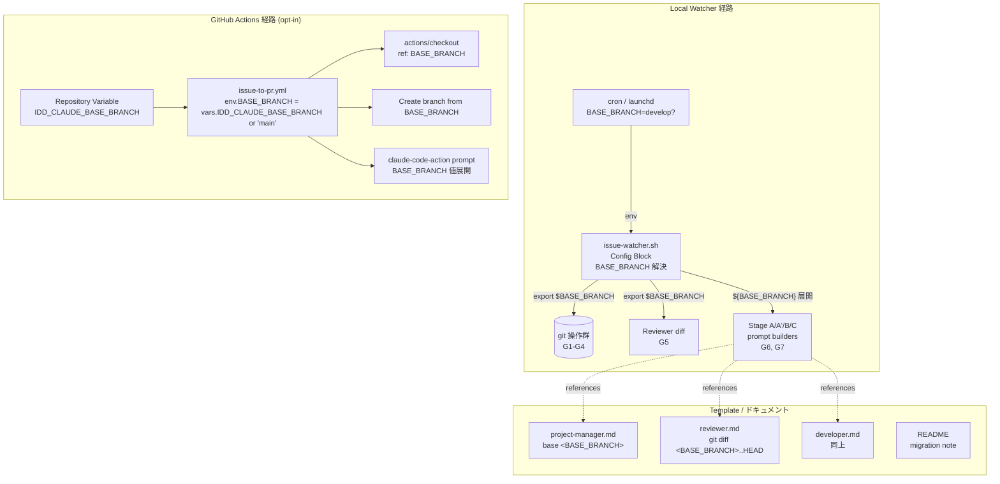
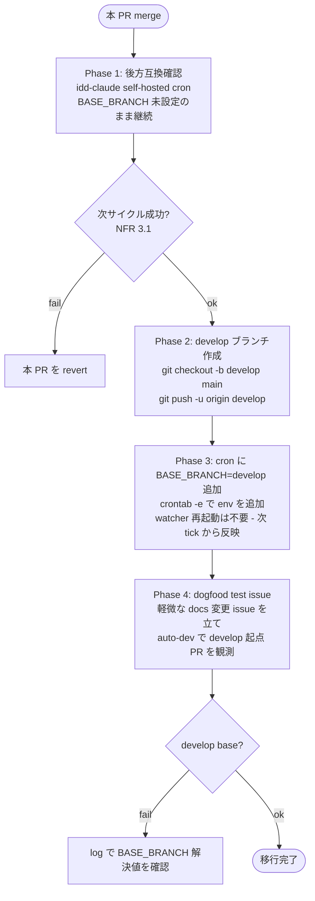

# Design Document

## Overview

**Purpose**: 本機能は idd-claude の watcher / GitHub Actions / agent prompt / template ドキュメントに散在する `main` リテラルを、`BASE_BRANCH` env var による解決値に統一して抽象化することで、gitflow（`develop` 起点）など `main` 以外の base branch に対しても auto-dev フローを完走させる能力を、idd-claude / consumer repo 双方の運用者に提供する。

**Users**: (1) idd-claude self-hosting cron（dogfooding）の運用者、(2) idd-claude を導入した consumer repo の運用者、(3) GitHub Actions 経路で `IDD_CLAUDE_USE_ACTIONS=true` を opt-in した運用者。それぞれ「`develop` を統合 branch にしたい」「`main` 起点を維持したい」のいずれの workflow でも 1 つの env で挙動を切り替えられる。

**Impact**: 現在は `local-watcher/bin/issue-watcher.sh` 約 25 箇所、workflow YAML 2 ファイル、agent prompt 3 ファイル、CLAUDE.md / README に「`main`」リテラルがハードコードされており、`develop` 起点運用ができない。本変更で `BASE_BRANCH` env による解決経路を 1 本通し、未設定時は `main` を採用することで完全な後方互換性を保ったまま gitflow 運用を解禁する。consumer repo 側のデフォルトは `main` のままであり、template 再 install 時も挙動は変わらない。

### Goals
- `BASE_BRANCH` 1 つで watcher 経路（local cron）と Actions 経路の双方の base branch を切り替え可能にする
- 未設定時は本変更導入前と git 操作・PR base 指定・prompt 文面・log メッセージのすべてで完全に同一の出力を維持する（NFR 1.1）
- `MERGE_QUEUE_BASE_BRANCH` の env var 名・挙動を変更せず、`BASE_BRANCH` の連鎖 default のみを追加する
- agent prompt が PM / Architect / Developer / Reviewer / PjM のどの context でも、解決された base branch を文意の整合性を保って参照する
- self-hosting (dogfooding) の cron が merge 直後も停止せず動作を継続する（NFR 3.1）
- README に `BASE_BRANCH` 役割・既定値・gitflow 移行手順を migration note として 1 箇所に集約する

### Non-Goals
- gitflow の release branch（`release/x.y.z`）自動作成・自動 merge / tag リリース
- PR base に応じた自動ラベル付与（例: `base:develop`）
- `MERGE_QUEUE_BASE_BRANCH` のリネーム・廃止（後方互換のため温存）
- consumer repo 側の base 切替支援ツール（`install.sh` への env 設定機能追加）
- 1 watcher プロセスで複数 base branch を同時並行運用すること
- prompt 内 `main` リテラルを完全置換した結果、Reviewer / Developer の判定挙動を変えること（文意保持で挙動同等が前提）

## Architecture

### Existing Architecture Analysis

idd-claude の watcher は **bash 単一ファイル ~4500 行**（`local-watcher/bin/issue-watcher.sh`）に Dispatcher / Slot Runner / Stage Wrapper / Reviewer Pipeline / Merge Queue / PR Iteration / Stage Checkpoint / Quota-Aware など複数 Processor が同居する構造。各 Processor は冒頭の **Config ブロック**（L51〜L211）で env var を集中管理し、`"${VAR:-default}"` 形式の opt-in / 後方互換 default を維持している。`MERGE_QUEUE_BASE_BRANCH` は既にこの形で `main` をデフォルトとして定義済み（L78-79）。

`main` リテラルが散在する箇所は大別して以下のカテゴリ:

| カテゴリ | 代表箇所 | 件数概算 |
|---|---|---|
| (G1) git 操作（fetch 後の checkout / pull） | L261-262 | 2 |
| (G2) worktree add / reset（`origin/main` 起点） | L3666, L3691, L4243（log 文面） | 3 |
| (G3) branch 派生 start point（`-B BRANCH origin/main`） | L4017, L4043, L4441 | 3 |
| (G4) safety-net checkout（処理終了時 `main` に戻す） | L686, L716, L1811, L1850, L1972, L1979 | 6 |
| (G5) Reviewer に渡す diff 範囲（`git diff main..HEAD`） | L2731, L2733, L2766 | 3 |
| (G6) 設計 PR 検索ヒント（PjM prompt 注入文） | L2795 | 1 |
| (G7) Stage A prompt 文面（branch=main 派生 / `git log --oneline main..HEAD`） | L2570, L2631, L2634, L2657, L2666, L2716, L2830, L4488, L4497 | 9 |
| (P1) repo-template agent prompt（PjM `base: main` / Reviewer `git diff main..HEAD` / Developer 文面） | `repo-template/.claude/agents/{project-manager,reviewer,developer}.md` | 11 |
| (P2) workflow YAML（root + repo-template の 2 本） | `.github/workflows/issue-to-pr.yml`、`repo-template/.github/workflows/issue-to-pr.yml` | 2 ファイル × 4 箇所 |
| (D1) ドキュメント（CLAUDE.md / README、「main への直接 push 禁止」等の文言） | `CLAUDE.md`, `repo-template/CLAUDE.md`, `README.md` | ~10 |

尊重すべき制約:
- 既存 env var 名（`REPO`, `REPO_DIR`, `LOG_DIR`, `LOCK_FILE`, `TRIAGE_MODEL`, `DEV_MODEL`, `MERGE_QUEUE_BASE_BRANCH`, `IMPL_RESUME_PRESERVE_COMMITS` 等）の温存（NFR 1.2）
- cron / launchd 登録文字列の不変（`~/bin/issue-watcher.sh` の起動方式・引数規約、NFR 1.3）
- exit code 意味・ラベル名・ラベル遷移契約の不変（NFR 1.4）
- consumer repo 側の `main` デフォルト維持（Req 7.1, 7.2, 7.3）
- self-hosting safety: idd-claude 自身の cron は本 PR merge 直後も `BASE_BRANCH` 未設定で動作継続（NFR 3.1）

### Architecture Pattern & Boundary Map

採用パターン: **Single Variable Resolution at Config Block + Substitute-At-Use**。watcher の Config ブロックで `BASE_BRANCH` を 1 度だけ解決し、すべての git 操作 / prompt 組み立て箇所はその resolved 値を参照する。Actions 経路では同等の解決を YAML 内で `vars.IDD_CLAUDE_BASE_BRANCH || 'main'` として行う。agent prompt の `main` リテラルは bash heredoc の **変数展開** で解決値に置換する（C2 参照）。



**Architecture Integration**:
- 採用パターン: Config ブロックで `BASE_BRANCH` を 1 度解決し、後段は変数参照に統一（既存の `MERGE_QUEUE_BASE_BRANCH` と同型）
- ドメイン／機能境界: (a) watcher core (C1)、(b) agent prompt 動的化 (C2)、(c) workflow YAML (C3)、(d) ドキュメント / template (C4) の 4 境界。それぞれ独立タスクとして並列化可能（後述 tasks.md 参照）
- 既存パターンの維持: Config ブロック中央集権、`"${VAR:-default}"` 形式 opt-in、log prefix 命名（後述 `base-branch:` log カテゴリは追加しない、既存 `slot_log` / `dispatcher_log` 等にインライン）
- 新規コンポーネントの根拠: いずれも追加せず、既存 Config ブロックに env var を 2 行追加するのみ（`BASE_BRANCH` 解決 + `MERGE_QUEUE_BASE_BRANCH` の連鎖 default 修正）

### Technology Stack

| Layer | Choice / Version | Role in Feature | Notes |
|-------|------------------|-----------------|-------|
| Local watcher | bash 4+（既存） | `BASE_BRANCH` 解決、git 操作の引数置換、heredoc 内変数展開 | `set -euo pipefail` 維持。新規 helper 関数 / 新規 file は作らない |
| GitHub Actions | YAML（既存 workflow）+ `actions/checkout@v4` + `anthropics/claude-code-action@v1` | `vars.IDD_CLAUDE_BASE_BRANCH` 解決、checkout の `ref` 動的化、prompt 内変数展開 | `IDD_CLAUDE_USE_ACTIONS=true` の既存 opt-in gate を変更しない（Req 3.4） |
| Agent prompt template | markdown（`repo-template/.claude/agents/*.md`） | `main` 一般化（C2 で採用方式に従う） | 配布先 consumer repo にも反映される（template 経路） |
| Documentation | markdown（root `CLAUDE.md`, `repo-template/CLAUDE.md`, `README.md`） | 「main への直接 push 禁止」等の特定 branch 名依存文言を一般化、README に migration note を新設 | self-hosting 観点 + consumer repo 観点の双方を README に併記 |

## File Structure Plan

本機能は新規ファイルを作らず、**既存ファイルへの編集のみ**で完結する。変更対象ファイルとその責務:

```
local-watcher/
└── bin/
    └── issue-watcher.sh                          # C1: Config ブロックで BASE_BRANCH 解決、
                                                  #     全 git 操作 / prompt heredoc を変数化、
                                                  #     起動時 log に解決値出力
                                                  # （Stage A/A'/B/C prompt builders L2542-2835、
                                                  #  Slot Runner branch init L4406-4451、
                                                  #  Worktree manager L3663-3699、
                                                  #  Repo update L259-263 を含む）
                                                  # ※ triage-prompt.tmpl / iteration-prompt.tmpl /
                                                  #    iteration-prompt-design.tmpl は `main`
                                                  #    リテラル不在のため変更不要（grep 確認済）

repo-template/
├── .claude/
│   └── agents/
│       ├── project-manager.md                    # C2: PR 作成時の base 指定文 (`base: main` の 2 箇所)、
│       │                                         #     「main への直接 push」禁止文言を一般化
│       ├── reviewer.md                           # C2: `git diff main..HEAD` / `git log --oneline main..HEAD`
│       │                                         #     等の参照箇所、Compared to ヘッダ
│       └── developer.md                          # C2: 「main に載っている」前提文、
│                                                 #     opt-in 時の `git diff main..HEAD` 文、
│                                                 #     impl-resume の `git log --oneline main..HEAD` 文、
│                                                 #     「main への直接 push」禁止文言
├── .github/
│   └── workflows/
│       └── issue-to-pr.yml                       # C3: env.BASE_BRANCH 注入、checkout ref、
│                                                 #     branch 作成 start point、prompt 内文言
└── CLAUDE.md                                     # C4: 「main への直接 push」を一般化
                                                  #     （consumer repo 側、template 配布物）

.github/
└── workflows/
    └── issue-to-pr.yml                           # C3: 上記 repo-template 版と同内容（self-hosting 用）

CLAUDE.md                                         # C4: idd-claude root の禁止事項節
                                                  #    「main への直接 push」を一般化
README.md                                         # C4: 「ブランチ運用 / BASE_BRANCH」節を新設、
                                                  #    既存「環境変数」表に BASE_BRANCH 行追加、
                                                  #    MERGE_QUEUE_BASE_BRANCH との関係を明示、
                                                  #    self-hosting で develop 運用に切替える
                                                  #    手順 + dogfood 確認手順を追加
```

### Modified Files Summary

| File | 変更カテゴリ | 主な変更内容 |
|---|---|---|
| `local-watcher/bin/issue-watcher.sh` | C1 | Config ブロックに `BASE_BRANCH` 解決追加（L78 直前）、`MERGE_QUEUE_BASE_BRANCH` の連鎖 default に変更、L261-262 の `git checkout/pull main` を `$BASE_BRANCH` 化、worktree 系 (L3666, L3691) と branch init 系 (L4017, L4043, L4441) を `origin/$BASE_BRANCH` 化、safety-net checkout (L686, L717, L1811, L1850, L1972, L1979, L869) を `$BASE_BRANCH` 化、Reviewer prompt の diff 範囲 (L2731, L2733, L2766) と Stage A heredoc (L2570, L2631, L2634, L2657, L2666, L2716, L2795, L2830, L4488, L4497) を `${BASE_BRANCH}` 展開、log 出力 (L3670, L4243) を `origin/$BASE_BRANCH` 化、起動時に解決値を `echo` |
| `repo-template/.claude/agents/project-manager.md` | C2 | base 指定文 2 箇所と禁止事項 1 箇所を C2 採用方式で更新 |
| `repo-template/.claude/agents/reviewer.md` | C2 | diff 参照 5 箇所と Compared to ヘッダを C2 採用方式で更新 |
| `repo-template/.claude/agents/developer.md` | C2 | 設計 merge 前提文 / opt-in 時の差分セルフチェック文 / impl-resume の commit 確認文 / 禁止事項を C2 採用方式で更新 |
| `.github/workflows/issue-to-pr.yml`（root + repo-template の 2 本） | C3 | `env: BASE_BRANCH: ${{ vars.IDD_CLAUDE_BASE_BRANCH \|\| 'main' }}` を job 直下に追加、checkout の `ref` を `${{ env.BASE_BRANCH }}` に変更、prompt の `main から派生` 文を `${{ env.BASE_BRANCH }}` 展開に変更、`main に直接 push しないこと` 文を base branch 一般化 |
| `repo-template/CLAUDE.md` | C4 | 「禁止事項」節の `main` 文言を一般化 |
| `CLAUDE.md` (root) | C4 | 同上 |
| `README.md` | C4 | 「ブランチ運用 / BASE_BRANCH」新節を追加（環境変数表にも追記）、self-hosting で develop 運用に切替える手順 + dogfood 確認手順を新設 |

## Components and Interfaces

### C1. Watcher Core: `BASE_BRANCH` 解決 + git 操作抽象化

#### Config Block Resolution

| Field | Detail |
|-------|--------|
| Intent | watcher 起動時に `BASE_BRANCH` を解決し、後段の全 git 操作 / prompt 組み立てが参照する単一の真実源とする |
| Requirements | 1.1, 1.2, 1.7, 2.1, 2.2, 2.3, 2.4, 5.3, 7.2, NFR 1.1, NFR 1.2, NFR 4.1 |

**Responsibilities & Constraints**
- `BASE_BRANCH="${BASE_BRANCH:-main}"` を `MERGE_QUEUE_BASE_BRANCH` 行（L79）の直前に新設
- `MERGE_QUEUE_BASE_BRANCH="${MERGE_QUEUE_BASE_BRANCH:-${BASE_BRANCH}}"` に変更（連鎖 default。Req 2.1, 2.2, 2.3）。`MERGE_QUEUE_BASE_BRANCH` の env var 名は変更しない（Req 2.4 / NFR 1.2）
- 起動時 log: 既存の最初期ログ箇所（`mkdir -p "$LOG_DIR"` 直後 L246 付近）に `echo "[$(date '+%F %T')] base-branch=${BASE_BRANCH} merge-queue-base=${MERGE_QUEUE_BASE_BRANCH}"` を追加（Req 1.7, NFR 4.1）
- グローバル変数として watcher プロセス全体で参照可（subshell 内も `export` 不要、bash の variable inheritance で十分）

**Dependencies**
- Inbound: cron / launchd（env を渡す）— Critical
- Outbound: G1〜G7 のすべての箇所 — Critical

**Contracts**: State [x]

##### Resolution Truth Table

| `BASE_BRANCH` | `MERGE_QUEUE_BASE_BRANCH` | resolved BASE_BRANCH | resolved MQ_BASE | 根拠 AC |
|---|---|---|---|---|
| unset | unset | `main` | `main` | 1.2, 2.3 |
| `develop` | unset | `develop` | `develop` | 1.1, 2.1 |
| unset | `master` | `main` | `master` | 2.2, 2.4 |
| `develop` | `master` | `develop` | `master` | 2.2 |
| `develop` | `develop` | `develop` | `develop` | 2.1 |

#### Git Operation Categories（置換対象）

各カテゴリは Config ブロックで解決された `$BASE_BRANCH` を参照する。

| Category | 行 / 文脈 | 変更前 | 変更後 | 根拠 AC |
|---|---|---|---|---|
| G1 / repo update | L261-262 | `git checkout main` / `git pull --ff-only origin main` | `git checkout "$BASE_BRANCH"` / `git pull --ff-only origin "$BASE_BRANCH"` | 1.1, 1.6 |
| G2 / worktree add | L3666 | `git -C "$REPO_DIR" worktree add --detach "$wt_path" "origin/main"` | 同上、`origin/$BASE_BRANCH` | 1.3 |
| G2 / worktree reset | L3691 | `git -C "$wt" reset --hard origin/main` | 同上、`origin/$BASE_BRANCH` | 1.4 |
| G2 / worktree log 文面 | L3670, L4243 | `(detached @ origin/main)` / `origin/main 最新化` | `(detached @ origin/$BASE_BRANCH)` / `origin/$BASE_BRANCH 最新化` | NFR 4.1, NFR 4.2 |
| G3 / branch start point (impl/design) | L4441 | `git checkout -B "$BRANCH" "origin/main"` | 同上、`origin/$BASE_BRANCH` | 1.3 |
| G3 / branch start point (impl-resume legacy) | L4017 | 同上 | 同上 | 1.3, 5.2 |
| G3 / branch start point (impl-resume preserve, branch 不在) | L4043 | 同上 | 同上 | 5.2 |
| G3 / log 文面 | L4048 | `resume-mode=fresh-from-main` | `resume-mode=fresh-from-base` | 5.4 |
| G4 / safety-net checkout | L686, L717, L869, L1811, L1850, L1972, L1979 | `git checkout main` / `git checkout '${MERGE_QUEUE_BASE_BRANCH}'` | `git checkout "$BASE_BRANCH"` または既存 `MERGE_QUEUE_BASE_BRANCH` 参照箇所はそのまま（連鎖 default で同値解決） | 1.6 |
| G5 / Reviewer diff | L2731, L2733, L2766 | `git diff main..HEAD` | `git diff "${BASE_BRANCH}..HEAD"`、prompt 内文面は `${BASE_BRANCH}..HEAD` の literal 展開 | 1.5, 4.3 |
| G6 / 設計 PR 検索ヒント | L2795 | `直近の main 上の merge commit から git log --oneline --merges で探す` | `直近の ${BASE_BRANCH} 上の merge commit から git log --oneline --merges で探す`（heredoc 内変数展開） | 4.1, 4.2 |
| G7 / Stage A heredoc 文面 | L2570, L2631, L2634, L2657, L2666, L2716, L2830, L4488, L4497 | 「`main` から派生」「`git log --oneline main..HEAD`」「`main` に直接 push しないこと」「`main` に merge 済み」 | `${BASE_BRANCH}` 展開で動的解決 | 4.1, 4.2, 4.3, 4.4, 5.4 |

**Note on G4 safety-net**: Merge Queue Processor 内（L686, L717, L869）は既に `${MERGE_QUEUE_BASE_BRANCH}` を使用済み。`MERGE_QUEUE_BASE_BRANCH` が `BASE_BRANCH` の連鎖 default になることで、コードを変更せずとも resolved 値が一致する。コードはそのまま、ただし「base ブランチが対象 main 以外なら自動 rebase の対象外」(L838) のような **コメント文中の "main"** は「対象 base ブランチ以外なら…」のように一般化して誤読を防ぐ。

#### Error Handling: `BASE_BRANCH` 不正値

| シナリオ | 検出層 | 観測手段 | 復旧経路 |
|---|---|---|---|
| `BASE_BRANCH=develop` だが `origin/develop` が存在しない | G1（L261-262 の `git checkout`/`pull`）が non-zero exit。`set -euo pipefail` で watcher プロセスが exit 1 | cron mailer / 直前 log の `git checkout` エラー | 運用者が `BASE_BRANCH` を見直すか、`origin/develop` を作成（NFR 3.2） |
| 同上で worktree reset 段階で発覚 | G2 (L3691) の reset --hard 失敗 → `_slot_mark_failed "worktree-reset"` で当該 Issue を `claude-failed` 化 | `slot-N-...log` の `worktree reset OK` 不在 + `claude-failed` ラベル | 運用者が `BASE_BRANCH` を見直す |
| Issue 投入時に worktree reset 後の `BASE_BRANCH` log 文面に値が出るので、誤設定が log で観測可能（NFR 4.1, 4.2） | C1 起動時 log + worktree reset log | watcher 起動 log の 1 行目 `base-branch=...` | 同上 |

silent fail を作らないため、新規 helper / try-catch は導入しない。既存の `set -euo pipefail` + `_slot_mark_failed` フローに乗せる。

### C2. Agent Prompt Dynamic Resolution

#### 採用方式と根拠

3 択（(a) watcher 側 `s/main/$BASE_BRANCH/g`、(b) `{{BASE_BRANCH}}` placeholder + watcher 展開、(c) 「base ブランチ」一般語化）について、本設計では **ハイブリッド方式** を採用する:

- **watcher 内蔵 prompt（heredoc）→ (b) 相当**: bash heredoc の `${BASE_BRANCH}` 変数展開で動的解決
- **template ファイル（`repo-template/.claude/agents/*.md`）→ (c) 一般語化**: `BASE_BRANCH` という変数名を含む説明 + 必要に応じて `<BASE_BRANCH>` プレースホルダ表記

**根拠**:

| 方式 | watcher heredoc | template `.md` |
|---|---|---|
| (a) `sed s/main/$BASE_BRANCH/g` | × `main` という文字列が「base branch 名」「ブランチ操作」「main 関数」「関数名 main」等と区別不可。誤置換リスク高 | × 同上 + watcher 経路でしか実行されないため、Actions / 直接 Read 経路で未解決のまま読まれる |
| (b) `{{BASE_BRANCH}}` placeholder + 展開 | △ heredoc では bash の `${VAR}` 展開で十分（プレースホルダ層を別途追加するのは過剰） | × template `.md` を agent が直接 Read する経路ではプレースホルダが展開されず、文意が壊れる |
| (c) 一般語化（"base ブランチ"） | △ Reviewer に渡す `git diff` 等は具体値が必要なため、文言だけ一般語化しても不十分 | ○ template は consumer repo にも配布され、watcher / Actions / 人間の直 Read のいずれの経路でも文意が成立する |
| 本採用: heredoc=(b)（bash 変数展開）+ template=(c) | ○ 動的具体値が必要 | ○ 静的文書として成立 |

**採用方式の確定詳細**:

(B-1) **watcher heredoc**: `cat <<EOF ... ${BASE_BRANCH} ... EOF`（既に `${BRANCH}` `${SPEC_DIR_REL}` 等で同型に変数展開している。学習コストゼロ）。`'EOF'`（quoted heredoc）の箇所は変数展開されないので使用しない（既存コードでも quoted heredoc は限定的）。

(B-2) **template `.md`**:
- 「base ブランチ」または「base branch」を主表記とし、補足として `<BASE_BRANCH>` を併記する形式
  - 例: PjM の `base: main` → `base: <BASE_BRANCH>`（PjM agent prompt 文中で「`<BASE_BRANCH>` は idd-claude が解決する base ブランチ。watcher 経由ならオーケストレーターから渡される env、Actions 経由なら repository variable」と注記）
  - 例: Reviewer の `git diff main..HEAD` → `git diff <BASE_BRANCH>..HEAD`（注記: `<BASE_BRANCH>` は env として与えられる、未与時は `main`）
  - 例: 禁止事項の `main への直接 push` → `base branch（既定 main）への直接 push`
- 一般語化のみで済む箇所（説明文・コメント）は単純に「base ブランチ」表記に変更

(B-3) **watcher が agent を起動するときの env 渡し**:
- agent サブエージェント（Stage B Reviewer / Stage C PjM 等）は **watcher 親プロセスの env を継承** する（`claude --print "..."` で起動するため）
- 親プロセスで `export BASE_BRANCH=$BASE_BRANCH` する必要は無い（bash variable は subshell 継承される）。**ただし claude CLI が env を子に伝播するかは未保証** のため、本設計では **prompt heredoc 内で具体値を inline 展開** する方式を主とし、agent が `Bash` で `git diff` を再取得する場合は `<BASE_BRANCH>` の説明から自分で値を組み立てる（Reviewer 自身が prompt の Compared to: `${BASE_BRANCH}..HEAD` を読む）

#### Components

##### Project Manager Agent Prompt（template）

| Field | Detail |
|-------|--------|
| Intent | 設計 PR / 実装 PR の base 指定が `BASE_BRANCH` 解決値になるよう agent に指示 |
| Requirements | 4.1, 4.2 |

**Responsibilities & Constraints**
- `gh pr create --base` 実行時に `<BASE_BRANCH>` を使う旨を記載（具体値はオーケストレーター prompt 内に展開済み）
- 「`main` への直接 push しない」→「base ブランチへの直接 push しない」へ一般化（idd-claude / consumer repo の双方で読める文言）

**Contracts**: API（PR 作成）

##### Reviewer Agent Prompt（template + watcher heredoc）

| Field | Detail |
|-------|--------|
| Intent | base..HEAD の diff / log 取得時に `BASE_BRANCH` を参照 |
| Requirements | 4.1, 4.3 |

**Responsibilities & Constraints**
- watcher 側 `build_reviewer_prompt`（L2726）の `git diff main..HEAD` を `git diff "${BASE_BRANCH}..HEAD"` に変更、prompt 内 `Compared to: main..HEAD` を `Compared to: ${BASE_BRANCH}..HEAD` に変更
- template `reviewer.md` の `git diff main..HEAD` 系 5 箇所を `git diff <BASE_BRANCH>..HEAD` に変更（説明: `<BASE_BRANCH>` は idd-claude が解決した base branch、未指定時は `main`）

**Contracts**: Service（review-notes.md 出力）

##### Developer Agent Prompt（template + watcher heredoc）

| Field | Detail |
|-------|--------|
| Intent | impl-resume の既存 commit 確認、opt-in feature flag のセルフチェック diff、設計 merge 前提文を `BASE_BRANCH` 対応 |
| Requirements | 4.1, 4.3, 5.1, 5.4 |

**Responsibilities & Constraints**
- 「`main` に載っている前提」→「base branch（idd-claude が解決する `<BASE_BRANCH>`、既定 `main`）に merge 済み前提」へ一般化
- `git log --oneline main..HEAD` → `git log --oneline <BASE_BRANCH>..HEAD`（template）/ `${BASE_BRANCH}..HEAD`（watcher heredoc）
- 「main への直接 push」→「base branch への直接 push」

**Contracts**: Service（実装コミット）

### C3. Workflow YAML: env 注入方式

#### 採用方式と根拠

3 択（A) `${{ vars.IDD_CLAUDE_BASE_BRANCH || 'main' }}`（repository variable）、B) `${{ inputs.base_branch || 'main' }}`（workflow_dispatch input）、C) hardcode）について、本設計では **A) repository variable** を採用する。

| 方式 | メリット | デメリット | 採否 |
|---|---|---|---|
| A) repository variable | 既存 `IDD_CLAUDE_USE_ACTIONS` と同型（同じ Settings 画面・同じ運用感）。1 度設定すれば `issues:` event で毎回適用される。consumer repo の運用者が「opt-in と base 切替」を 1 つの mental model で扱える | repository variable 未設定 = `main`、明示設定 = 別 base、と 2 段階の opt-in 構造になる（が、既定 `main` にフォールバックするため後方互換は確保） | **採用** |
| B) workflow_dispatch input | 1 回限りの手動起動には便利 | `issues:` トリガーは GitHub Actions の workflow_dispatch とは別経路。base 切替が常時必要な場合、毎回手動 dispatch では運用にならない | 不採用 |
| C) hardcode | 最も単純 | gitflow 運用 repo では yaml を書き換える必要があり、template 一括配布の意味が消える | 不採用 |

**採用方式の確定詳細**:

```yaml
# .github/workflows/issue-to-pr.yml（root + repo-template）
jobs:
  claude-team-dev:
    if: |
      vars.IDD_CLAUDE_USE_ACTIONS == 'true' &&
      contains(github.event.issue.labels.*.name, 'auto-dev') &&
      ...
    env:
      BASE_BRANCH: ${{ vars.IDD_CLAUDE_BASE_BRANCH || 'main' }}
    steps:
      - name: Checkout base branch
        uses: actions/checkout@v4
        with:
          ref: ${{ env.BASE_BRANCH }}
          fetch-depth: 0
      ...
      - name: Create working branch from base
        run: |
          # BASE_BRANCH は env 経由で参照（YAML 文字列展開ではなく shell 変数化）
          git checkout -B "$BRANCH" "origin/${BASE_BRANCH}"
          git push -u origin "$BRANCH" --force-with-lease
```

- `env:` を job スコープで宣言し、後段 step は `${{ env.BASE_BRANCH }}` または `$BASE_BRANCH` で参照
- `IDD_CLAUDE_USE_ACTIONS` opt-in gate は変更しない（Req 3.4）
- prompt（heredoc）内の `main から派生`、`main に直接 push しないこと` 等は `${{ env.BASE_BRANCH }}` で展開、または「base ブランチ（`${{ env.BASE_BRANCH }}`）」のように併記（Req 3.3）
- README にて「Settings → Variables に `IDD_CLAUDE_BASE_BRANCH=develop` を追加」の手順を案内（Req 6.1）

#### Components

##### Workflow YAML Job

| Field | Detail |
|-------|--------|
| Intent | Actions 経路でも `BASE_BRANCH` を repository variable から解決し、checkout / branch 作成 / prompt の base 参照を統一する |
| Requirements | 3.1, 3.2, 3.3, 3.4 |

**Contracts**: Batch（GitHub Actions workflow）

### C4. Documentation & Template

#### Components

##### README Migration Note

| Field | Detail |
|-------|--------|
| Intent | `BASE_BRANCH` の役割・既定値・設定方法、`MERGE_QUEUE_BASE_BRANCH` との関係、self-hosting で `develop` 運用に切替える手順、dogfood 確認手順を運用者に提供 |
| Requirements | 6.1, 6.2, 6.3, 6.5 |

**Section Layout**:

新節「ブランチ運用と `BASE_BRANCH`」を **既存 `## セットアップ` 節と `## 環境変数` 系節の間** に新設し、以下を含める:
- `BASE_BRANCH` の役割（base branch の単一切替点）
- 既定値（`main`）と未設定時の挙動（完全な後方互換）
- 設定方法（cron / launchd 例 + Actions の repository variable 例）
- gitflow 移行手順（(1) `develop` ブランチ作成 + push、(2) cron に `BASE_BRANCH=develop` 追加、(3) watcher プロセス再起動 = 次サイクル待ち、(4) test issue で dogfood 確認）
- `MERGE_QUEUE_BASE_BRANCH` との関係表（連鎖 default、明示時は merge queue だけ別 base）
- self-hosting 用 `develop` 作成は **本 PR では README 手順書記載のみ**、`setup.sh` 自動化は別 Issue 化（Open Question 4 への結論）
- prompt 一般語化の訳語選定: 「base ブランチ」「base branch」を主表記、`<BASE_BRANCH>` を技術参照表記として併記（Open Question 5 への結論）

##### CLAUDE.md / repo-template/CLAUDE.md 文言一般化

| Field | Detail |
|-------|--------|
| Intent | 「main への直接 push 禁止」等の特定 branch 名依存文言を base branch を指す一般化文言に置換 |
| Requirements | 6.4 |

**Responsibilities & Constraints**
- `repo-template/CLAUDE.md` L112: `- \`main\` ブランチへの直接 push` → `- base ブランチ（既定 \`main\`、設定によっては \`develop\` 等）への直接 push`
- root `CLAUDE.md` L111: 同上
- 「`origin/main` 起点で fresh init + force-push」(repo-template/CLAUDE.md L135) のような **動作説明** は技術文脈なので `origin/<BASE_BRANCH>` 表記 + 既定値の併記に変更

## Requirements Traceability

| Requirement | Summary | Components | Interfaces | Flows |
|-------------|---------|------------|------------|-------|
| 1.1 | `BASE_BRANCH=develop` で全 git 操作 / PR base / prompt 文面に develop を使う | C1 / C2 / C3 | Config Block, all G1-G7, agent heredoc | watcher 起動 → Config 解決 → 全 step が `$BASE_BRANCH` 参照 |
| 1.2 | `BASE_BRANCH` 未設定時は `main` 採用 | C1 | Config Block (`${BASE_BRANCH:-main}`) | 同上、デフォルト経路 |
| 1.3 | branch 派生は `origin/$BASE_BRANCH` 起点 | C1 | G2, G3 | worktree add / branch checkout |
| 1.4 | per-slot worktree を `origin/$BASE_BRANCH` に強制リセット | C1 | G2 (`_worktree_reset`) | Slot Runner 起動時 |
| 1.5 | Reviewer 投入 diff は `$BASE_BRANCH..HEAD` | C1 / C2 | G5 (`build_reviewer_prompt`), reviewer.md | Stage B Reviewer prompt 組み立て |
| 1.6 | safety-net checkout は `$BASE_BRANCH` 復帰 | C1 | G4 | Merge Queue / PR Iteration の後処理 |
| 1.7 | 起動時 log に解決 `BASE_BRANCH` 出力 | C1 | Config Block log | watcher 起動 |
| 2.1 | `BASE_BRANCH` のみ設定で merge queue も同値採用 | C1 | Config Block 連鎖 default | resolution truth table |
| 2.2 | `MERGE_QUEUE_BASE_BRANCH` 明示時は優先 | C1 | Config Block 連鎖 default | resolution truth table |
| 2.3 | 双方未設定時は `main` | C1 | Config Block デフォルト | resolution truth table |
| 2.4 | `MERGE_QUEUE_BASE_BRANCH` 名は不変 | C1 | Config Block | NFR 1.2 |
| 3.1 | Actions で base 切替可 | C3 | Workflow YAML env / checkout ref / branch start point | Actions 経路 |
| 3.2 | Actions 未設定時は `main` | C3 | `vars.IDD_CLAUDE_BASE_BRANCH \|\| 'main'` | Actions 経路 |
| 3.3 | workflow YAML 内 prompt の base 表記が解決値か一般語化 | C3 | YAML heredoc 内 `${{ env.BASE_BRANCH }}` 展開 | Actions 経路 |
| 3.4 | `IDD_CLAUDE_USE_ACTIONS` opt-in gate 不変 | C3 | Workflow YAML `if:` 不変 | Actions 経路 |
| 4.1 | Prompt 内 base branch 参照が `BASE_BRANCH` 反映 | C2 | watcher heredoc + template `.md` | Stage A/A'/B/C prompt |
| 4.2 | PjM が PR base に `BASE_BRANCH` を指定 | C2 | project-manager.md | PjM execution |
| 4.3 | Developer / Reviewer が `$BASE_BRANCH..HEAD` 範囲で diff/log | C2 | reviewer.md / developer.md | Reviewer / Developer execution |
| 4.4 | 任意 base で文意が整合する形式 | C2 | template 一般語化 + 補足注記 | template 全般 |
| 5.1 | impl-resume の spec 存在判定が `$BASE_BRANCH` 上で行われる | C1 | Slot Runner L4262 EXISTING_SPEC_DIR 判定 | Slot Runner 起動時の spec 検出（worktree が `origin/$BASE_BRANCH` 最新化済みなので structurally 担保。コード変更不要） |
| 5.2 | impl-resume の新規作成は `origin/$BASE_BRANCH` 起点 | C1 | G3 (`_resume_branch_init` L4017, L4043) | impl-resume branch init |
| 5.3 | `IMPL_RESUME_PRESERVE_COMMITS` 名は不変 | C1 | Config Block | NFR 1.2 |
| 5.4 | impl-resume log の `main` ハードコード除去 | C1 | G3 log L4048, G7 heredoc | resume-mode log / Stage A heredoc |
| 6.1 | README に `BASE_BRANCH` 役割・既定値・設定方法 | C4 | README ブランチ運用節 | docs |
| 6.2 | README に gitflow 移行手順（migration note） | C4 | README ブランチ運用節 | docs |
| 6.3 | README に `BASE_BRANCH` と `MERGE_QUEUE_BASE_BRANCH` の関係表 | C4 | README ブランチ運用節 | docs |
| 6.4 | CLAUDE.md の特定 branch 名依存文言を一般化 | C4 | root + repo-template CLAUDE.md | docs |
| 6.5 | self-hosting dogfood 確認手順 | C4 | README ブランチ運用節 | docs |
| 7.1 | `install.sh` 再実行で template デフォルトが `main` 相当 | C4 | template 配布物（既定値が `main`） | installer 経路（コード変更なし） |
| 7.2 | `BASE_BRANCH` 未設定で従来挙動完全同一 | C1 | Config Block デフォルト + 全 G1-G7 | NFR 1.1 |
| 7.3 | installer は `BASE_BRANCH` 設定を必須化しない | C4 | install.sh は本機能の env を要求しない（コード変更なし） | installer 経路 |
| NFR 1.1 | 完全な後方互換（git/PR/prompt/log すべて差分等価） | C1 / C2 / C3 / C4 | 全境界の resolved 値が `main` のときに既存挙動 | 全経路 |
| NFR 1.2 | 既存 env var 名不変 | C1 | Config Block で `MERGE_QUEUE_BASE_BRANCH` / `IMPL_RESUME_PRESERVE_COMMITS` 等を保持 | Config 解決 |
| NFR 1.3 | cron / launchd 登録文字列不変 | C1 | env 追加のみで `~/bin/issue-watcher.sh` 起動方式不変 | cron 起動 |
| NFR 1.4 | exit code / ラベル / 遷移契約不変 | C1 | コード変更が引数のみ | 全経路 |
| NFR 2.1 | install.sh / setup.sh 再実行の冪等性維持 | C4 | コード変更しない（template 内容のみ更新） | installer 経路 |
| NFR 2.2 | sudo 不要のユーザースコープのみ | C4 | 同上 | installer 経路 |
| NFR 3.1 | self-hosting cron が merge 直後も停止せず動作継続 | C1 | `BASE_BRANCH` 未設定で `main` フォールバック | dogfood 経路 |
| NFR 3.2 | `develop` 不在で `BASE_BRANCH=develop` 誤設定時は log で観測可能、silent fail なし | C1 | `set -euo pipefail` + `_slot_mark_failed` の既存経路 | error 経路 |
| NFR 4.1 | 起動時に `BASE_BRANCH` 値を log 出力 | C1 | Config Block log 1 行追加 | watcher 起動 |
| NFR 4.2 | 失敗時 log で操作と `BASE_BRANCH` 値を判別可能 | C1 | worktree reset / branch init log の `origin/$BASE_BRANCH` 表記 | error 経路 |

## Data Models

該当なし（永続データ・新規 schema は導入しない）。env var 解決はプロセスローカルで完結する。

## Error Handling

### Error Strategy

silent fail を作らない（CLAUDE.md 禁止事項）。`set -euo pipefail` + 既存 `_slot_mark_failed` 経路に乗せる。新規 helper / try-catch / safety-net 関数は導入しない。

### Error Categories and Responses

- **User Errors（運用者の env 誤設定）**:
  - `BASE_BRANCH=develop` だが `origin/develop` 不在 → G1 の `git checkout` / `git pull` が non-zero exit → watcher プロセス終了。cron mailer に直前 log が届く
  - 起動時の `base-branch=develop` log で誤設定が即座に観測可能（NFR 4.1）
  - 復旧: 運用者が `BASE_BRANCH` を見直すか、`origin/develop` を作成
- **System Errors（git 操作失敗）**:
  - worktree reset 段階で発覚した場合 → `_slot_mark_failed "worktree-reset"` で当該 Issue を `claude-failed` 化（既存パス）
  - per-slot のため他 slot の処理は継続（既存挙動と同じ）
- **Documentation Errors（誤置換）**:
  - C2 採用方式の **template = 一般語化 + 補足注記** により、watcher 経路と Actions 経路の双方で文意整合性を確保
  - レビュー時の `grep -n '\bmain\b' repo-template/.claude/agents/*.md` で残存リテラルを mechanical check（実装フェーズの自己点検項目）

## Testing Strategy

本 repo は unit test framework を持たないため（CLAUDE.md「テスト・検証」節）、検証は静的解析 + 手動スモークテスト + dogfood で行う。

- **Static Analysis（自動）**:
  - `shellcheck local-watcher/bin/issue-watcher.sh` 警告ゼロ（変更後）
  - `actionlint .github/workflows/*.yml repo-template/.github/workflows/*.yml` クリーン
  - `grep -rn '\bmain\b' local-watcher/bin/issue-watcher.sh` で意図的に残した箇所のみ（コメント・既定値定義）であることを確認
  - `grep -rn '\bmain\b' repo-template/.claude/agents/` で残存箇所が `<BASE_BRANCH>` 補足注記の説明文または「main 関数」「main loop」等の汎用語のみであることを確認
- **Manual Smoke Tests（手動）**:
  - **後方互換確認**: `BASE_BRANCH` 未設定で watcher を `dry-run`（対象なし状態）→ `処理対象の Issue なし` で正常終了し、起動 log に `base-branch=main merge-queue-base=main` が出ることを確認
  - **新挙動確認（develop 起点）**: scratch repo に `develop` ブランチを作成・push、`BASE_BRANCH=develop REPO=owner/scratch REPO_DIR=/tmp/scratch $HOME/bin/issue-watcher.sh` を流し、`base-branch=develop` log と `git checkout develop` の成功を確認
  - **連鎖 default 確認**: `BASE_BRANCH=develop MERGE_QUEUE_BASE_BRANCH=master` で起動し、log に `base-branch=develop merge-queue-base=master` が出ることを確認（resolution truth table の row 4）
  - **Actions 経路確認**: `repo-template/.github/workflows/issue-to-pr.yml` を `actionlint` で構文チェック、`vars.IDD_CLAUDE_BASE_BRANCH` 未設定で job が `main` を採用することを reading で確認
  - **install.sh 冪等性**: `./install.sh --repo /tmp/scratch` を 2 回実行し、template が破壊されないこと、`BASE_BRANCH` 関連の追加配置が無いこと（`install.sh` は今回変更しない）を確認
- **E2E（dogfood）**:
  - 本 PR を idd-claude 自身に merge した後、`BASE_BRANCH` 未設定のままで watcher cron が次サイクルを正常完走（NFR 3.1）
  - `develop` ブランチを作成し `BASE_BRANCH=develop` を cron に追加 → test issue（軽微な docs 変更）を立てて、設計 PR / 実装 PR が `develop` を base に作成されることを確認
- **Performance/Load**: 該当なし（性能影響は env 解決 1 回 + heredoc 展開のみで無視可能）

## Migration Strategy



**Phase 0（merge 前）**: 本 PR の review / approve

**Phase 1（merge 直後 ~ 数日）**: `BASE_BRANCH` 未設定のまま既存 cron が動作継続することを確認。dogfood の watcher が起動 log に `base-branch=main` を出すこと、auto-dev Issue が従来通り `main` 起点で進むことを観測（NFR 3.1）

**Phase 2（運用者の任意のタイミング）**: `develop` ブランチを手動作成（README 手順）

**Phase 3**: cron に `BASE_BRANCH=develop` を追加。watcher プロセスは次 tick で env を読み直すため、明示的な再起動は不要（cron は毎 tick で fresh 起動）

**Phase 4**: dogfood test issue で develop 起点 PR が作られることを確認（README の dogfood 確認手順）

**consumer repo への影響**:
- `install.sh` 再実行時、`repo-template/.github/workflows/issue-to-pr.yml` が更新される（`env.BASE_BRANCH` 行が増える）
- 既存運用者が `IDD_CLAUDE_BASE_BRANCH` を設定していなければ `'main'` フォールバックで挙動不変（Req 7.2）
- `IDD_CLAUDE_USE_ACTIONS` opt-in 済みでない repo では yaml 自体が条件分岐で skip されるため影響ゼロ（Req 3.4）

## Security Considerations

該当なし（本機能で新規外部呼び出しは追加しない。`IDD_CLAUDE_USE_ACTIONS` opt-in gate を変更しないため、未 opt-in repo には新規ネットワーク呼び出しが発生しない / Req 3.4）。

env var に保存される値は branch 名のみで、機密情報を扱わない。
